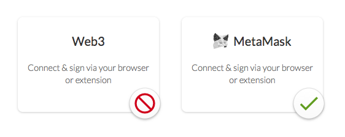

## Identifying Your Provider

If you're a web3 wallet developer or user, you'll definitely want to have people see your name and logo when they browse MyCrypto with your browser:

It's easy to make that happen, just [open a pull request](https://github.com/MyCryptoHQ/MyCrypto) with the following changes:

1. Add your logo to `common/assets/images/wallets/{provider}.svg`

   - Must be an SVG, must be #000 black, should be roughly square in shape.

2. Add the name of your provider to `common/translations/lang/en.json` as `X_{PROVIDER}`.

   - If you go by a different name in other languages, you can also add it to other language configs.

3. Add the logo and names to the configuration in `common/utils/web3.ts`'s `WEB3_CONFIGS` object.
   - The key of the `WEB3_CONFIGS` object should be the value of `web3.currentProvider.constructor.name`. You **must** ensure that this string is consistent, and not uglified as a part of your build. This has become the standard way of identifying providers, though we're open to better techniques as they come along.

An example of this process can be found [here](https://github.com/MyCryptoHQ/MyCrypto/pull/2129).

## Suggesting Your Provider

If you'd like for us to suggest your web3 provider during wallet creation or web3 unlock as an alternative, please reach out to press@mycrypto.com.
