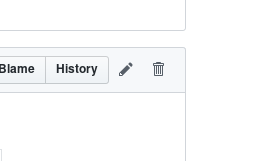
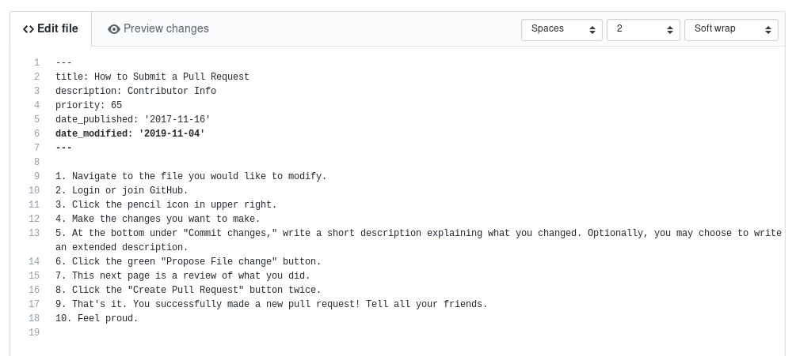
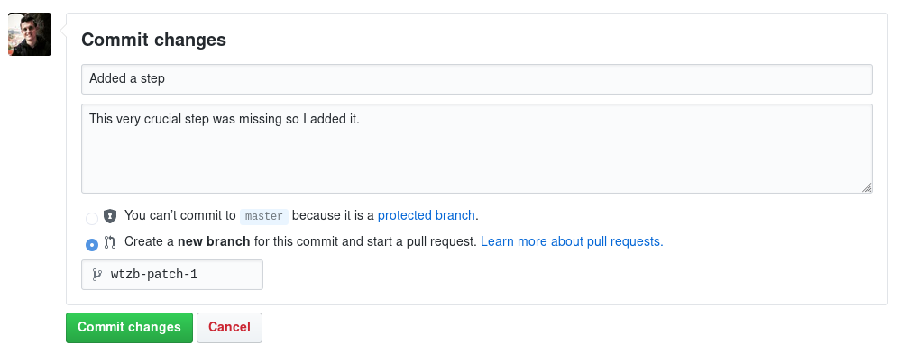
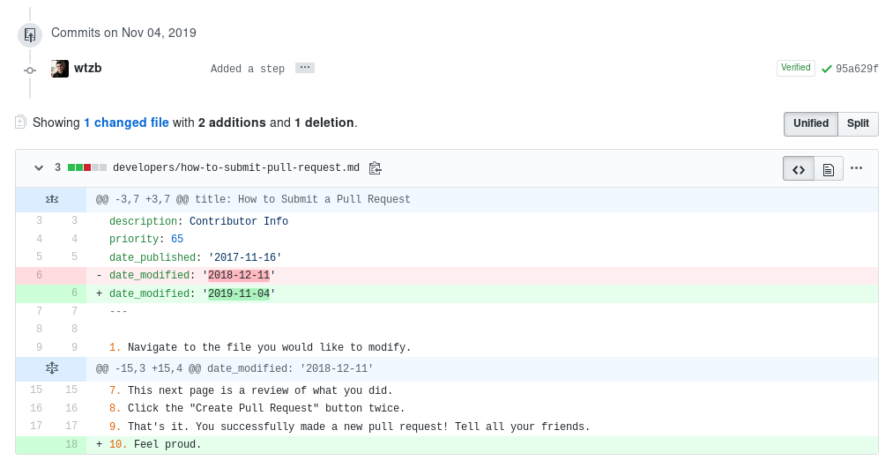

1. Navigate to the file you would like to modify. If you want to make edits to an article on the knowledge base, you can click "Improve this article" which is at the bottom of each article.

2. [Login](https://github.com/login) or [join](https://github.com/join) GitHub.
3. Click the pencil icon in upper right.

4. Make the changes you want to make.

5. At the bottom under "Commit changes", write a short description explaining what you changed. Optionally, you may choose to write an extended description. Then propose the file change.

6. This next page is a review of what you did.

7. Click the "Create Pull Request" button.

8. That's it. You successfully made a new pull request! Tell all your friends.
