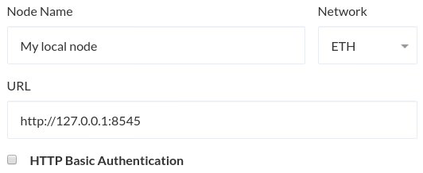

You can use MyCrypto to connect to your own node, which decouples the frontend and features that you love about MyCrypto from our backend infrastructure. This means more nodes send more transactions and is closer to the decentralized nature of Ethereum. It also means that you fully control the entire process and don't rely on us.

<Alert label="Be careful!">

When connecting to your own node, please do not have any accounts in that node. Meaning: Do not do things like `Geth account add` or store your private keys in the Geth Keystore folder.

</Alert>

You will be using MyCrypto to sign and then broadcast the transactions via your node. You will **not** be using your node to sign and send. [If you do not heed this warning, bad things _could_ happen if another setting gets changed. Here's one example](https://www.reddit.com/r/ethereum/comments/3itz1f/insecurely_configured_geth_with_no_firewall_and/). Better safe than sorry.

## Specifics to Connect to Your Local Node

First, download and run the [MyCrypto Desktop App](https://download.mycrypto.com/).

### Run Geth or OpenEthereum with correct flags

- Geth: `geth --http --http.corsdomain "*"`
- OpenEthereum: `openethereum --jsonrpc-cors=all`

### Connect to your node

- Open the MyCrypto desktop application.
- At the bottom left, there is a node switcher. Here is where you can select which node / chain you are connected to.
- Click it, scroll all the way down, and choose `Add Custom Node`.
- Enter a `Node Name` for your node.
- URL: `http://127.0.0.1:8545`.
- Select the chain.

- Click "Save & Use Custom Node."
- This should immediately connect or an error message will display.
- Go to the "View & Send" tab and unlock via "View Address."
- Verify that balances are loading correctly.

## Hosted Node

### Requirements

The URL must have an SSL certificate (HTTPS). You can get a free SSL certificate via [Let's Encrypt](https://letsencrypt.org/) very quickly. If your node is local, it's much easier to follow the instructions above, as this does not require an SSL certificate.

If you wish to run MyCrypto locally + hardware wallet, you will need to have a self-signed certificate in order to connect to your hardware wallet via U2F or WebUSB. Browsers that support U2F or WebUSB require that these calls take place over SSL. This is not something we have control over.

### Run Geth or OpenEthereum with correct flags

- Geth: `geth --http --http.addr "0.0.0.0" --http.corsdomain "https://mycrypto.com/"`

### Connect to your node where it's hosted

- Go to [the settings page on MyCrypto](https://app.mycrypto.com/settings).
- Under "Network & Nodes," click on the node you would like to change, and select the "Custom" option.
- Enter a `Node name` for your node.
- Enter the `Node address`.
- Click "Save & Use Custom Node."
- This should immediately connect or an error message will display.
- Verify that balances are loading correctly.
