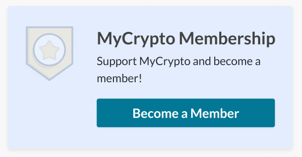

<Alert label="Memberships are available on the xDai and Polygon networks too.">

Ethereum gas fees can be a high barrier of entry to purchasing a MyCrypto Membership at times, so we've added support for purchasing memberships on the xDai and Polygon networks! Owning a MyCrypto Membership is the same regardless of the network you purchase it on -- as long as you have the Membership-holding account connected to MyCrypto, you're good to go.

</Alert>

The MyCrypto Membership is a monthly subscription that gives you additional features and helps to support MyCrypto’s future developments.

Buy a membership by visiting [app.mycrypto.com/membership](https://app.mycrypto.com/membership). This link is also available on your dashboard.

### What do I get in return for being a MyCrypto Member?

MyCrypto Membership, at its core, is a way for you to help us continue creating useful products. Essentially, MyCrypto Membership provides a sense of pride and accomplishment for purchasing it. Just kidding, [we’re not EA](https://www.reddit.com/r/StarWarsBattlefront/comments/7cff0b/seriously_i_paid_80_to_have_vader_locked/dppum98/).

While creating free and open-source products is extremely important to us, we need to take a look at things that can bring in a few bucks and allow us to keep the lights on. MyCrypto Membership helps us provide additional perks to our users in a way that we believe is worth paying for.

This is just the beginning, but right now being a MyCrypto Member gives you:

- Membership Badge & NFT
- MyCrypto Stickers
- MyCrypto Shirt (Requires annual or lifetime membership)
- Unlimited Protected Transactions
- Zero Ads
- [New!] Regular POAP NFT drops
- [New!] 10% Discount for Trezor Hardware Wallets
- [New!] Extra Faucet Testnet ETH (Rinkeby, Ropsten, Kovan, Goerli)
- [New!] Access to the exclusive MyCrypto Citadel

We have a lot of plans for the MyCrypto Membership and a long-term roadmap that will see many new rewards and features coming soon.

### How much does the MyCrypto Membership cost?

$10 per month, or you can purchase multiple month packages at a discounted rate. For the hardcore, there’s also a lifetime membership.

### How does the MyCrypto Membership work?

We use the [Unlock Protocol](https://unlock-protocol.com/) for this. You’ll be purchasing a token that unlocks features of MyCrypto when we detect that you hold that token. Each token has an expiration date according to the duration of membership you purchased. One membership unlocks the membership features for all the addresses in your interface, so you don't need additional memberships.

### What cryptocurrencies can I use to buy a Membership?

You can currently purchase a MyCrypto Membership on:

- the Ethereum network with DAI or [ETH](/how-to/getting-started/how-to-buy-ether-with-usd)
- the xDAI network with [xDAI](/general-knowledge/scaling/how-to-get-xdai)
- the Polygon network with USDC

If you don't have the tokens to purchase a membership, get some by using [MyCrypto Swap](https://app.mycrypto.com/swap?utm_medium=organic&utm_source=support&utm_campaign=membership) or our [fiat onramp](https://buy.mycrypto.com)!

### Can I give my token to someone else?

Sending your unique UnlockProtocol token to another address will result in that token being voided. This is done to prevent abuse of the system.

### Will the price stay the same forever?

As we continue to add features to the MyCrypto Membership, we may adjust the prices. However, if you have an active membership at the time we add new features, you will get access to those new features for no extra cost until your existing membership expires.

### Can I purchase MyCrypto Membership for a friend?

At this time you cannot purchase MyCrypto Membership for another account. We would like to implement this function at some point soon.

### Can I get a refund?

Unfortunately, no. We will not be offering refunds for MyCrypto Membership.

### How do I receive my MyCrypto stickers and / or shirt?

All MyCrypto Members can receive MyCrypto stickers, but you must have a year or lifetime membership in order to receive a MyCrypto shirt. Please [follow our instructions for receiving your MyCrypto shirt and other benefits](/general-knowledge/about-mycrypto/membership-rewards/).
