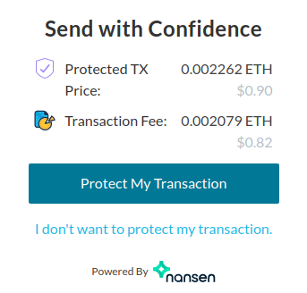

Protected transactions help you to send your funds in a safe way. When you protect a transaction, MyCrypto will automatically check the transaction, and everything around it, to ensure that your transaction is sent to the right person.

## Why use transaction protection?

MyCrypto's transaction protection has a couple of advantages:

- The recipient address will automatically be scanned for (suspicious) activity.
- You will be able to see more information about the recipient address, such as the balance and recent transactions.
- You can cancel a transaction for up to 20 seconds after sending it, in case you change your mind.

MyCrypto has an integration with [Nansen](https://nansen.ai/) for automatic analysis of Ethereum addresses. For more information about what Nansen does and how it works, please refer to [their website](https://nansen.ai/#about).

## How to protect a transaction

Protecting your transaction is easy. Make sure all fields are filled out, and simply click on the "Get Transaction Protection" button, on the "Send Assets" page. Note that you can currently only protect transactions when you send more than $5.00.

You will see an overview of the cost for the transaction protection on the bottom right side. Then click on "Protect My Transaction". You will have to sign and send an extra transaction.

After signing and sending the extra transaction, you will see a report of the address you're trying to send to. Additionally, you will be able to cancel your transaction for up to 20 seconds after sending it.
