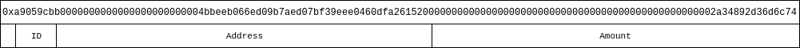
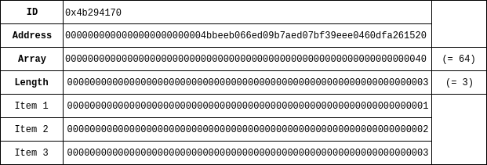
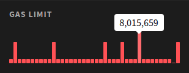

You may have noticed that when you're, for example, sending some tokens, or interacting with a contract in some different way, your transaction contains some input data. In this article you will find a technical explanation of transaction input data.

## What is input data?

Let's take a look at [this token transaction](https://etherscan.io/tx/0xa0d13ee62d9013ec0d704abe746e3e0fc1822771b8a039db0926d831971fa157). A person sent 0 ETH to [0xd26114cd6ee289accf82350c8d8487fedb8a0c07](https://etherscan.io/address/0xd26114cd6ee289accf82350c8d8487fedb8a0c07) (OmiseGo), but as you can see on Etherscan, it was a transaction for ~0.19 OMG (OmiseGo) to [this address](https://etherscan.io/address/0x4bbeeb066ed09b7aed07bf39eee0460dfa261520). So how did the EVM (Ethereum Virtual Machine) know that this person wanted to transfer this amount of tokens to another address?

If you look on Etherscan again, you will see that the transaction has some input data. This is extra data that you can include when sending a transaction. This can be regular text (formatted as a hexadecimal string), but in this case the person is using the input data to tell the contract to run a certain function. Contracts are built from a group of functions. For example, a ERC-20 token has functions like `transfer` and `balanceOf`, to transfer tokens from A to B and get the balance for an address respectively. For the transaction above, you can see on Etherscan that the function `transfer(address _to, uint256 _value)` was called.

### The Contract ABI specification

Most contracts follow the [Contract ABI specification](https://solidity.readthedocs.io/en/develop/abi-spec.html), which allows a website like Etherscan to automatically decode the input data, and show the exact action. The transaction above is a token transaction for a token that uses the [ERC-20 standard](https://github.com/ethereum/EIPs/blob/master/EIPS/eip-20.md). This means that we know all the possible functions and their signature. For example, the full signature for the `transfer` function of a ERC-20 contract is always `transfer(address,uint256)`. This function has two arguments: the address to transfer to and the amount of tokens as `uint256`, a unsigned 256-bit (32-byte) integer (a number from 0 to 2^256 - 1).

Solidity has a bunch of possible argument types that can be used. All of these argument types can be found in the Solidity documentation, [here](https://solidity.readthedocs.io/en/develop/abi-spec.html#types).

## Back to the input data...

The raw input data for the transaction above is `0xa9059cbb0000000000000000000000004bbeeb066ed09b7aed07bf39eee0460dfa26152000000000000000000000000000000000000000000000000002a34892d36d6c74`. You can separate this long hexadecimal string into a few smaller groups. `0x` simply means that the string is hexadecimal. The first 8 bytes after that (`a9059cbb`) are the function identifier. After that are all the function parameters in groups of exactly 32 bytes (or 64 hexadecimal characters). So, the first group is `0000000000000000000000004bbeeb066ed09b7aed07bf39eee0460dfa261520` and the second group is `000000000000000000000000000000000000000000000000002a34892d36d6c74`.



If you look at the formatted input data in Etherscan (the default), you will see the same thing:

```text
Function: transfer(address _to, uint256 _value)

MethodID: 0xa9059cbb
[0]:  0000000000000000000000004bbeeb066ed09b7aed07bf39eee0460dfa261520
[1]:  00000000000000000000000000000000000000000000000002a34892d36d6c74
```

### The function identifier

As we have learned, the function signature for the `transfer` function is `transfer(address,uint256)`. This signature is the same for every ERC-20 contract. To get the hexadecimal signature for this function, we have to take the first 4 bytes (8 hexadecimal characters) from the [SHA-3 (or Keccak-256)](https://en.wikipedia.org/wiki/SHA-3) hash of this function, e.g. `web3.utils.sha3('transfer(address,uint256)')`, which will output `0xa9059cbb2ab09eb219583f4a59a5d0623ade346d962bcd4e46b11da047c9049b`. If we take the first 8 characters (without the `0x`), we get `a9059cbb`, which matches with the `MethodID` above.

Another example: the function signature for the ERC-20 `approve` function is `approve(address,uint256)`. If we take the SHA-3 hash of this function, we get `0x095ea7b334ae44009aa867bfb386f5c3b4b443ac6f0ee573fa91c4608fbadfba` and the first 8 characters are `095ea7b3`, so the input data for an `approve` transaction will start with `0x095ea7b3`. For example, this transaction to the DAI token contract [here](https://etherscan.io/tx/0x6e8e85d2b839cc5b199785645c03b423cbf4188dd91896b49413d2ad1832e27d).

### The address and amount

Each argument (except for arrays and strings, we'll get to that), has a length of 32 bytes, or 64 hexadecimal characters, but Ethereum addresses are only 40 characters long (without the `0x`). To account for that, the address is padded with zeros. In a hexidecimal string, `0x0000123` is the same as `0x123`, so `0x0000000000000000000000004bbeeb066ed09b7aed07bf39eee0460dfa261520` (address) in the transaction above is the same as `0x4bbeeb066ed09b7aed07bf39eee0460dfa261520` and `0x00000000000000000000000000000000000000000000000002a34892d36d6c74` is the same as `0x2a34892d36d6c74`. So why use all the zeros then?

As we learned earlier, the maximum number in a Solidity contract is 2^256 - 1, which fits in exactly 32 bytes. Using a fixed length also makes it easier to decode the data, since you can assume that each group always has the same length.

### So what about arrays and strings?

An array is basically a list of items. For example, a list of 1, 2 and 3 would be written as `[1, 2, 3]`, in most programming languages. To send this data in a transaction, each individual item in the list is sent as 32 byte group and put at the end of the input data. A pointer to the length of the array is used as argument.

For example, lets say we have a function `myFunction` that takes an address and array of numbers (`myFunction(address,uint256[])`). The function signature for this function is `4b294170`. For the address, we'll use the same address as above. Because our array has 3 items, the length of the array as a hexadecimal string is 0x3. We know that each argument takes exactly 32 bytes and the array is put after all arguments, so the position of the array is 32 + 32 = 64 bytes.

The input data for this transaction will be: `0x4b2941700000000000000000000000004bbeeb066ed09b7aed07bf39eee0460dfa26152000000000000000000000000000000000000000000000000000000000000000400000000000000000000000000000000000000000000000000000000000000003000000000000000000000000000000000000000000000000000000000000000100000000000000000000000000000000000000000000000000000000000000020000000000000000000000000000000000000000000000000000000000000003`



Because strings can have an arbitrary length (longer than 32 bytes), they are separated into groups of 32 bytes and treated the same as arrays in the input data.

## How does a site like Etherscan decode the input data?

A hash is a one way function, so if you have the function signature hash, it's not possible to get the function signature from that hash (unless you bruteforce it). Contract owners can upload the contract ABI as [JSON](https://solidity.readthedocs.io/en/develop/abi-spec.html#json), like [this one here](https://api.etherscan.io/api?module=contract&action=getabi&address=0xfc668AE14b0F7702c04b105448fE733D96C558DF), which can be used to get the function signature hashes.

Even if the contract owner did not upload the contract ABI, it is possible to decode input data for many contracts. As you learned earlier in this article, the signatures for ERC-20 contract functions are always the same, for every contract that uses ERC-20, so Etherscan can simply use a pre-defined contract ABI for those contracts. For example, the contract ABI for the `transfer` function of an ERC-20 contract looks like this:

```json
{
  "constant": false,
  "inputs": [
    {
      "name": "_to",
      "type": "address"
    },
    {
      "name": "_value",
      "type": "uint256"
    }
  ],
  "name": "transfer",
  "outputs": [
    {
      "name": "",
      "type": "bool"
    }
  ],
  "payable": false,
  "stateMutability": "nonpayable",
  "type": "function"
}
```

## Is there a limit?

Is there a limit to the length of the input data? Yes and no. Ethereum does not have a fixed limit for the length of the input data, but the input data does consume gas. The maximum amount of gas in a single block fluctuates, but is about 8 million at the time of writing. Every 0-byte (`0x00`) consumes 4 gas and every non-0-byte consumes 68 gas. The gas cost for a standard transaction is 21,000, so not taking any contract execution into account, the maximum length for the input data right now is about 2 megabytes of zeros, or about 0.12 megabytes for only non-zeros. Since the input data is not likely to have just zeros or non-zeros, the actual limit is somewhere in between and depends on the input data.

If you want to see the actual block gas limit, you can use [ETHStats.net](https://ethstats.net/).



## Related articles

* [What is Gas?](/general-knowledge/ethereum-blockchain/what-is-gas)
