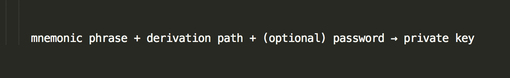

Cryptocurrency might be home to some of the most confusing naming conventions on Earth.

> What's the difference between "wallet" and "account"?
> Isn't MyCrypto a wallet?
> What's the difference between a seed phrase and a private key?
> Isn't my seed phrase my private key?

Fortunately, you're not the only one who might be confused, as much of the Ethereum ecosystem often uses these terms interchangeably.

## Defining a Wallet

Per Ethereum.org - _"Ethereum wallets are applications that let you interact with your Ethereum account. Think of it like an internet banking app – without the bank. Your wallet lets you read your balance, send transactions and connect to applications."_

Your wallet is where you are interacting with the Ethereum network. Even though that might sound quite clear so far, there are various wallet types, such as hardware wallets, web wallets, seed phrase wallets, or paper wallets. You might also come across terms such as "hot" and "cold" wallets.

The following will describe these wallets and the differences between them in further detail.

## Private Keys

A private key proves full ownership of an Ethereum account, which includes any and all funds on that account. A raw private key is a string of 64 characters, consisting of a combination of characters between A-F and 0-9, and could be written down on a piece of paper. No password is required, which means that if someone were to find your unencrypted private key, they could access your account easily.

Using raw private keys is not recommended, as they are [insecure](https://medium.com/mycrypto/a-safer-mycrypto-79d65196e7d8). If you were to access your account on a phishing site with a private key, the phishers would get full access to your wallet. However, if you still desire to create and use a wallet in this manner, you can generate them locally with the [MyCrypto Desktop App](https://download.mycrypto.com/).

## Web Wallets

Web wallets are wallets that you can access in your browser, typically with an email address and password login. In many cases, the company that owns the web wallet has custody (management) of your private key and its funds. You're essentially trusting that the website where you're storing your crypto is doing the right thing, and won't take your money from you.

Putting control back into your hands is something MyCrypto cares deeply for, and while web wallets might offer benefits such as being able to change the password in case you lose it, your funds are still in the hands of another entity and not your own.

MyCrypto is **not** a web wallet, as your private key is never sent to us, and everything you do with MyCrypto is performed locally on your computer. MyCrypto is known as noncustodial because of this.

## Keystore Files

Keystore files, commonly known as UTC/JSON files, are files that are generated using a private key + a password of your choosing, essentially encrypting the private key.

This is slightly safer than a raw private key, as you cannot "go backwards" to get the private key without having the password associated with your keystore file.

While slightly safer than a raw private key, this wallet type is still insecure, as phishers will get full access to your wallet if you mistakenly upload your keystore file + associated password to a phishing site.

## Mnemonic Phrases

Commonly referred to as seed phrases, secret phrases, recovery phrases, or 12- or 24-word phrases (depending on the length), mnemonic phrases are a group of random words. These can be used to derive a theoretically infinite number of accounts, are often used in combination with hardware wallets, and should be written down on a piece of paper by the user to safely back up their funds.

A derivation path is a numerical representation of which individual address (and related private key) you wish to access within a mnemonic phrase. Different applications might interact with these differently. Have you ever had trouble accessing your older Ethereum addresses when you use Ledger Live? The derivation path is why. Unlike a keystore file, there is no way to turn a private key into a mnemonic phrase. It’s a one-way street.

The biggest benefit of this kind of wallet is that instead of only supporting one account, it can derive an endless amount of them, with the same 12 or 24 words.

Also, it is optional to add an additional password on top of a mnemonic phrase, similar to how a Keystore File has a password. This is useful because accessing your wallets would require something you have (the mnemonic phrase) plus something you know (the password). Unfortunately, the mnemonic phrase is also seen as insecure because of the same phishing dangers like private keys and keystore files, but at the end of the day, this is all up to an individual’s level of awareness and security.

## Hardware Wallets

Hardware wallets, such as [Ledger](https://www.ledgerwallet.com/r/1985?path=/products/) or [Trezor](https://shop.trezor.io/?offer_id=10&aff_id=1735), are physical devices that require you to manually perform an action on the device in order to confirm a transaction from your account(s).

The device itself stores the private keys and signs transactions for you. MyCrypto is integrated with both Ledger and Trezor, so you can even use the same interface you are already familiar with. This ensures your keys aren't ever exposed to the internet. Phishers can't get them. Malware can't get them. Keyloggers can't get them.

Whatever solution you are currently using or might end up using, no solution is perfect at the end of the day. While private keys or mnemonic phrases might be the easiest solution, as they are the simplest to create, your funds might get stolen if this sensitive information falls into the wrong hands.

Even with hardware wallets, the solution we recommend most, whichever interface you might end up connecting your device to could potentially be compromised and send illegitimate transaction info to your hardware wallet in the hopes of you confirming it without double-checking the receiving address on the physical device itself.

We absolutely recommend being proactive about the [security of your funds](/staying-safe/protecting-yourself-and-your-funds), and hardware wallets are the single best way of ensuring private keys are contained on a separate device, preferably in an [offline environment](/how-to/offline/how-to-run-mycrypto-offline-and-locally).

- Buy a [Ledger](https://www.ledgerwallet.com/r/1985?path=/products/)
- Buy a [Trezor](https://shop.trezor.io/?offer_id=10&aff_id=1735)

## Related articles

- [Protecting Yourself and Your Funds](/staying-safe/protecting-yourself-and-your-funds)
- [How to Properly Save and Backup your Wallet](/how-to/backup-restore/how-to-save-back-up-your-wallet)
- [Hardware Wallet Recommendations](/staying-safe/hardware-wallet-recommendations)
