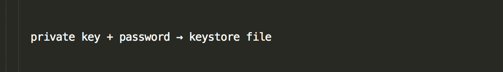
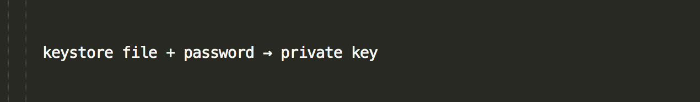

> What are the different types of private key formats that I can use to access my wallet?

The ETH is stored on the blockchain. Your private key, Keystore file, or whatever piece of information you have proves ownership of that ETH, which allows you to move it.

At the end of the day, you are always signing with your private key.

However, for additional functionality (like protecting it with a password), there are different formats and ways of storing your private key:

## MetaMask

* [Learn More Here](/how-to/migrating/moving-from-mycrypto-to-metamask)

## Hardware Wallets

* [Learn More Here](/staying-safe/hardware-wallet-recommendations)

## Parity Signer

* [Learn More Here](/how-to/accessing-wallet/how-to-use-the-parity-signer-with-mycrypto)

## Keystore File (UTC / JSON)

A keystore file is a file that is generated using your private key + a password of your choosing. Using fancy math and code…

If you only have the keystore file (without the password), you cannot “go backward” to get the private key. However, if you combine the password with the keystore file, you can use fancy math and code…

* This is encrypted by the password you chose.
* If you cannot use one of the options above, this is the recommended version to save.
* This Keystore file matches the format used by Mist so you can easily import it in the future.
* Make sure to have multiple backups.
* Keystore files are insecure. If you unlock your account on a phishing site with a Keystore file, the phishers will get full access to your wallet. Use one of the options above, or the [MyCrypto Desktop App](https://download.mycrypto.com/).

[How to Properly Save and Backup Your Wallet](/how-to/backup-restore/how-to-save-back-up-your-wallet)

## Mnemonic Phrase

A mnemonic phrase is actually a whole bunch of private keys, represented by a 12- or 24-word phrase that looks something like: brain surround have swap horror body response double fire dumb bring hazard. Again, using fancy math and code…

The derivation path is a numerical representation of which private key / address you wish to access. Have you ever had trouble accessing your older Ethereum addresses when you use Ledger Live? The derivation path is why. Unlike a keystore file, there is no way to turn a private key into a mnemonic phrase. It’s a one way street.

* Typically, these come in 12-word or 24-word strings.
* They can derive multiple addresses, meaning your phrase actually is able to create multiple accounts, addresses, and private keys.
* [MyCrypto](https://download.mycrypto.com), Ledger, TREZOR, MetaMask, and Jaxx create these for you.
* Mnemonic phrases are insecure. If you unlock your account on a phishing site with a mnemonic phrase, the phishers will get full access to your wallet. Use one of the options above, or the [MyCrypto Desktop App](https://download.mycrypto.com/).

## Private Key (Unencrypted)

* This is the unencrypted text version of your private key, meaning no password is necessary.
* If someone were to find your unencrypted private key, they could access your wallet without a password.
* For this reason, encrypted versions are typically recommended. To learn about how you can encrypt your private key, [click here for more information](/how-to/migrating/how-to-change-your-wallet-password-unencrypted-to-encrypted).
* However, you should print the paper wallet or save this in an **offline** environment (like a piece of paper or USB drive). This ensures a lost password does not result in lost ETH, and acts as another backup.
* Private keys are insecure. If you unlock your account on a phishing site with a private key, the phishers will get full access to your wallet. Use one of the options above, or the [MyCrypto Desktop App](https://download.mycrypto.com/).

## Related articles

* [Protecting Yourself and Your Funds](/staying-safe/protecting-yourself-and-your-funds)
* [How to Properly Save and Backup your Wallet](/how-to/backup-restore/how-to-save-back-up-your-wallet)
