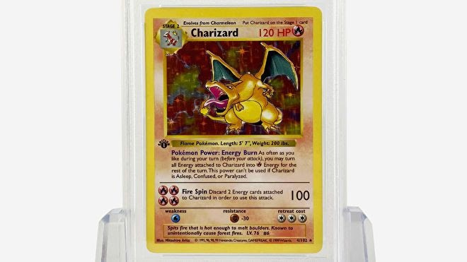
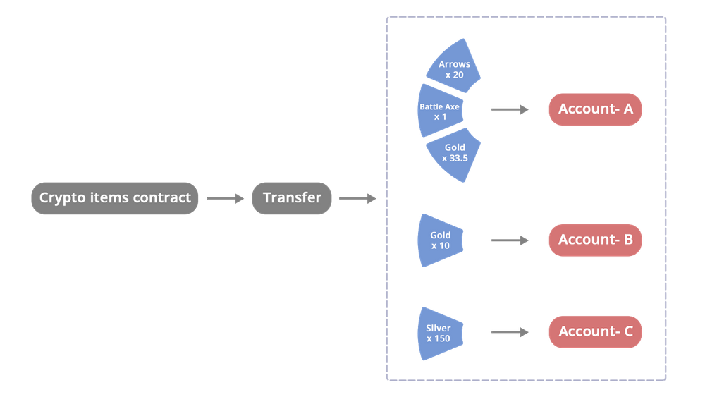

What does Non-Fungible Token actually mean? Fungibility is defined by Merriam-Webster as:

> "being something (such as money or a commodity) of such a nature that one part or quantity may be replaced by another equal part or quantity in paying a debt or settling an account"

For example, Ethereum and Bitcoin are both fungible. There is nothing unique about the ETH that I hold, versus the ETH that you hold - they are the exact same and equally fungible. Outside of crypto if I show you my Holographic Charizard, that is an example of a non-fungible item. Other examples of non-fungible items are things like baseball cards, cars, and even houses.

NFTs factor into all this by being a token on the blockchain that is tied to and represents a unique non-fungible item, such as the 10,000 uniquely individual [CryptoPunks](https://www.larvalabs.com/cryptopunks). Other examples that are quite popular now include [Dreamloops](https://bitlectrolabs.com/), [Bored Ape Yacht Club](https://boredapeyachtclub.com/), and [NFTBoxes](https://www.nftboxes.io/) from [Pranksy](https://twitter.com/pranksyNFT).

## Breaking Down NFTs on the Blockchain

ERC-20 is the token standard that you’re likely already familiar with - it is the current standard of "fungible" ETH tokens. [The ERC-20 standard was implemented in 2015](https://eips.ethereum.org/EIPS/eip-20) and introduced token contracts for the first time. This eventually gave way to new markets and tokens in the Decentralized Finance (or DeFi) space.

[ERC-721 dropped in early 2018](https://eips.ethereum.org/EIPS/eip-721), and the EIP (Ethereum Improvement Proposals) first described NFTs as deeds, which still happens to be a great summary. Owning an ERC-721 means that you own a unique NFT (which can also be viewed as the deed to whatever art/music/etc that is attached to it) on the Ethereum blockchain. NFTs were popping up here and there before ERC-721 came out, including the cult-favorite CryptoPunks. [LarvaLabs](https://larvalabs.com/), the creator of CryptoPunks changed a bit of the ERC-20 code so each token they sent out to initial adopters was its own unique ERC-20-like token (LarvaLabs describes it as “almost an ERC-20 token”). The work that the team at LarvaLabs did was some of the early inspiration for the ERC-721 standard.

Now we come to the latest piece in Ethereum token standards of today and that is ERC-1155. [ERC-1155](https://eips.ethereum.org/EIPS/eip-1155) combines both ERC-20 and ERC-721 to create a token that can be fungible, non-fungible, or even semi-fungible. Semi-fungible tokens could revolutionize ticketing to concerts, sporting events, or even to act as simple as coupons for your local grocery store, but many organizations have not yet pushed into that space.

ERC-1155 works towards bridging all the standards together into one token. This works well for NFTs that are not truly 1-of-1, where there are multiple copies of each one made (ex. 100/100). Games that are run off the blockchain are able now to mint ERC-1155 tokens in a non-fungible state as in-game items and in a fungible state as in-game points. Creators are also able to mint tokens using less gas because you can combine the non-fungible/fungible tokens in a single smart contract. ERC-1155 is truly the best of both worlds, but it is all situational in what type of token you are working with.

The NFT market is still fairly new and can be dangerous. If you stay vigilant you should have no problem navigating the open seas of NFTs (pun intended). These common scams should increase your awareness, but should not scare you off from getting into the market. Whether it be for investing, collecting, or just because you respect the artist or love the piece, get out there and do it! The NFT community is strong and tight-knit, and any member of the community would be more than happy to help with anything. If you enjoyed this article, feel free to take a look at the previous one we published on [the relationship between NFTs and IPFS](https://blog.mycrypto.com/ipfs-and-nft-the-relationship/).

sdfhsdjkfh

## Related articles

- [Common NFT scams](/staying-safe/common-scams/common-nft-scams)
