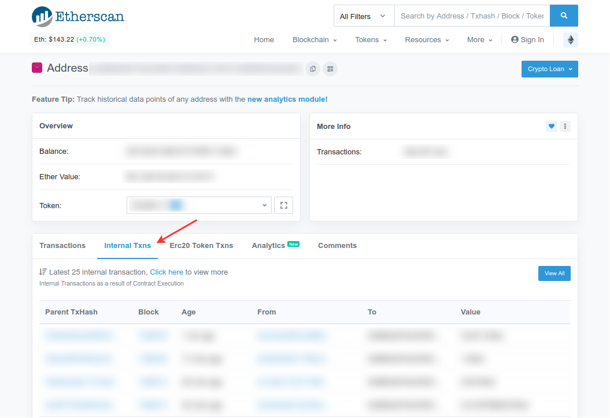

Internal transactions, despite the name (which isn't part of the yellow paper but is a convention people have settled on), are not actual transactions. They are also not included directly in the blockchain; they are value transfers that were initiated by executing a smart contract (smart contract Ether or token transfer).

Certain Ether and token transfers require calling a smart contract to perform the action. These show up as internal transactions and are not indicated in the main ETH transaction history on etherscan.io. There should be a separate tab for "Internal Transactions" when you look up your wallet address in [Etherscan](https://etherscan.io/).

When withdrawing, you need to make sure that the receiving address supports smart contracts, like MyCrypto.

If you can't see your transaction, please take a look at our article [here](/troubleshooting/sending/transactions-not-showing-or-pending).

If you see that your transaction was successful but you can't see the tokens in your account, please refer to our article about [adding a custom token to your MyCrypto interface here](/how-to/tokens/showing-and-loading-tokens).
