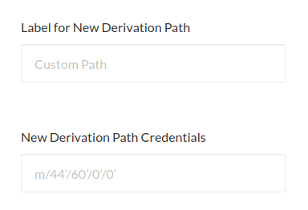

If you use a Secret Recovery Phrase or hardware wallet, you may come across the term "derivation path." In short, it specifies _which_ private key (and thus which address) is used. A derivation path looks something like this:

```text
m/44'/60'/0'/0/0
```

Note the extra "/0" at the end of the derivation path. This number is called the address index, and is used by MyCrypto to show you all the different addresses in the list. MyCrypto follows the [BIP-32](https://github.com/bitcoin/bips/blob/master/bip-0032.mediawiki) and [BIP-44](https://github.com/bitcoin/bips/blob/master/bip-0044.mediawiki) specification for this.



Each coin has its own base derivation path, to ensure that you get different addresses for each coin. That does not mean that you cannot use the same address for ETH (`m/44'/60'/0'/0/x`) and ETC (`m/44'/61'/0'/0/x`), but by default, these addresses are separated.

If you're interested in a full, technical explanation of how BIP-32 and BIP-44 work, please refer to [this article](https://blog.mycrypto.com/the-journey-from-mnemonic-phrase-to-address/).
