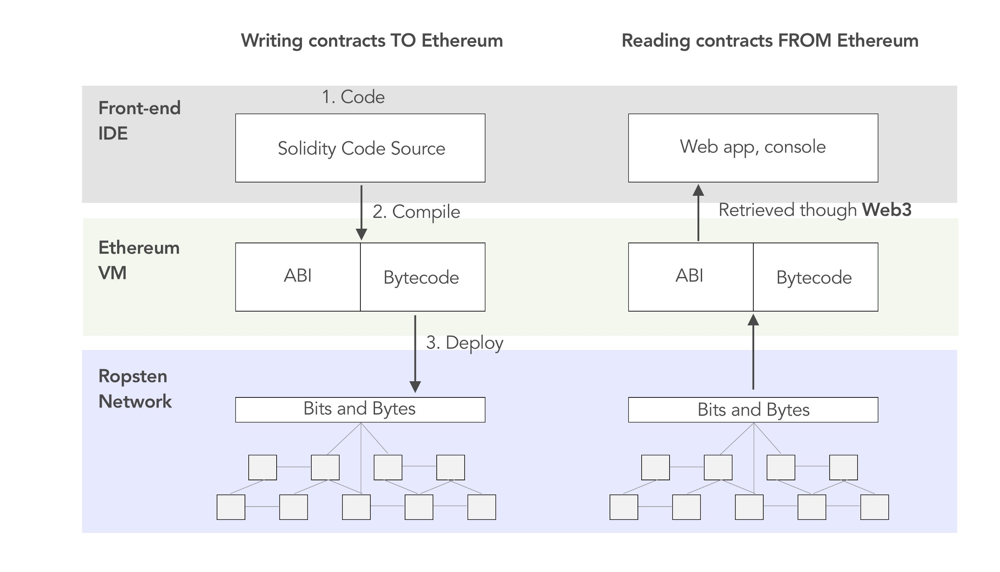
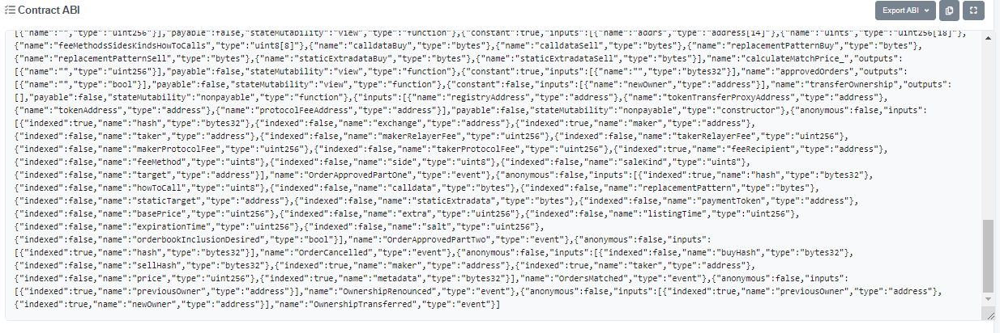

An Application Binary Interface (ABI) allows the MyCrypto interface to get very basic information about the functions and function types that are available in a smart contract. It is able to show functions in a way that is minimal and comprehensible. Without ABI we wouldn't be able to know if you want to `withdrawDeFiToken(amountOfDeFiToken)` or `setOwner (address)` or both, or neither.

## Where do I get the ABI for a contract?

MyCrypto should automatically pull the ABI for you, or you can find it on the Contract Page on Etherscan. For example, [here is the contract of OpenSea](https://etherscan.io/address/0x7be8076f4ea4a4ad08075c2508e481d6c946d12b#code) and the ABI:

