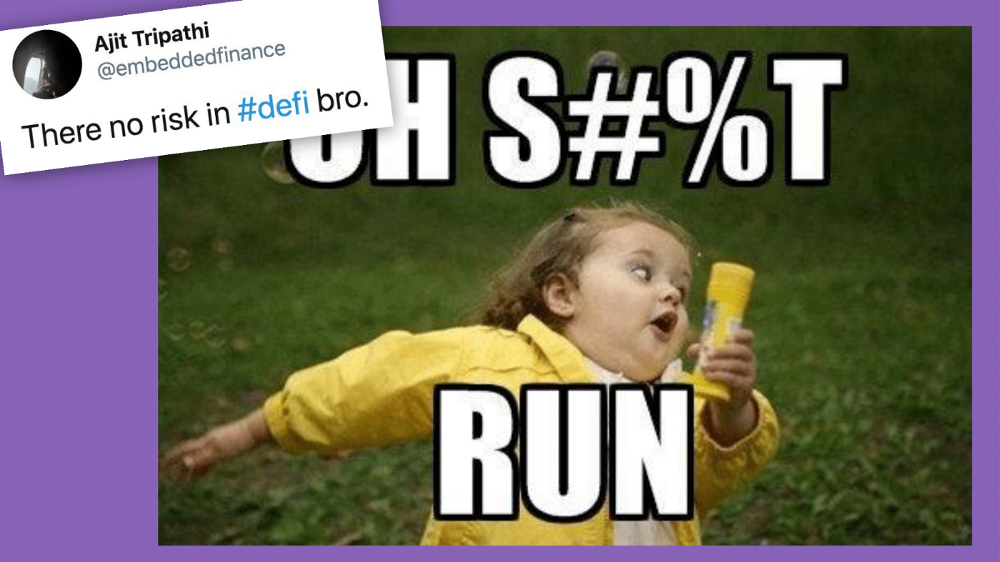
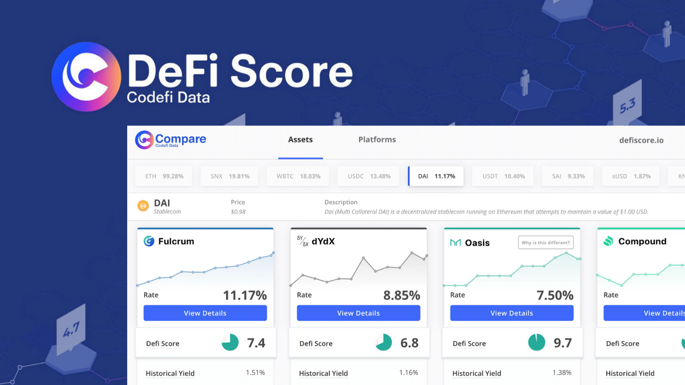
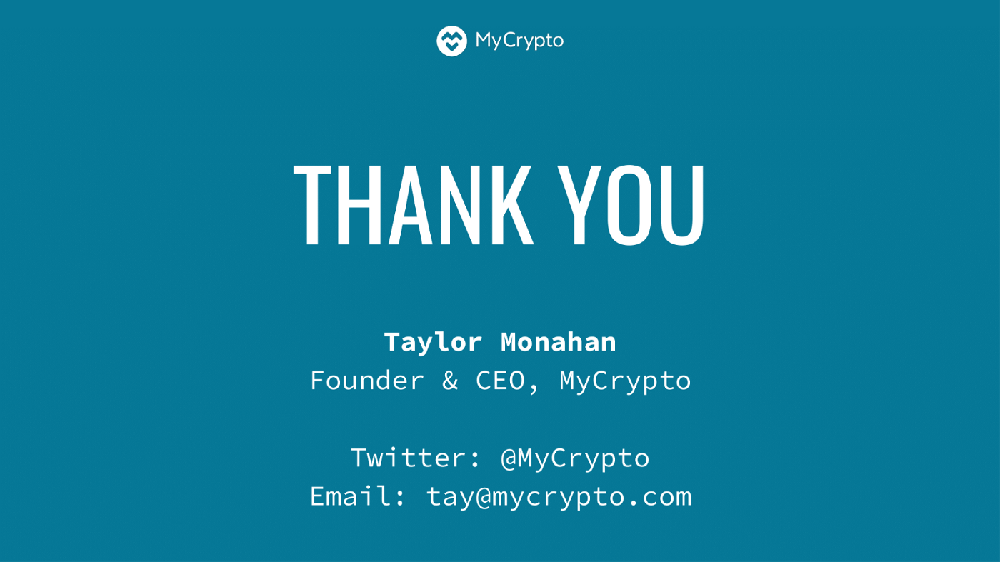

This article was originally a [talk Taylor gave at ETHDenver](https://youtu.be/gRBCD5nzBdQ?t=3000) in February 2020.

If you haven’t seen Risky Business, it’s a coming-of-age story starring Tom Cruise. In the movie, his parents go out of town, shit goes down, he has to find his way out of trouble, which only creates more trouble. The journey only remains adorable because the baby-faced Tom Cruise is so naive and just can’t catch a break. If he was any older or any less naive, his choices would be too irresponsible for anyone to overlook.

The crypto industry is like this in a lot of ways. We get away with things that we probably shouldn’t. We refuse to learn from our past mistakes. We refuse to admit that smart contracts shouldn’t be trusted yet. We use our idealism and naivety to defend each other when things go wrong.

Unfortunately, being naive doesn’t reduce risk, nor will it remain an acceptable excuse as time goes on. If we want to have a ‘coming of age’ story rather than a ‘fall flat on our face’ story, we cannot rely on being adorable to get away with the risky business we engage in.

If we don’t learn from history or remember what came before us, we are going to repeat it. We’re already starting to see this. If we look at the smart contract attacks, they’re the same type of attacks that have happened again and again and again.

## But what can we do to realistically reduce risk?

Broadly speaking, we need a **culture that mitigates and reduces risk**:

* **Self-awareness:** We should be aware of ourselves and the impact our actions have on people and the larger world around us.
* **Vigilance:** We should be vigilant about detecting the risks involved before they result in negative outcomes, whether those are risks to ourselves or those around us. We should also actively seek information to reduce the “unknown unknowns.”
* **Appreciation:** We should appreciate the complexity of these systems. We should appreciate the power we have and appreciate that we can affect actual, real people around us.
* **Paranoia:** We should have a higher level of fear and paranoia and skepticism in this space. If we don’t, it’s only going to be adorable for so long.

## What is risk?

Risk is the potential for bad things to happen. It’s the probability that something will not go as anticipated. It’s when you’re expecting one thing to happen — you’re expecting to make money, or expecting to save the world, or expecting to make this amazing product — and then you…do the opposite.

Risk pervades everything we do, and we are incredibly bad at reasoning about risk.

I’ve been reading way [too much about the evolution](https://www.wired.com/story/its-time-for-innovators-to-take-responsibility-for-their-creations/) of [the internet](https://nymag.com/intelligencer/2018/04/an-apology-for-the-internet-from-the-people-who-built-it.html). Those early builders were so idealistic and so optimistic, and yet today we live with the outcome of their creations. They never imagined the level of influence and control that Google and Facebook would come to have.

We need to be aware of what may come so that we can attempt to mitigate even the deep, moral risks. We don’t want to go down a path where we think that we’re connecting everyone and creating a new decentralized world when, in fact, we’re creating a super-efficient system to invade everyone’s privacy and exploit the entire global population.

There are many different types of risk. Some are very specific to financial markets and some are very specific to cryptocurrency and smart contracts.

One of the most interesting — and terrifying — things about DeFi is that it combines these two inherently risky things. We throw them together, mash them up, and then, for some reason, expect everything to be okay.

We’re gonna have to work incredibly hard if we want it to turn out okay.

**You are at risk each time these systems connect to each other, rely on each other, or build on top of each other**. With DeFi, we love to think about it as “DeFi Lego” but if the foundation is not solid, it’s actually “DeFi Jenga” and we’re going to fall on our face.

**You are at risk each time someone fails to uphold their end of an agreement**. DeFi does eliminate some of the counterparty risk, but you still see risks around liquidity, slippage, and old-fashioned human miscommunication.

**You are at risk each second that goes by where a DeFi system handling millions of dollars in user deposits is upgradeable**. If you don’t follow [Chris Blec on Twitter](https://twitter.com/ChrisBlec/status/1222237069516460036), you need to right now because he’s been doing [amazing research](https://docs.google.com/spreadsheets/d/1b9KwXfPPEgvpy2nxlpnLhtPMd7S5KfIx-hf4Hv77kBk/edit#gid=0) and attempting to determine [how these upgradeable smart contracts are secured](https://www.youtube.com/watch?v=U9fVIPhWj6c&feature=youtu.be). Is it just a private key? (It is for bZx, even though they promised a multisig & governance in 2018.) What’s protecting the smart contract code from being changed or controlled? What’s protecting all this money? Most (if not all) of these DeFi smart contracts are upgradeable. And…news flash! People get phished — even people who control complex smart contract systems.

The wide swath of risk can be a lot to take in and even more to manage. There are so many things that threaten individuals, the systems, and the interwoven system of systems.

What do these risks mean for the DeFi ecosystem? How bad can it be?

## February 15, 2020: Fulcrum / bZx

Well, at the time of this talk (February 15, 2020, @ 9:50am MST), a bad thing had just happened and people were trying to determine if this bad thing was a hack or exploit of the smart contract or something else. It was theorized that an attacker gained an approximate value of USD $350,000 via some complex means. Since then, more details have emerged that convolute the event further on just about every level. A similar exploit took place two days later, this time netting the attacker $650k.

However, in my opinion, it doesn’t matter if it’s a hack, exploit, vulnerability, or market manipulation. *Something* unexpected happened. And when unexpected things happen in financial markets, it’s very rarely good. When unexpected things happen that allow one party to gain $350,000, it usually means another party, or parties, lost $350,000.

The reason these exploits occurred was that some of the #DeFi systems connect, rely on, or build on each other in various ways. When the perpetrator combined positions across all these different platforms, he made a whole lot of money. But, again, when someone makes a lot of money, that usually means someone else loses a lot of money.

[Stani from Aave](https://twitter.com/StaniKulechov) forwarded this adept this message via Telegram detailing what the suspected exploit was. And while the analysis was sound, the ending bothered me:

Let’s take a step back. This is absurd. “Oh, well, at least our smart contract didn’t get hacked! I didn’t write bad code in the traditionally insecure way! I just wrote code that did something unexpected in a different way! 🍻”

This is why I say we need to be more diligent and more paranoid. Don’t hide behind legalese. Don’t shroud reality with fancy word choices. Trying to get away with something technically or legally does not negate the outcome of what actually happened and who it happened to. Instead, focus on making safe, secure products that don’t do unexpected things and don’t lose people’s money.

*[Note: It was later revealed that the attack was aided by manipulation / exploitation of the system but the real [exploit was enabled by a bug in the code](https://medium.com/@peckshield/bzx-hack-full-disclosure-with-detailed-profit-analysis-e6b1fa9b18fc).]*

**Anyways!** [Phil Daian](https://twitter.com/phildaian) chimed in with some very prescient thoughts, per usual, the morning of the attack. If you don’t know Phil, he has done immense research on this type of thing. [His Devcon 4 talk was pretty much this situation in a nutshell](https://www.youtube.com/watch?v=i-oWE8hg6-0). Anyway, he points out the following:

This is the stuff that needs to be top of mind for us all. I don’t have anything else to add.

And as much as we can learn from this attack itself, it’s especially painful considering the bZx team was forewarned about this style of attack in September 2019:

[Sam Sun](https://samczsun.com/) — a security researcher and white-hat, smart contract hacker extraordinaire — did [a writeup on DDEX and bZx (aka Fulcrum)](https://samczsun.com/taking-undercollateralized-loans-for-fun-and-for-profit/) where he looked at what happens if you manipulate the price feed that they rely on. (*To be clear: He responsibly disclosed the exploit(s) to the appropriate teams and assisted them during the fix process, just as he has done for [0x](https://samczsun.com/the-0x-vulnerability-explained/), [Curve](https://blog.curve.fi/vulnerability-disclosure/), [ENS](https://medium.com/the-ethereum-name-service/ens-registry-migration-bug-fix-new-features-64379193a5a), [Kyber](https://blog.kyber.network/anatomy-of-a-bridge-reserve-smart-contract-vulnerability-and-how-we-fixed-it-fc5c50d13238), [Cheeze Wizards](https://medium.com/dapperlabs/disclosure-forking-cheeze-wizards-smart-contracts-all-funds-and-wizards-are-secure-3c53af5bc531), [Livepeer](https://forum.livepeer.org/t/protocol-paused-for-bug-fix-upgrade-7-29-19-4-21pm-edt-update-protocol-resumed-as-of-8-40pm-edt/841/2), [Authereum](https://samczsun.com/authereum-meet-parity/), and others.🙇*)

He specifically looked at the markets to see if he could manipulate the price data in order to cause the smart contract to do things they probably shouldn’t. As these platforms rely on price data from Uniswap and Kyber, if an attacker could cause the price to spike momentarily, the DDEX/bZx smart contracts would give them a far bigger loan than they deserve. If this unexpected behavior resulted in someone making an insane amount of money, it means someone also lost money.

Sam further provided some great recommendations for all smart contract developers:

Dependencies are something we at [MyCrypto](https://mycrypto.com/) deal with on a daily basis. The JavaScript ecosystem relies heavily on npm, where including one dependency adds 50 more. It’s impossible to fully audit everything and we’ve seen various supply chain attacks that specifically target crypto products. However, just because you don’t have a package.json, it doesn’t mean you aren’t depending on others…as exemplified by these exploits.

This is my favorite line of this article:

Just because we think, or we assume, that some contract is secure, it doesn’t mean that there isn’t risk. That contract could be manipulated. That contract combined with your contract could be manipulated. Any number of things could harm your system and your users. In this case, it appears that four different DeFi platforms were combined and manipulated, resulting in a pretty epic exploit.

Okay, now back to your originally scheduled talk…

There’s a relatively new contract DeFi thing called Curve. They put their system on the mainnet without being fully audited. Guess what happened?

Yup. Sam Sun (again!) discovered a potential vulnerability. He disclosed it responsibly to the team and then everyone ran around like chickens with their heads cut off trying to get the funds out of the contract before people lost their money. And, thank goodness, they were able to do so. This allowed the creators of the contracts and their friends to save funds.

I know that we want to create amazing things. I know that this environment is exciting. But let’s be real. Deploying a smart contract on the mainnet, letting it grow to a million dollars, and expecting it to not be annihilated is a sign of arrogance, immaturity, and cluelessness. It is not adorable. And it’s going to get more dangerous as the market grows.

And while it’s easy to blame the creators for making insecure choices, some blame also falls on the community, on Curve’s users, and the loud voices in this space for not asking questions and pressuring teams to be transparent.

## Risk on top of risk on top of risk on top of risk…

Let’s look at how risk compounds as you use these products.

Let’s pretend I’m just a regular person and I hear about this “DeFi” thing where I can make 5%, maybe 8%, or maybe even 10% interest! Oh, and I can 2x or 20x or 100x long?! That’s amazing! So I grab my USD and use it to buy ETH.

This single process of going from USD to ETH carries all sorts of risks. There’s risk with holding crypto. There’s risk with the financial market. There’s also a risk that you get phished or you fall for a Twitter giveaway scam.

Then I decide I’m going to get some USDC because ETH is just a little too intense, but I still want to access the DeFi markets and I want to make some passive income. Once again, the process of trading ETH for USDC carries additional risk.

USDC, a centralized stablecoin, has to abide by regulations, so its token contract also contains a blacklist that allows its maintainers to freeze the tokens should they decide (or be compelled) to do so.

Just pretend that says USDC -> cUSDC, via Compound.

Now I want to put my USDC in Compound to earn interest. In return I get cUSDC.

And once again, this process carries a whole new set of risks. You can lose your keys. Smart contracts can be manipulated or outright hacked. Once my USDC is in Compound, I’m trusting that I can get my USDC back and trusting that the token contracts and Compound contracts remain unexploited.

And then I learn about TokenSets!!!! It’s super freaking cool. It is promising me all the money in the world!

I take my cUSDC and put it in the ETHRSIAPY set. Whoo! #DeFi!

Again, this process introduces new risks. Again, smart contracts can be hacked. Someone could front run the rebalancing of the orders at your expense. Let’s not even think about the tax implications and, of course, you could still have the risk of simply not making money because the market moves differently than you expected.

And the biggest problem: No one made this very clear to me at any point. Unless I read the fine print and ignore crypto Twitter, I’m going to be very surprised if I lose all my money.

If we zoom out and take this all in… that’s risky. That is risky business. And that’s what we’re doing right now. That’s DeFi.

The combination of risks that you take on in order to transform your USD into a position on TokenSets carries a wide variety of risks. This is why DeFi scares me. It’s the overlap of all the smart contract risks, all the technical risks, all the crypto risks, all the market risk, and all the financial risk.

We should be scared.

Obviously, I just did an example with USDC because it’s super fun due to the centralized ‘I can blacklist you!’ aspect. But we all know that the elephant in the room is Maker and DAI. I’m just going to leave it at that because we know it, they know it, we all know it.

If anyone ever tells you that there’s no risk in Ethereum or that DeFi is low-risk, you need to **just run**. That level of cockiness and arrogance will result in bad things happening.

Being unaware or in denial about potential risks is an indication they lack awareness of the impact of their actions. If someone who builds DeFi systems tells you this, yell about it before (or after) you run. Tell everyone you know. Shout it from the rooftops. Given how important it is for people to stay up-to-date in a rapidly evolving ecosystem, this is not the attitude you want smart contract developers to have.

It is one of the single biggest red flags that exists. It’s a bigger red flag than a contract without an audit because you can have your contracts audited, but it’s far harder to change the culture of the team. Trusting your money to someone who thinks they have built a perfect system is dangerous because they likely have gross disregard for users’ funds.

Just run. Run, run, run.

I’ve been hearing that some people think that I hate DeFi. To be clear: **I don’t hate DeFi**. In fact, I am super excited about DeFi. I don’t hate it. But it does scare me.

I think the potential of what we are creating here is amazing. One of the goals of crypto is to give people access to money that doesn’t have a central entity controlling it. Another goal is to “bank the unbanked.” That doesn’t just mean people can hold their money — it means that they can make that money work better for them. When money can move efficiently, the people, community, and world can improve because of it.

As much as I talk about the risks and how absurd certain things are, ultimately I want DeFi to succeed. I think we all do. But in order to succeed, we have to be aware of the risks so that we can mitigate and reduce those risks. This helps reduce the chance of failure.

If we walk down a path where we rely solely on our idealism and we refuse to heed anyone’s warnings, we won’t address the issues at our core. We need people to poke holes in our theories and our contracts. That’s how it becomes robust and increases the likelihood we will succeed.

The reason I dedicated an entire talk to this is because I think this is valuable *if we get it right*. I want us to get it right.

## So, how do we get it right? 👯‍♂️

We need to first **be aware of the risk**.

Then, we have to **reduce the risk**. This means getting rid of attack surfaces. Have fewer things that can go wrong. Don’t rely on external dependencies or systems.

Then, we have to **mitigate the risk**. If something does go wrong, which it will, can we make it so it doesn’t go really wrong? Instead of losing 100 million, is there a way to limit the loss to 100 thousand?

We see failure to properly mitigate risk all the time with security incidents. We focus on reducing the risk, thinking the only actions worth taking are the ones that eliminate the risk completely. We forget to make a plan for the worst-case scenario. We forget about the small things. How do you detect when something goes wrong? How do we know if something goes wrong? How do we address it quickly? How do we limit the amount of loss?

There’s this really awesome project called [DeFi Score](https://defiscore.io/). [Jordan Lyall](https://twitter.com/JordanLyall) and his team have been doing a ton of research into the types of risks found across the various DeFi platforms, and have been attempting to create a score that people can use to understand how risky — or safe — each platform is.

The most important thing about this tool is that it needs to be as comprehensive as possible. In this space, that’s hard. New knowledge becomes available every day, and we don’t have enough people thinking about this problem. We need to be able to look at the scores, share the scores, and ensure they are accurate and provide value where it’s most needed.

These scores should help people understand these platforms better. If you don’t identify the risk and truly communicate the risk, users cannot make a truly informed decision about the risk. People need to be aware of the risks **before** they throw all their money into DeFi. It should not be hidden in the fine print.

When I think about integrating DeFi products directly on MyCrypto, I think hard about the promises we are making to our users. People trust us. Do we want to imply that this thing is the most high-yield savings account ever? If our only goal is to get more users, sure. But if we care about our users, comparing a smart contract that has been used in production for a few months to a bank is pretty fucked up.

It’s especially important to be cognizant of what we say — and don’t say — as the market picks back up. It’ll be too late when you realize you aren’t only talking to experienced people who are hanging out in a bear market, but you’re also talking to people who just got into the space after being promised piles of money.

I don’t think that people realize where we’re at right now. This is the amount of ETH sent to The DAO contract over the month-long token creation period. This is a very traditional exponential curve.

And here are the ICOs in 2017. That’s the same crazy exponential growth. That was absolute madness. The amount of money put into The DAO should have been a warning that shit was about to go down. But it’s hard to notice when the market shifts from bearish to bullish, especially when the building never stopped being bullish. The DAO was made up of primarily experienced crypto people, just as DeFi is mostly experienced crypto people today. But over the course of the next year, we went from having three ICOs total to having three ICOs each day.

And here’s the DeFi graph now. Another hockey stick.

About six months ago, I said that lending will never be hype. **Today, I can say with 100% certainty that I was wrong.** We are officially in a market right now where DeFi platforms are hyped and they’re going to get even more hyped in the future. We will start seeing new people throw money in them.

That graph isn’t going to just drop off — even if shit gets hacked. We may see a pullback or we may see a stutter, but when you zoom out it’ll still follow that exponential curve.

Whether you’re talking on Twitter, writing copy for your product, or deciding whether you want to put a smart contract on mainnet unaudited, I want you to think about the attitudes that were so pervasive during The DAO and ICOs. We must try to help people as they rush into DeFi instead of counting their soon-to-be-lost dollars. Educate users, educate builders, and demand a higher level of service and safety. Think about the mistakes the ecosystem has made. Then, don’t make them again.

At the end of the day, you have a responsibility to yourself, your team, your employees, your peers, the community, and the ecosystem as a whole. If you do something that’s irresponsible, bad things happen and it affects a wide range of people.

You should be paranoid about that. It should scare you. That fear will help drive you to make responsible decisions.

## Honestly though, what can we do about this?

The very first thing that we need to do is talk about this.

1. We need to ask hard questions.
2. We need to engage in honest discourse.
3. We need to offer good faith feedback.
4. We need to ask questions in public. Don’t rush to Telegram or DM.
5. We need to be skeptical.
6. We need to encourage that skepticism in this space. When I first got into Bitcoin, nobody was trustworthy. Everyone was evil. You should be skeptical. Trust, but verify. Accountability. Transparency. These values have been somewhat lost.
7. Lastly, I would really love to see more public forums. Everything moves to Telegram channels, and it’s terrible. You can’t find relevant conversations via Google. You can’t stumble upon insights. Even if you are part of the chat, you can’t keep up with it. And there’s no history to learn from. One of the best things about The DAO is we can go back and read what we were thinking at the time. You can learn from the attitudes before, during, and after The DAO hack. That’s valuable.

Secondly, we need to secure, educate, and share. When I say secure, I mean secure everything:

* More secure smart contracts.
* Better research and tooling.
* Comprehensive audits and formal verification.
* Upgradability and key management. (Not just key management for the users, but for the admin functionality of the smart contracts.)

But if it all goes terribly wrong, please be transparent and share everything with the community. Share what happened, share how it felt, share how you fucked up, share what assumptions you made — everything. Let other people learn from your mistakes. You’ve already lost. The only way to turn it into a gain is by preventing future loss.

Lastly, we need more care and empathy. Being aggressive in the crypto space is normal, but there is a difference between being aggressive and being a bully.

*“OK Boomer”* is not an acceptable response to anything and it’s especially not an acceptable response to someone who just lost their money. It’s alienating. It’s mean. It makes us look like dicks.

Similarly, *“If they can’t write down 12 words they shouldn’t be in crypto!” Or, “Well, if they didn’t know the risk, then they shouldn’t have DeFi’d.”*

No. No, no, no.

**You** didn’t tell them the risks. **You’ve** been bragging about your product on Twitter. **You** have been telling everyone that it’s flawless and the most freaking amazing thing sent directly from the heavens to make everyone who touches it rich. **You don’t get to blame them** when they do what you said to do and, oops, it wasn’t actually secure. That’s not acceptable.

Have care and empathy for each other and for the user who loses their money. Even if, at the end of the day, it really was their fault, it doesn’t matter. It still sucks. They still lost their money. It’s still bad for the ecosystem. Those people don’t come back. You don’t lose all your money and be like, “Yeah crypto! Let’s do this! I love you!”

I’m so serious. Please do not underestimate the power of #FOMO. Do not underestimate the power of greed. It will make rational people do irrational things. It destroys things. Be careful.

## Shilly shill

In the past six weeks, the price of ETH is up ~115%. Visits to [beta.mycrypto.com](http://beta.mycrypto.com/), [mycrypto.com](http://mycrypto.com/), and our [knowledge base](https://support.mycrypto.com/) are up 68%, 75%, and ~130%, respectively.

That’s a bit crazy, right? What does that mean?

First, it means that not enough of you are checking out [beta.mycrypto.com](https://beta.mycrypto.com/).

Second, it means that people are looking for help. We’re seeing a greater increase in traffic to our knowledge base than we are to our actual product. The most visited article by a mile is “How to buy ETH.” This indicates that new users are entering the space, and we need to create more resources to help them. It can be shallow or it can be deep. Just share knowledge.

If you launched a product after January 2018, you’ve been basically chilling in a really amazing space. My one piece of advice for you is to read and absorb every piece of information that you possibly can about the bad things that have happened to those who came before you. Oh, and hire support people early because it’s really hard to train them when things are on fire.

For those who are just getting started: Be scared and be paranoid, but don’t let this talk completely demoralize you.

Experimentation is valuable — just do it in a safe way. There are many different testnets. You can limit the size of your contracts. You can do an alpha and then a beta. You can have a contingency plan. Have fun. Just don’t have so much fun that you lose everyone’s real money.

Lastly, for the OGs — the people who have been here since before The DAO and before ICO mania — I urge you to share your wisdom, knowledge, and experience. Share all that you have gained over the past years.

This knowledge needs to be shared, especially with the newcomers. When things get over-hyped or you sense something is off, the best thing you can do is **open your mouth**.

You can help keep everyone safer. You can help curb the hype. You can help prevent DeFi from becoming The DAO 2.0 or ICOfest 2.0.

At the end of the day, **the worst user experience is the one where people lose their money**. So quit it with all your fancy buttons and “we won’t save you” disclosures hiding in 2px font on a secret page, and pretend you care about people and their funds.

Okay, thanks! Love you, bye! 💖

