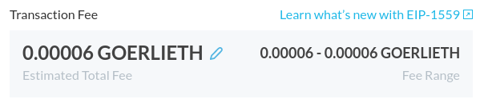
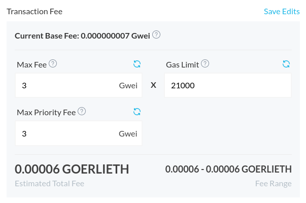

August 5th saw the deployment of the London hard fork, which includes various changes to how transaction fees are handled on Ethereum, aiming to make them more predictable. These changes are part of an Ethereum Improvement Proposal (EIP), known as EIP-1559.

## How did fees previously work?

Previously, the speed at which transactions were mined and their costs were set by a single Gas Price value. Transactions with the highest gas prices would get mined first, followed by those with lower gas prices in descending order. Sometimes, low-gas transactions wouldn't get mined at all if specified gas price wasn't high enough, causing the transaction to stay pending forever until it eventually gets dropped from the network.

This makes for a very unpredictable situation, in which the minimum gas price to get a transaction included changes all the time.

## EIP-1559

The new system introduces a **base fee**, which is an algorithmically determined fee to get a transaction through on the Ethereum network. Additionally, a **priority fee** is introduced, which can be seen as a tip to incentivize miners to prioritize your transaction before they consider other transactions.

In the previous system, all transaction fees were paid to the miners on the network. With EIP-1559, only the priority fee (and block rewards) go to the miners, while the base fee is burned.

## What will change for me?

You'll notice that you'll no longer find a transaction fee slider when you send a transaction with [app.mycrypto.com](https://app.mycrypto.com/). Instead, it will show an estimated fee that will be enough to get your transaction mined in a quick manner.

Keep in mind that the Ethereum network might still get congested, which can cause a high base fee. This update doesn't necessarily make transaction fees cheaper, but does give you a better sense of how busy the network is by looking at the base fee.

If you wish, you can manually change the transaction fee by clicking the pencil icon.

The **Max Fee** is the highest total gas price per gas unit that you're willing to spend on your transaction, and is a maximum that consists of both the base fee and priority fee. The **Max Priority Fee** is an optional amount that gets paid to the miner that processes your transaction. Keep in mind that the Max Priority Fee should not exceed the Max Fee.

## Related articles

- [This is EIP-1559](https://thedailygwei.substack.com/p/this-is-eip-1559-the-daily-gwei-300)
- [What is EIP-1559? How Will It Change Ethereum?](https://consensys.net/blog/quorum/what-is-eip-1559-how-will-it-change-ethereum/)
