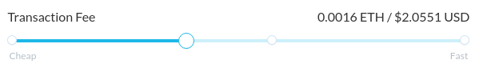

Ethereum is the network, also known as the blockchain. Ether (ETH) is the fuel for that network. When you send tokens, interact with a contract, send ETH, or do anything else on the blockchain, you must pay for that computation. That payment is calculated in gas, and gas is paid in ETH.

You are paying for the _computation_, regardless of whether your transaction succeeds or fails. Even if it fails, the miners must validate and execute your transaction _(compute)_ and therefore you must pay for that computation just like you would pay for a successful transaction.

You can see your transaction fee (`Gas limit` × `Gas price`) in ETH & USD when you search for your transaction on [Etherscan.io](https://etherscan.io). This is not a transaction fee that MyCrypto, or any other service provider, receives. This fee is paid to miners for mining transactions, putting them into blocks, and securing the blockchain.

## Overview

When you hear "Gas", the person is either talking about:

- Gas Limit
- Gas Price

The total cost of a transaction (the "transaction fee") is the gas limit, multiplied by the gas price. Typically, if someone just says "Gas", they are talking about the "Gas Limit". You can think of the gas limit like the amount of liters/gallons/units of gas for a car. You can think of the gas price as the cost of that liter/gallon/unit of gas:

- With a car, it's `$2.50 (price)` per `gallon (unit)`.
- With Ethereum, it's `20 Gwei (price)` per `gas (unit)`.

To fill up your "tank", it takes...

- `10 gallons` at `$2.50` = `$25`
- `21,000 units of gas` at `20 Gwei` = `0.00042 ETH`.

Therefore, the total transaction fee will be 0.00042 Ether. Note that Gwei is just a unit of Ether, and is equal to 0.000000001 ETH. You can use the converter in [this article](/general-knowledge/ethereum-blockchain/what-are-the-different-units-used-in-ethereum) to quickly convert from Gwei to Wei to Ether, which can be helpful when you want to know your transaction fee in ETH, rather than Gwei.

### Gas Limit

The gas limit is called the _limit_, because it's the maximum amount of units of gas you are willing to spend on a transaction. This avoids situations where there is an error somewhere in a contract, and you spend way too much Ether. MyCrypto will automatically estimate how much gas your transaction will use.

However, the units of gas necessary for a transaction are already defined by how much code is executed on the blockchain. If you do not want to spend as much on gas, lowering the gas limit won't help. You must include enough gas to cover the computational resources you use, or your transaction will run out of gas. A standard transaction, from address A to address B with no contracts involved, will use a fixed amount of 21,000 gas.

All unused gas is refunded to you at the end of a transaction, so if you go to MyCrypto, send 1 ETH to our donation address, and use a gas limit of 400,000 you will receive 400,000 - 21,000 back. However, if you were sending 1 ETH to a contract, and your transaction to the contract fails, your transaction may use the entire 400,000, and you receive nothing back.

If your transaction runs out of gas, you can refer to our article on [knowing which gas limit you should use](/how-to/sending/how-to-know-what-gas-limit-to-use).

### Gas Price

If you want to spend less on a transaction, you can do so by lowering the amount you pay per unit of gas. The price you pay for each unit increases or decreases how quickly your transaction will be mined.

You can adjust the gas price with the slider on the transaction page. It will automatically determine the "best" gas price, by looking at current network activity.

If you want, you can also manually adjust the gas price, by clicking on "+ Advanced". For the current recommended gas prices, you can refer to [ETH Gas Station](https://ethgasstation.info/).

## Related Articles

- [How To Know What Gas Price to Use](/how-to/sending/how-to-know-what-gas-price-to-use)
- [How To Know What Gas Limit to Use](/how-to/sending/how-to-know-what-gas-limit-to-use)
- [Gas Required Exceeds Allowance or Always Failing Transaction](/troubleshooting/sending/gas-required-exceeds-allowance-or-always-failing-transaction)
