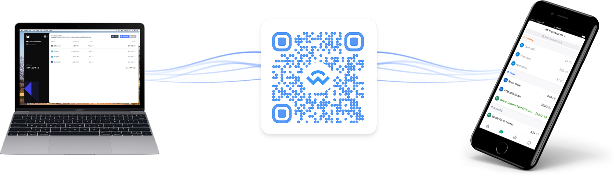
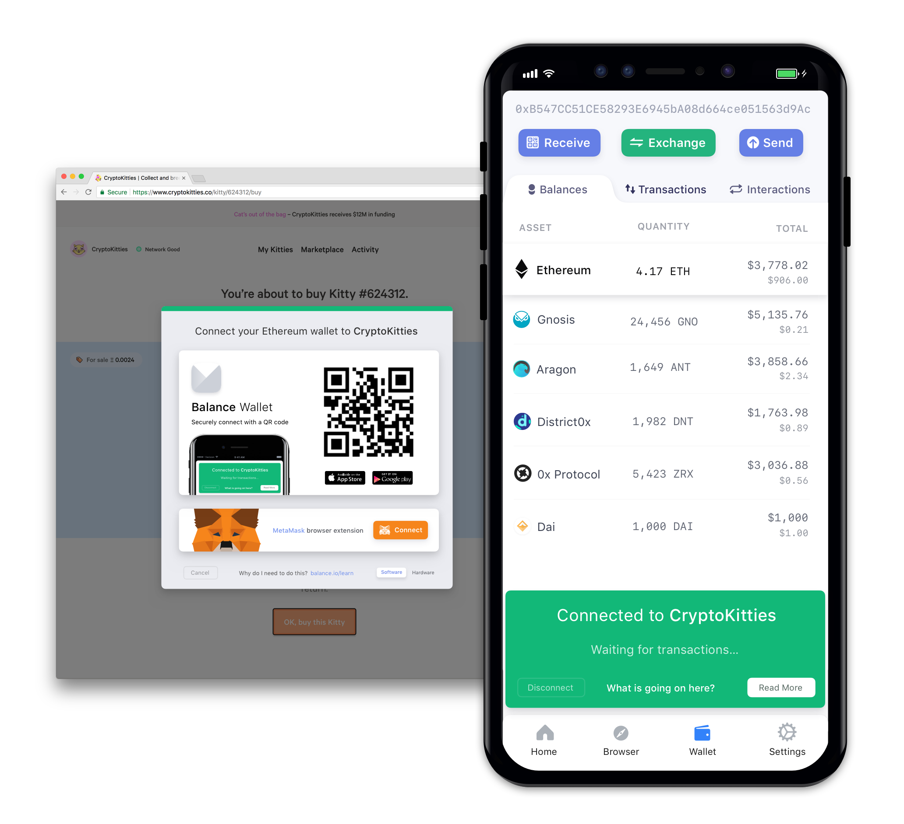

WalletConnect is an open protocol made to facilitate a secure connection between mobile cryptocurrency wallets and desktop applications, such as dapps. Transactions are made through an encrypted connection by scanning a QR code, and are confirmed on the mobile device. As the private key never leaves the user’s device, their funds are never at risk and the possibility of a hijack is very low.

WalletConnect was initially shared with the public by Richard Burton in [2018](https://medium.com/balance-io/walletbridge-a-simple-way-for-web-based-dapps-to-talk-to-mobile-wallets-5c4015f1838c), and is in active development. A plethora of mobile wallets currently support the WalletConnect protocol, such as [Ambo](https://www.ambo.io/), [Trust](https://trustwallet.com/), [Argent](https://www.argent.xyz/), and the [mobile Metamask app](https://metamask.io/).

## Why should I use WalletConnect?

A few of the most popular options for interacting with a dapp include using a desktop browser-only extension like [Metamask](https://metamask.io/), or a mobile wallet/Ethereum browser like [Cipher](https://www.cipherbrowser.com/) or [Status](https://status.im/). The problem with these solutions is that funds are generally ‘stuck’ on one platform, and would make it difficult to switch between mobile and desktop, unless the recovery phrase would be exported which could result in serious security implications.

With WalletConnect, only one device, like a mobile wallet, needs to store the funds and that device is enabled to interact with dapps on a different platform, like a desktop. This way, the funds never leave the original source, but the user can still utilize different dapps on other devices to manage their crypto.

## How does it work?

A supported dapp will allow you to access your address by scanning a QR code with your mobile wallet. Once scanned, the mobile app will ask you to confirm that you want to share your wallet address with the dapp.

Once this is confirmed, the dapp won’t actually be able to send any transactions from the address that was just connected on its own. You must make an additional, manual confirmation for each transaction that’s made on the dapp interface from your mobile device. This way, the private key is always securely stored on your device, and you have full control of which transactions get broadcast to the network.

## Is WalletConnect safe?

With WalletConnect, the transaction signature is conducted on your mobile device's WalletConnect app. The considerations for this are that you need to make sure the transaction sent to WalletConnect is the transaction you intend to send (is it the correct recipient address and amount) and you need to make sure that your WalletConnect Mobile app is not changing the transaction and submitting a malicious transaction (intending to route your funds to malicious entity) back. This relies primarily on the security of the WalletConnect app you use.

WalletConnect mobile apps do not expose your private key to MyCrypto, similar to how hardware wallets don't expose your private key to MyCrypto. However, mobile apps are NOT as safe as hardware wallets because hardware wallets have well-defined security models and usually have specific security-oriented hardware that allows them to more-safely store and interact with your private keys.

## Further reading

* [How to Use WalletConnect with MyCrypto](/how-to/accessing-wallet/how-to-use-walletconnect-with-mycrypto)
* [WalletConnect: A simple way for web-based dapps to talk to mobile wallets](https://medium.com/balance-io/walletbridge-a-simple-way-for-web-based-dapps-to-talk-to-mobile-wallets-5c4015f1838c)
* [Exploring WalletConnect | Facilitating communication between desktop dapps & mobile wallets!](https://medium.com/@dedicatedguy/exploring-walletconnect-facilitating-thcommunication-between-desktop-dapps-mobile-wallets-f0a4424c0c2c)
