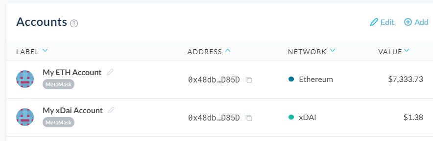

If you want one place to view and manage all of your xDai accounts at once, you’ll want to get set up with MyCrypto.

1. Visit [app.mycrypto.com/add-account](https://app.mycrypto.com/add-account/)
2. Select the wallet you’ll be connecting to MyCrypto. _Note: click [View Address](/how-to/accessing-wallet/how-does-view-address-work) if you only plan to track an account and not send from it._
3. Select the xDai network from the dropdown. _Note: If you’re using MetaMask, you will not see this dropdown and you’ll need to make sure you’ve selected the xDai network within MetaMask before continuing._

4. Continue to connect, and check out your xDai account(s) on your MyCrypto dashboard, right alongside any other accounts you have!

As mentioned earlier, you can use the same account for Ethereum and for xDai, so we’ve made sure to distinguish your accounts separately according to the network they’re attached to. Note the above screenshot where it shows two separate listings for one address — one used with Ethereum, one used with xDai.

From here, you can view your balances and interact with MyCrypto features using your xDai account just like you would with an Ethereum account.

## Related Articles

- [What is the xDai chain?](/general-knowledge/scaling/what-is-the-xdai-chain)
- [How to get xDai](/general-knowledge/scaling/how-to-get-xdai)
