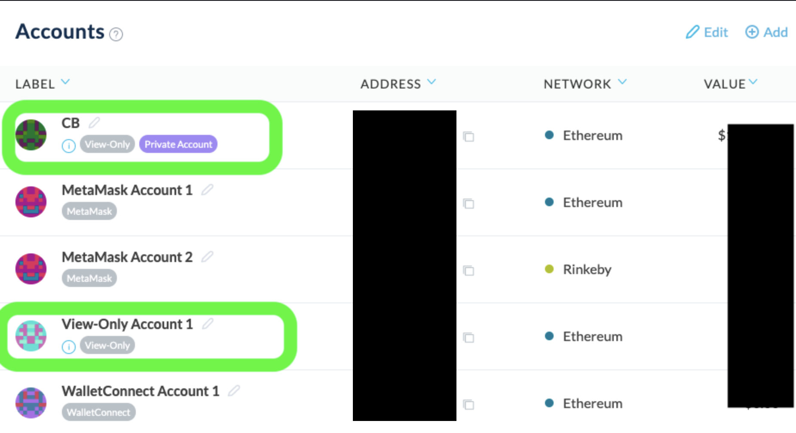
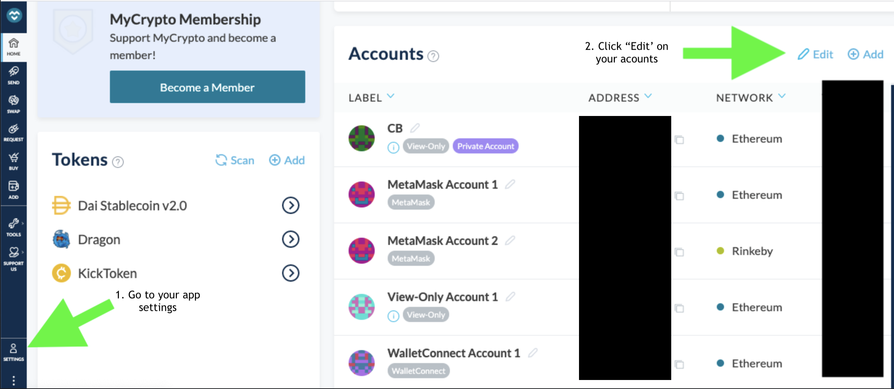
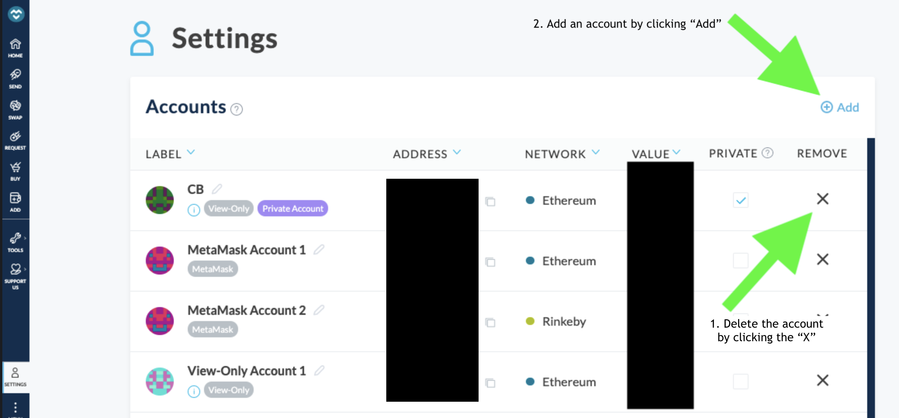
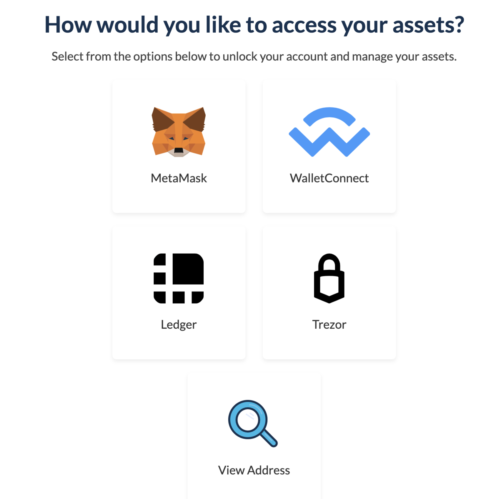

MyCrypto is a client-side application, which means that we never store your funds. Every address you access and transaction you generate is being done locally; nothing is actually sent to us. Your Ethereum address is public on the Ethereum blockchain, and everyone can see your balance and transactions you've made on the blockchain by using a tool such as Etherscan.

MyCrypto supports various methods of accessing your accounts (an account is made up of your public-facing address and your private key), like hardware wallets (Ledger and Trezor), MetaMask, WalletConnect, or private keys (by using our [desktop application](/how-to/offline/how-to-run-mycrypto-offline-and-locally)). All of these methods allow you to send transactions. The "View Address" functionality is just that: a way to view your address and its balances. You don't have to first unlock the address to add it to your interface, like you would with the other methods, and you can't send transactions since you're just viewing your address and its balances. (Please note that you can also use this function to view other people's addresses as well. If you don't have the private key to that address or a way to access it using another method, you will not have any control over the funds it holds.)

### View only

Adding a "view-only" account means that you will not be able to send a transaction from it. If you want the ability to SEND from this account, please choose another method of connection on the "Add Account" screen. Or, you can add it as "view-only" for now and connect it at another time.

## Changing from View-Only access to SEND Access

Click on "Settings" or "Edit"

After opening Settings, you simply need to remove the view-only address by clicking the "X", and then click "Add" so you can add your address through the actual method your address is stored on.

