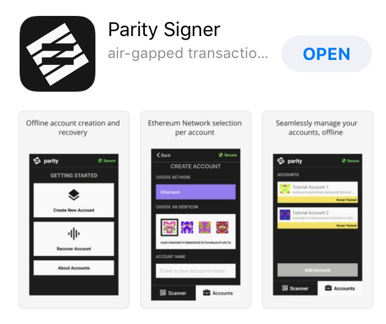
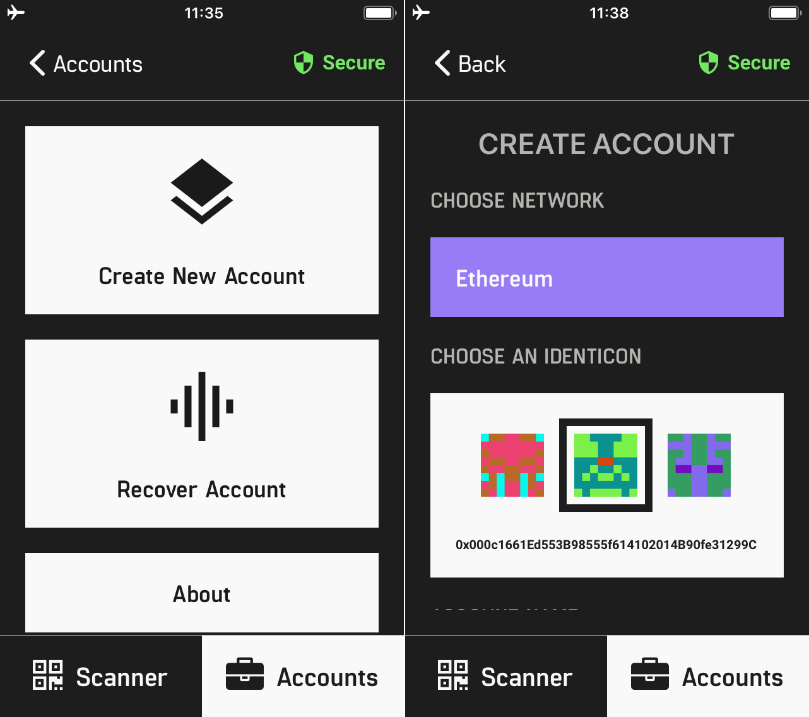
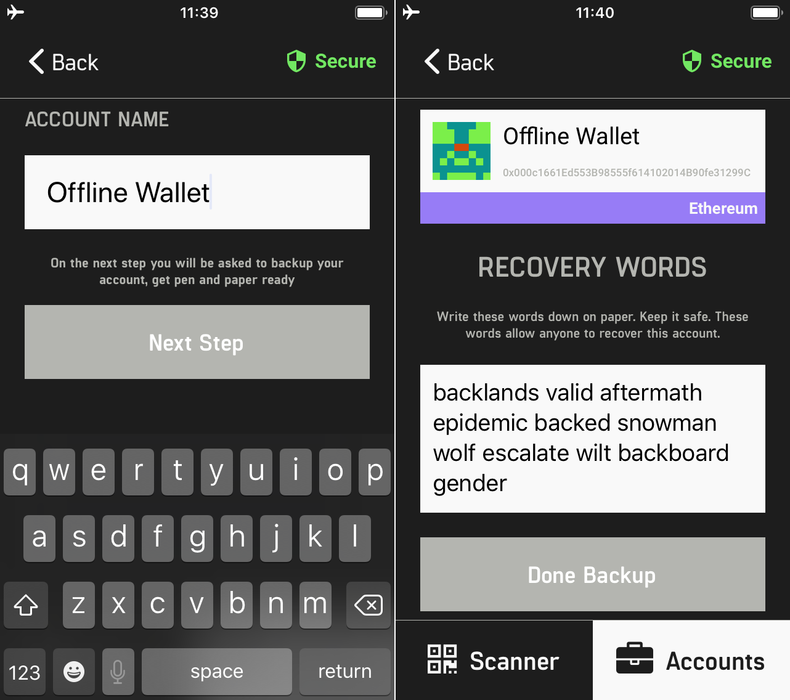
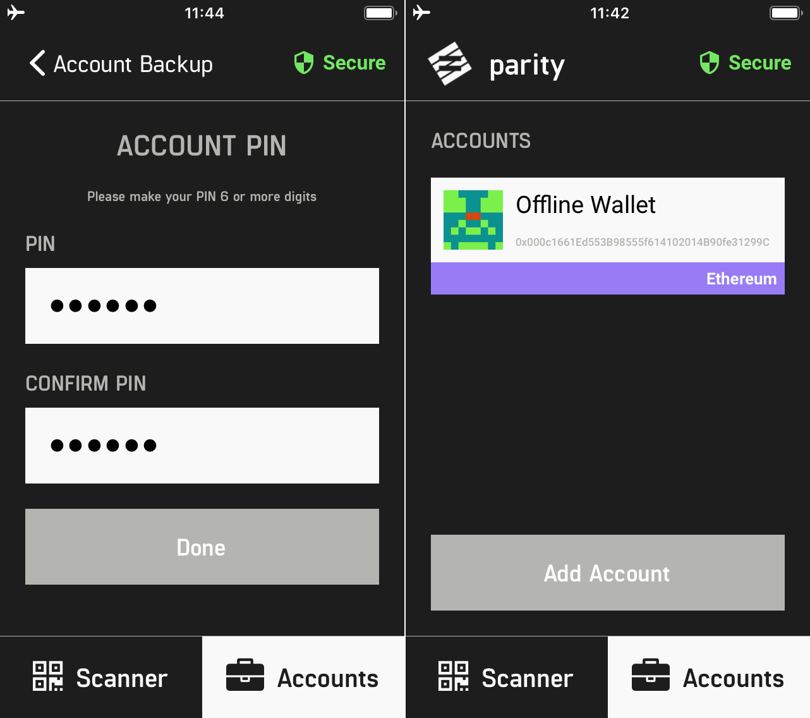
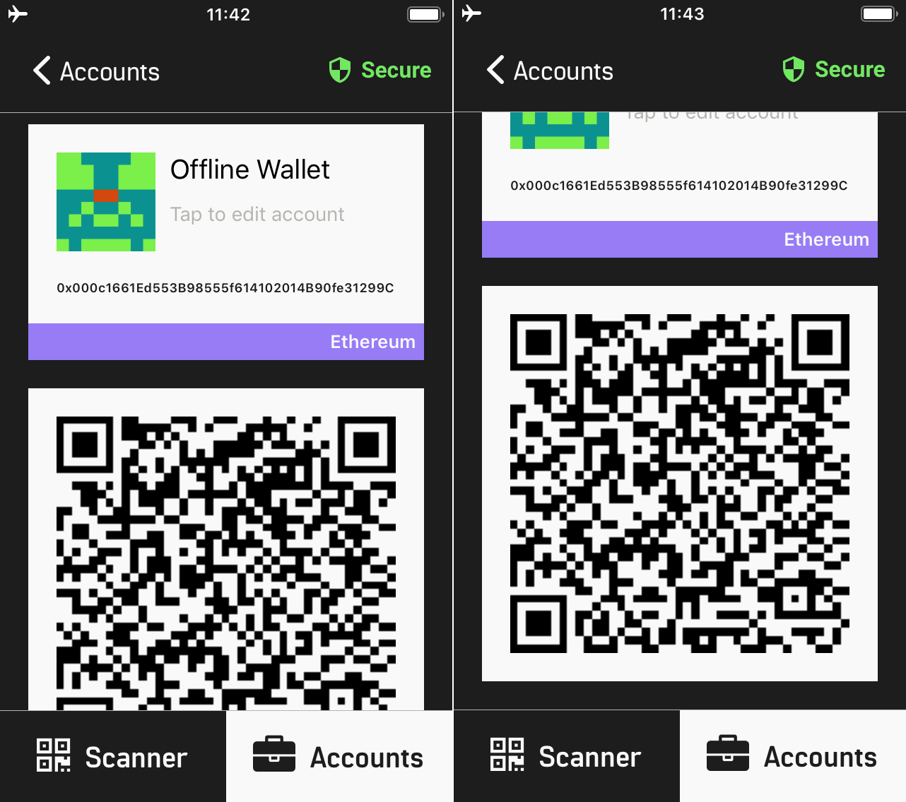
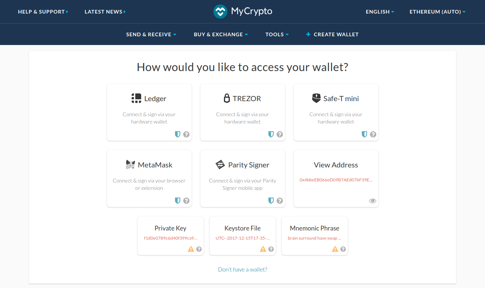
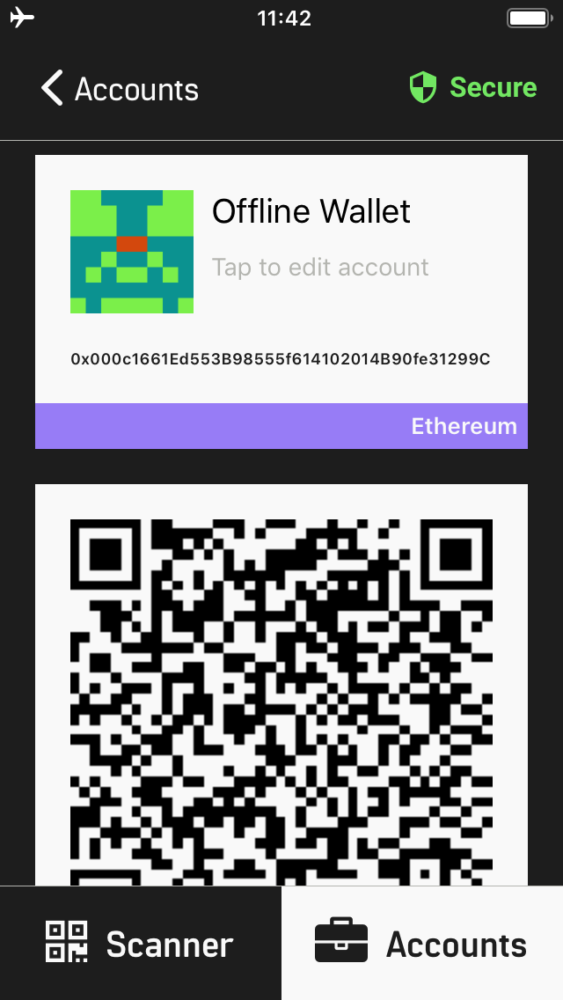
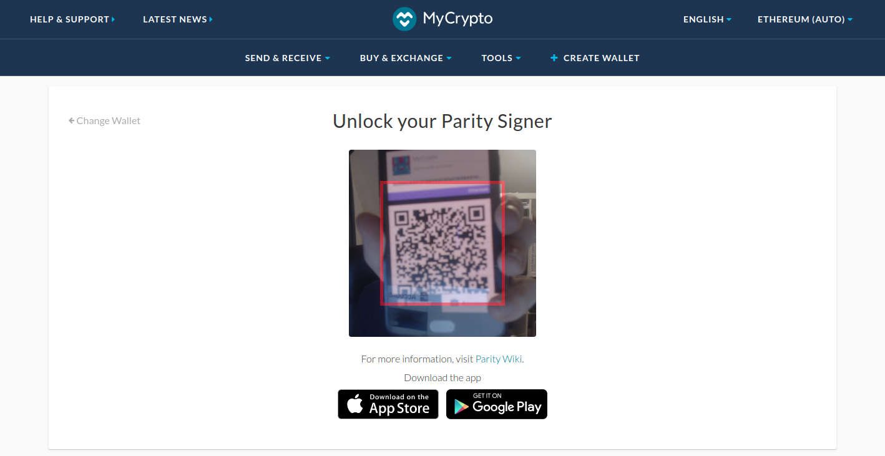
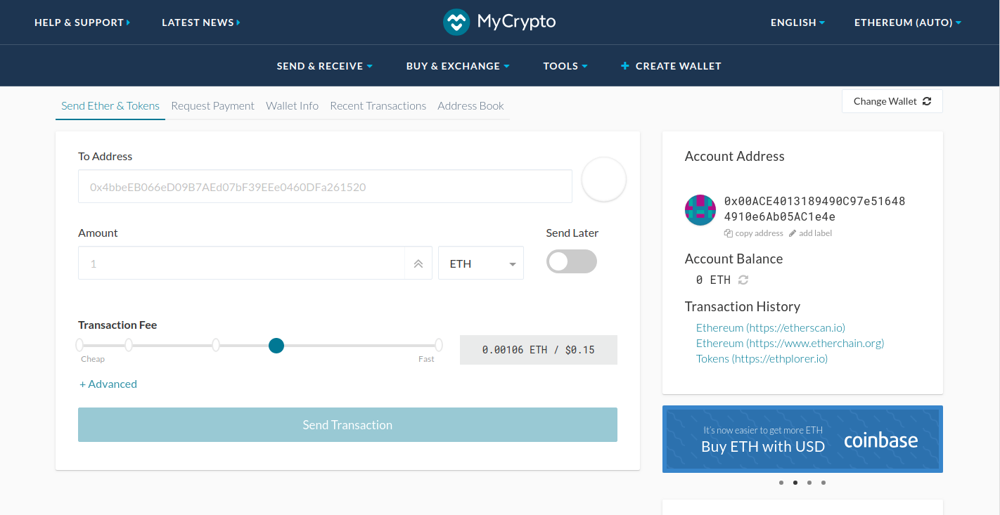

## What is the Parity Signer?

Parity Signer, available for iOS and Android, is an offline mobile app that securely generates and stores your Ethereum private keys. Most mobile wallets connect to the internet, but Parity Signer gives you one extra layer of security: it never connects to the internet and can be used air-gapped.

Parity Signer has been the perfect companion with Parity Wallet, allowing users to create “watch-only” accounts on their networked computers while keeping their keys safer in the open-source mobile app.

But now, you can also use MyCrypto to send transactions from your Parity Signer accounts without having to run your own Parity node.

## How to get started

1. Get the App

You can download the app for your device using one of the links below.

 

Currently, the Android app is still in beta, but it is publicly available via the link above.

2. Create a new account and select your identicon.

3. Fill in an account name.

Your recovery phrase and public address will be generated. After you type in your account name, make sure your back up your recovery phrase. Click [here](https://blockonomi.com/keep-recovery-seed-safe/) for more info on how to back up and store your recovery phrase.

4. Enter and confirm your PIN.

5. Account Name - Public Address - QR Code for Public Address

This public address and QR code can be used to send and receive ETH.

You can create multiple accounts by clicking on the "Accounts" button in the bottom right corner.

## Recover an account

If you already have an account created in Parity Signer Mobile App or Parity Wallet (Desktop), you can recover your account by following the instructions below.

1. Click on "Accounts" and click on "Recover Account."
2. Enter the account name.
3. Fill in the recovery words you wrote down when creating the wallet.
4. Set up a PIN code.

## Access your account from your phone with MyCrypto

1. Go to [MyCrypto.com](https://mycrypto.com/account).

2. Open the Parity Signer App on your phone and select the account you want to access. This will bring up your account info and QR Code.

3. Scan your QR code.

When you click on the Parity Signer button on MyCrypto's homepage, it will bring you to screen where you can scan your QR code. Make sure the camera on your PC / Mac is on. Position the QR code on your phone within the camera lines as presented on your PC / Mac.

4. View account details on MyCrypto.

Check to make sure your account details match up. From this screen, you can send transactions. NOTE: if you leave this screen, you will be logged out of your Parity address.

## Sending a transaction

1. Enter the amount and address you would like to send and click "Send Transaction."
2. From Parity Signer, tap "Scanner" and scan the QR Code presented by MyCrypto.
3. Review the details carefully and enter your PIN to sign the transaction offline.
4. Present your signed transaction QR code to MyCrypto to confirm and send!
   
[View FULL Tutorial on Parity's Wiki](https://wiki.parity.io/Parity-Signer-Mobile-App-MyCrypto-tutorial.html).

Make sure to first do a trial run with a small amount of Ether before sending larger amounts.

## Related articles & links

* [Parity Support](http://paritytech.io/)
* [Parity Privacy Policy](http://paritytech.io/legal/)
* [Parity Signer + MyCrypto Tutorial](https://wiki.parity.io/Parity-Signer-Mobile-App-MyCrypto-tutorial.html)
* [How to Keep your Recovery Seed/Phrase Secure](https://blockonomi.com/keep-recovery-seed-safe/)
* [Traditional Hardware Wallet Recommendations](/staying-safe/hardware-wallet-recommendations)
