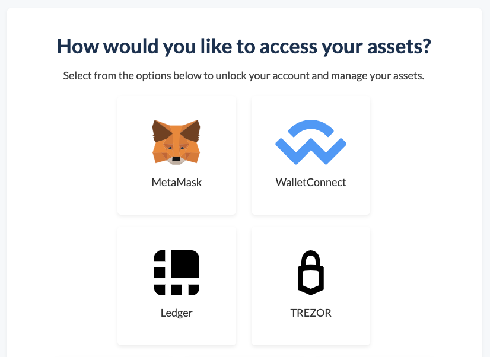
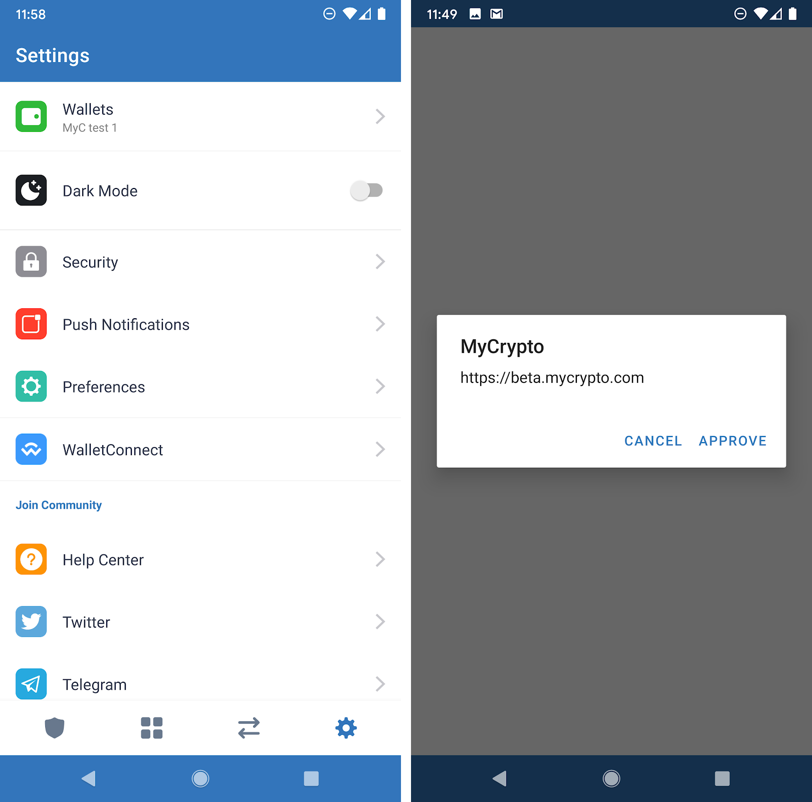
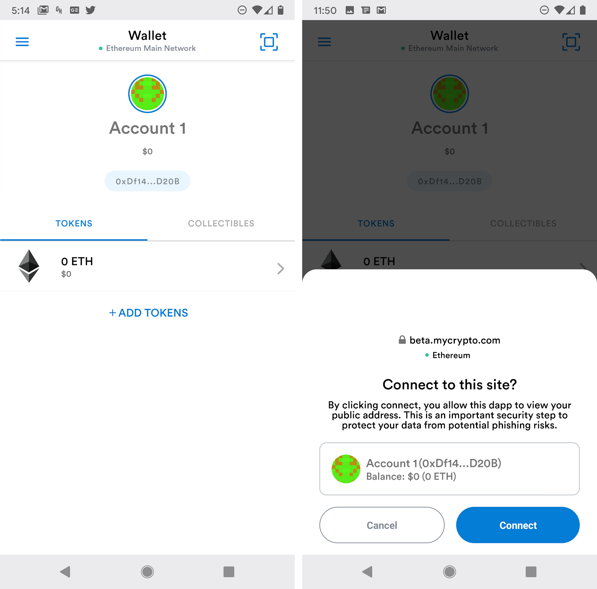
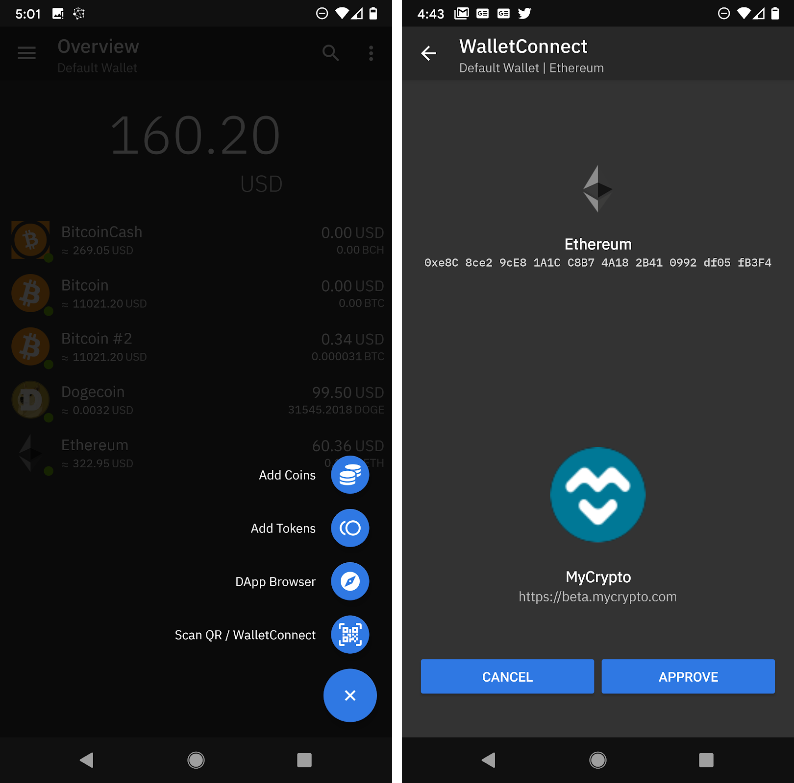

<Alert>

This feature is currently only found on MyCrypto beta, which you can find at [beta.mycrypto.com](https://beta.mycrypto.com/).

</Alert>

It is very easy to use your mobile wallet in conjunction with the functionality of MyCrypto. Many of the most widely used mobile wallets allow you to connect to web3 applications quickly and easily by using WalletConnect. It’s as simple as scanning a QR code with your phone.

First, you need to add your account to MyCrypto. On the add account screen, select WalletConnect, and the Ethereum network. Once you do this, it will display a QR code. Depending on which mobile wallet you are using, you either just scan the code the same way you would for any other mobile transaction, or check inside your settings for a WalletConnect option.

## How to connect using different mobile apps

These are just a couple of the available apps that support WalletConnect. If you're not using one of the apps mentioned here, you can still use WalletConnect with MyCrypto.

### Argent

Here is an example of how to do this using Argent:

<YouTubeEmbed id="MEG7G562NTA" />

### Trust Wallet

On Trust Wallet, go to Settings (Gear icon, bottom right corner). On the settings screen, select WalletConnect. This opens the camera to scan the QR code. After scanning, it should prompt you to approve the connection to MyCrypto. After this, the MyCrypto window should return to the dashboard, and your Trust Wallet account will be in your accounts list.

### MetaMask Mobile

In MetaMask, simply click on the scan icon (top right corner) and scan the QR code. A window at the bottom of the screen will then prompt you to connect. After this, the MyCrypto window should return to the dashboard, and your MetaMask account will be in your accounts list.

### Coinomi

To connect your Coinomi ETH wallet, begin by clicking on the plus (+) icon at the bottom right. Then click on "Scan QR / WalletConnect." After scanning the QR code, you will be prompted to approve the connection to MyCrypto. After this, the MyCrypto window should return to the dashboard, and your Coinomi ETH account will be in your accounts list.
