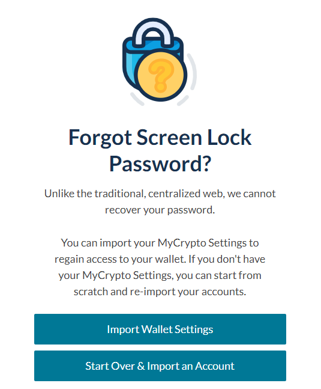

<Alert>

This feature is currently only found on MyCrypto beta, which you can find at [beta.mycrypto.com](https://beta.mycrypto.com/).

</Alert>

Screen Lock is a security feature that is intended to keep prying eyes away from your information. 

When you have your MyCrypto dashboard open and become inactive, Screen Lock will hide all of the information in your dashboard. This includes the addresses of the accounts you have added and the balances of those accounts.

Screen Lock is especially useful for when your device is accessible to more people than just you. 

## How do I set up Screen Lock?

When you have MyCrypto open and are inactive for a period of time (default is one minute), a countdown will appear. 

After that countdown ends, and if you have not set up Screen Lock already, you will be prompted to set up Screen Lock by entering a password.

After setting up a password for your Screen Lock, you’re good to go. Whenever you leave MyCrypto open and become inactive, the countdown will appear and will lock your screen. To unlock, simply enter the password you input before.

The default time for the countdown to appear is after one minute of inactivity. You can change this period of time in General Settings.

## What if I forget my Screen Lock password?

If you forget your Screen Lock password, you’ll start over and re-add your accounts to MyCrypto. This is a minor inconvenience, but MyCrypto does not store any of your information -  including your Screen Lock password - so we cannot recover that information.

To make this process easier, we encourage you to export your MyCrypto Settings on a regular basis. If you forget your Screen Lock password, you can easily start over by importing all your MyCrypto Settings that you previously exported.

