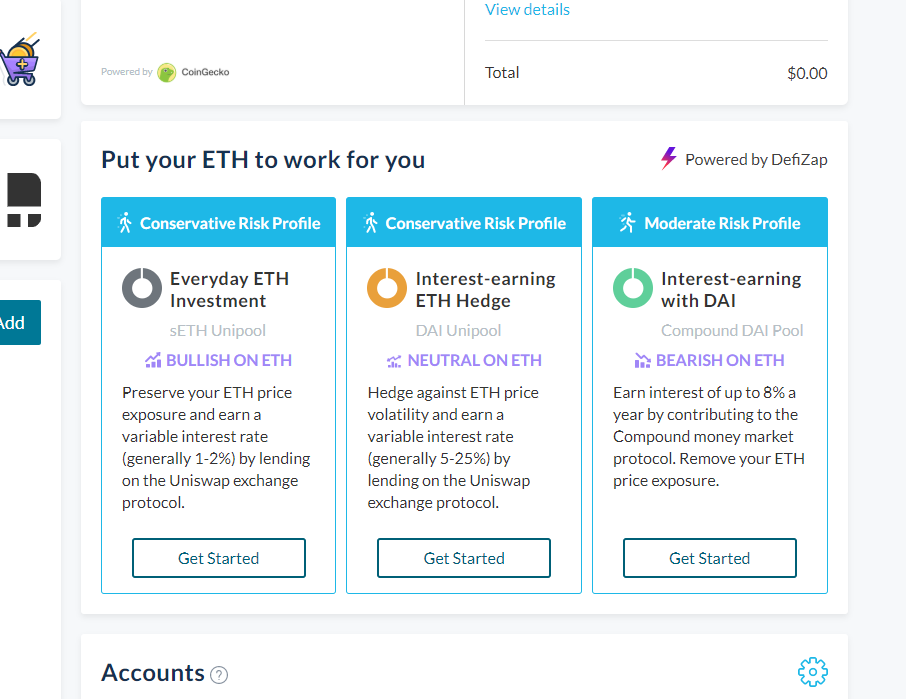
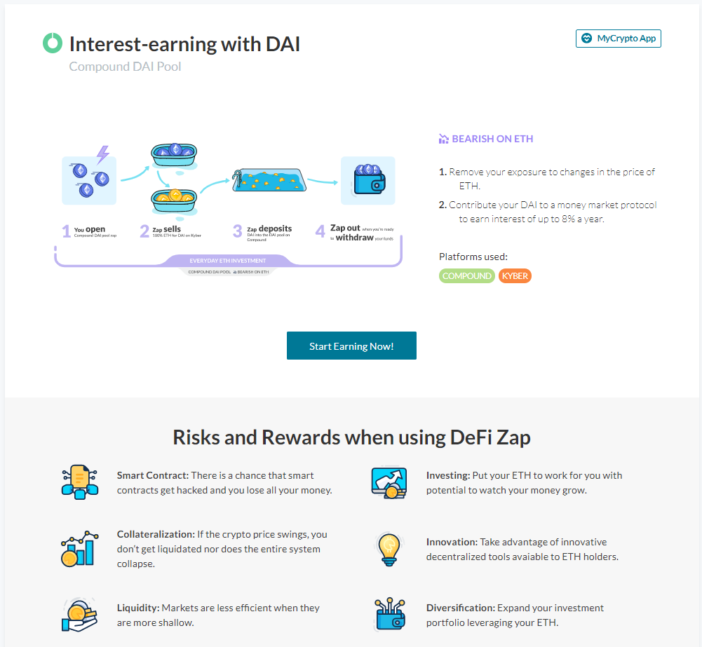
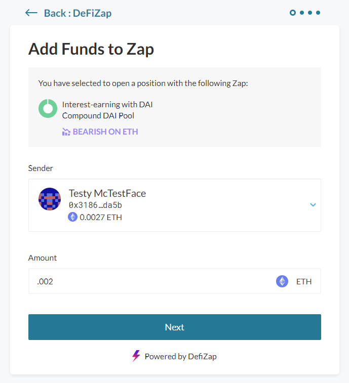
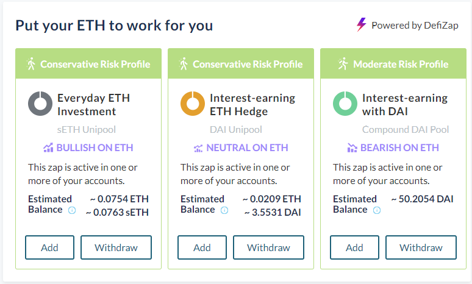

For more information, including the risks involved with Zapper, important terms, and an FAQ, read [the Risks Involved With Zapper](/how-to/defi/risks-involved-with-zapper).

## More Information About Zapper

Zaps are created by none other than [Zapper](https://zapper.fi) (formerly known as DeFiZap)! With the intent to help users gain access to decentralized finance (“DeFi”) protocols, Zapper takes complicated processes and turns them into one-click solutions.

In addition to this easy entry into otherwise complicated DeFi protocols, it’s all noncustodial. You retain complete control of your funds and can manage everything manually if you’d like.

MyCrypto’s Zapper integration aims to take this one step further and allows one-step access to DeFi protocols without having to leave the comfort of your dashboard.

Visit [Zapper](https://zapper.fi) to learn more.

## How To Enter A Zap

Upon visiting your MyCrypto dashboard, there’s an area for Zapper. You’ll see a summary of the available zaps, how they work, and your balances.

1. Choose what looks best to you and click Get Started.

2. Click “Start Earning Now” to go into the deposit flow.

3. After filling out the information, click Next.
4. If everything looks good, confirm your transaction.
5. After the transaction has completed, go back to your dashboard and you’ll see your balance!
(This may take a few extra seconds to appear)

## How To Close A Zap

We’re working on a method for closing zaps from MyCrypto, but in the meantime please visit [Zapper.fi](https://www.zapper.fi/), go to the Zap that you’re currently engaged with, and follow the steps that they outline.
