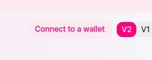
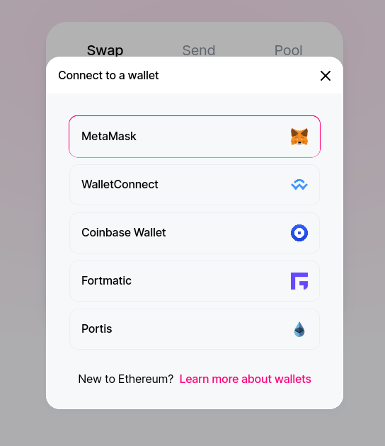
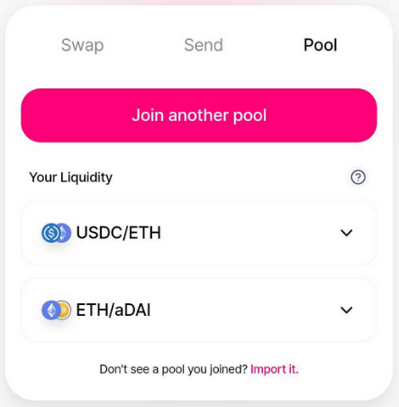
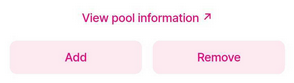
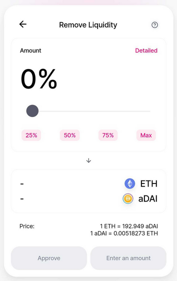

The Zapper integration in MyCrypto makes it easy to get started with various DeFi protocols straight from the MyCrypto interface. Unfortunately, it's not possible to close Zaps from the MyCrypto interface at this time, but this article aims to help you with withdrawing your funds directly from the Uniswap website.

First of all, go to the Uniswap website at [app.uniswap.org](https://app.uniswap.org/#/swap). Then click the "Connect to a wallet" button in the top right-hand corner.

A menu will appear with wallet types that the Uniswap website supports. If you wish to use your Ledger or Trezor hardware wallet, you can use the Metamask browser extension to access these. You can find more info about using your Ledger or Trezor with Metamask [here](https://metamask.zendesk.com/hc/en-us/articles/360020394612-How-to-connect-a-Trezor-or-Ledger-Hardware-Wallet).

After unlocking your address, click the "Pool" tab in the Uniswap interface. A list of pools will show up that you've joined.

Click the pool you would like to withdraw from. Two buttons will appear, allowing you to add more funds to your pool, or remove funds. Click the "Remove" button.

A slider will appear, allowing you to choose how much of your funds you would like to withdraw. If you wish to withdraw everything, click the "Max" button.

Select how much you wish to withdraw, and finally approve it. After that, you should see that your funds have successfully been withdrawn.
