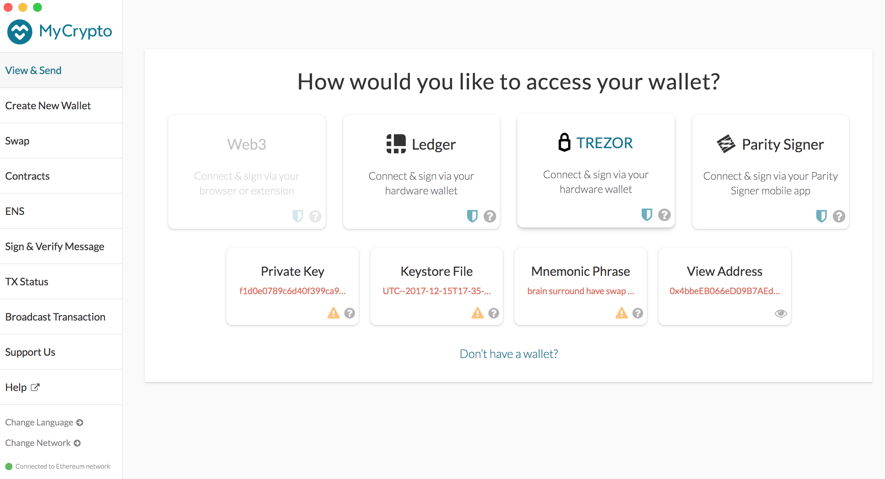
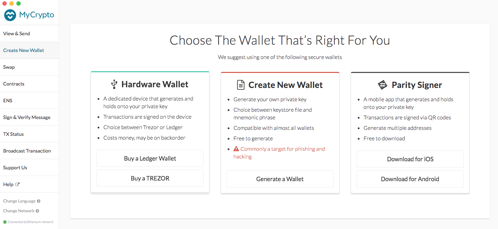
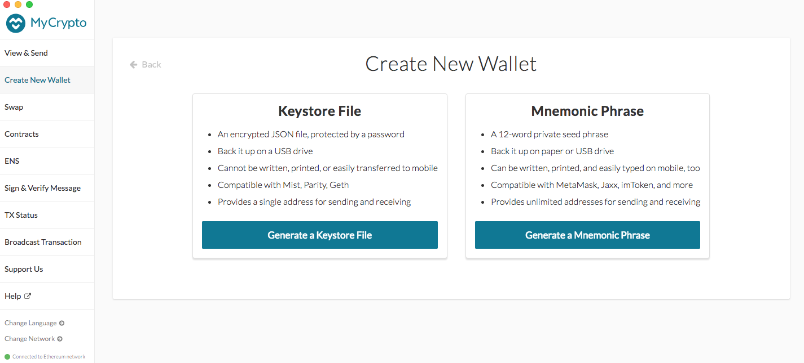

We highly recommend getting a hardware wallet or using MetaMask as a method to access your wallet and store your funds.

The following assumes you are **not** using a hardware wallet or MetaMask. Due to their ease of use and security, [we recommend a hardware wallet for cold storage](/staying-safe/hardware-wallet-recommendations).

Remember to back up any wallets you create! Including the 12-word or 24-word private seed phrase for your hardware wallets! MyCrypto <em>CANNOT</em> recover any lost passwords or access accounts. MyCrypto only has access to information that is publicly available on the blockchain. The security and responsibility of your funds rests on your own shoulders! But MyCrypto will always be here for guidance and to answer any questions that you may have regarding how to be safe with your funds.

## How To Create a New Wallet

If you do not choose to use a hardware wallet or MetaMask, then we recommend to use the MyCrypto desktop app. The desktop app is available for Mac, Windows, Linux or as a standalone app.

<Alert>

The MyCrypto desktop application is part of an older version of MyCrypto that is not actively maintained. You can find the latest version of MyCrypto on [mycrypto.com](https://mycrypto.com).

</Alert>

Follow our guide on [running MyCrypto offline and locally](/how-to/offline/how-to-run-mycrypto-offline-and-locally).

Once you have downloaded and successfully installed the app, open the app from your applications folder. This should open the MyCrypto Desktop interface.

Click "Create New Wallet" in the side navigation bar. This will bring up three options.

Select an option for a type of wallet to create. In this case, click "Generate a Wallet" in the "Create New Wallet" box.

### Generate a keystore file

1. Enter a strong password. Using a randomly-generated password is recommended. Make sure that you write this password down on multiple pieces of paper! Place the paper somewhere safe!

   - You can also create a text file on a USB and save your password there.
   - _This password encrypts (protects) your private key. It does not generate your private key. This password alone will **not** be enough to access your Ether._

2. Enter the password again to confirm it.

3. Click the `"Create New Wallet"` button.

4. Download your `Keystore File`:

   - Save this file to a USB drive.
   - _This is the encrypted version of your private key. You need the password to access it. It is safer than your unencrypted private key but you must have your password to access it in the future._

5. Read the warning. If you understand it, click the `"Continue"` button.

6. Print your paper wallet backup.

7. Print out the current page to save your private key by using your web browser's print option.

   - You can write it out by hand, but it is not recommended. _If you do choose to write it down, it is recommended you write it 2 or 3 times. This decreases the chance your messy handwriting will prevent you from accessing your wallet later._

8. Copy & paste your address into a text document and save it.
   - _Search your address on [Etherscan](https://etherscan.io/). Bookmark this page. This is how you will view your balance at any time_.

### Secret Recovery Phrase

1. Click the `"Generate a Mnemonic Phrase"` button.

2. You can click "Regenerate Phrase" as many times as you want until you get a set of words that you like.

3. Write down the 12-word phrase that you have listed.

4. Click the `"Confirm Phrase"` button.

5. Click the words on your phrase in order.
   - This is to double check that you wrote down your 12-word phrase correctly.

Congratulations! You've successfully created a wallet!

## Things to double check

- Unlock your new wallet using the method you chose to generate your wallet: Keystore File or Secret Recovery Phrase. Ensure it unlocks the wallet you generated and that the address matches the one you bookmarked.

  - _Do not simply leave your new wallet open. Pretend you are coming back a year later to access your riches. Can you do it?_

- Send a small amount of Ether (0.0001 ETH) from your previous wallet or exchange to your new wallet's public address (the one beginning with '0x').

- Send a small amount of Ether (0.00001 ETH) from this new wallet to another address.

  - _Perhaps our donation address? We are a free, open-source service. There are no fees, no ads, no tracking, no cookies, no selling your data._

- Ensure you have recorded all necessary bits of information and the addresses match at all times. If they don't, you miswrote something somewhere. That means it's time to start from the beginning in order to make sure you never lose access to your funds.

Doing all of this is tedious, but it ensures (1) you have complete access to your funds, (2) the address you sent to is correct and matches the private key you have saved, and (3) you can rest easily for years to come, knowing you will be able to access your ETH later.

### Safe storage of backups

It is recommended that you store backups of both forms of your key (the Keystore or Secret Recovery Phrase and paper wallet version) in physically separate, offline environments.

This prevents loss of the private key and password due to a dead hard drive, lost USB drive, wet piece of paper, etc. Keep in mind that physical loss can affect an entire geographical area (e.g., fire, flood).

### MyCrypto cannot recover your key

MyCrypto is not a web wallet and cannot recover your private key or password, access your account, move funds, recover funds, nor cancel/reverse transactions.

We are a client-side interface that allows you to interact with the Ethereum blockchain. Please secure and back up your key like the millions of dollars it could someday be worth.

## Related articles

- [What is the difference between private key & Keystore / UTC file?](/general-knowledge/ethereum-blockchain/difference-between-wallet-types)
- [Protecting yourself and your funds](/staying-safe/protecting-yourself-and-your-funds)
- [How to Back Up Your Wallet](/how-to/backup-restore/how-to-save-back-up-your-wallet)
