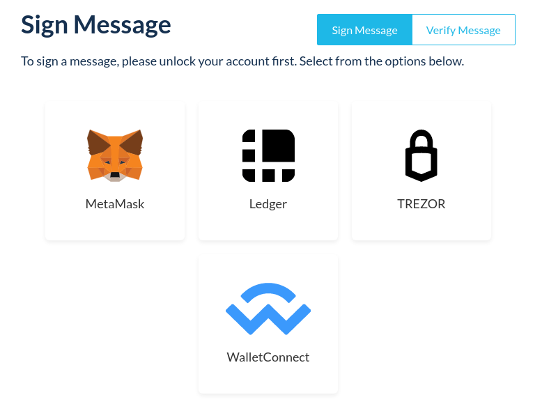
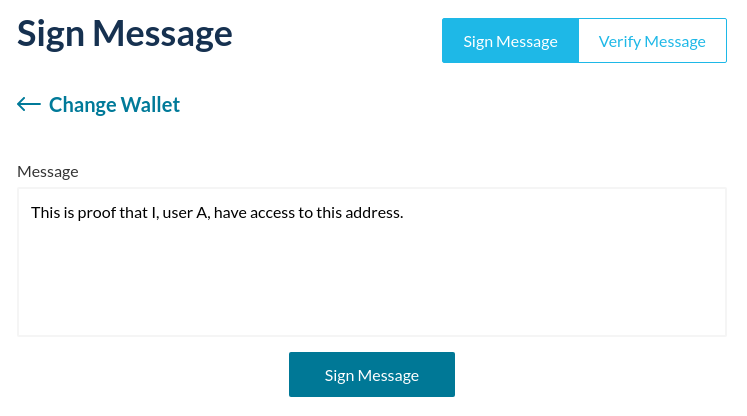
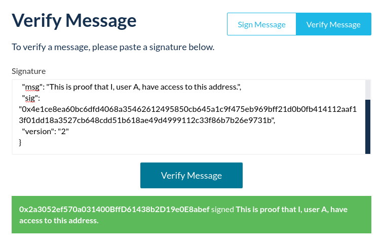

### Why?

With Ethereum, signatures are a way of providing evidence that a specific user has access to a specific address.

For example, if user A wants to provide evidence to user B that user A has access to address X, they could sign a message with their private key, stating that user A has access to address X, then share the signed signature with user B. If the signature is correct, user B can verify that user A has access to address X without user A ever having to share their private key to user B.

### Signing a message

1. Go to the [message signing page on MyCrypto](https://mycrypto.com/sign-and-verify-message/sign). Make sure that you see the green "MyCrypto, Inc" certificate in your URL bar. [Don't see it?](/troubleshooting/cannot-see-the-extended-validation-certificate)
2. Access your wallet.



3. Enter the message that you wish to use to prove your ownership of the address.



4. Click the big blue "Sign Message" button.
5. Your signed message will appear in a box below. It should look a bit like this:

```json
{
  "address": "0x497D15829C338f9e817314662febC7ccE47E69b1",
  "msg": "This is proof that I, user A, have access to this address.",
  "sig": "0xfa076d068ca83ec87203f394c630a1a992f0d39eac5e761aec4c90011204f0b776adf698fe3d626dfd4e7c6ef1f89adb4b9831adaeac72dd19093381265b45471b",
  "version": "2"
}
```

You can use this message as proof that you own an address, and share it with anyone.

### Verifying a message

1. Go to the [message verifying page on MyCrypto](https://mycrypto.com/sign-and-verify-message/verify).
2. Enter the signed message that you want to check, and click "Verify Message."



If the signature is correct, a green bar will be displayed.
