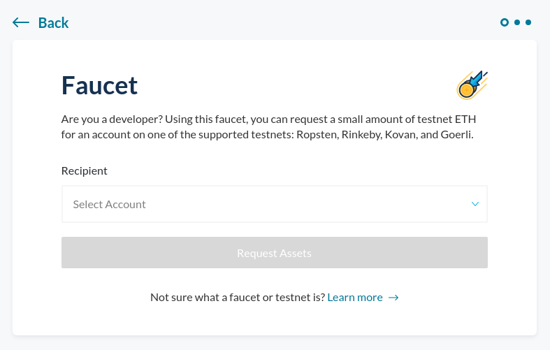

There are currently 4 different testnets for the Ethereum public chain:

- Rinkeby
- Ropsten
- Kovan
- Goerli

With the MyCrypto faucet you can easily request Ether from any of the above mentioned testnets. Get started with the [MyCrypto faucet](https://app.mycrypto.com/faucet) by adding your address, and request testnet Ether right away.

The amount of testnet Ether you can request in a day is limited based on the demand. If you need a higher amount of testnet Ether, please reach out to us through [the contact form](/contact-us), or send an email to support@mycrypto.com. Please include the testnet, the amount you would like, and your Ethereum address. Although we will try to honor every request, please keep in mind that we only have a limited amount of testnet Ether at any given time. Usually, building and testing applications on testnet only requires up to 5 ETH. If you would like to request a higher amount because of exceptional circumstances (like education or non-profit development), include a clear explanation of your use case.

---

Below you will be able to find additional information for every testnet, and alternative faucets.

## Rinkeby

Rinkeby is a public testnet for Ethereum that uses PoA (Proof of Authority).

### Useful links

- Block explorer: <https://rinkeby.etherscan.io/>

| Faucets                           |
| --------------------------------- |
| <https://faucet.rinkeby.io/>      |
| <https://faucets.blockxlabs.com/> |

## Ropsten

Ropsten is a public testnet for Ethereum that uses PoW (Proof of Work).

### Useful links

- Block explorer: <https://ropsten.etherscan.io/>
- GitHub: <https://github.com/ethereum/ropsten>

| Faucets                          |
| -------------------------------- |
| <http://faucet.ropsten.be:3001/> |
| <https://faucet.kyber.network/>  |
| <https://faucet.metamask.io/>    |

| Token Faucets                                 |
| --------------------------------------------- |
| <https://developers.smartcontract.com/faucet> |

## Kovan

Kovan is a public testnet for Ethereum that uses Parity's PoA (Proof of Authority) consensus engine.

- Immune to spam attacks (Ether supply is controlled by trusted parties)
- Consistent 4-second block time

### Useful links

- Block explorer: <https://kovan.etherscan.io/>
- GitHub: <https://github.com/kovan-testnet/>

| Faucets                                                           |
| ----------------------------------------------------------------- |
| Ask on <https://gitter.im/kovan-testnet/faucet>                   |
| Verify your account <https://www.youtube.com/watch?v=99UucFzYCRc> |
| <https://faucets.blockxlabs.com/>                                 |

## **Goerli**

Goerli is a public testnet for Ethereum that POA (Proof of Authority) consensus engine - it is cross client compatible.

- Immune to spam attacks (Ether supply is controlled by trusted parties)

### Useful links

- Block explorer: <https://goerli.etherscan.io/>
- GitHub: <https://github.com/goerli/>

| Faucets                                     |
| ------------------------------------------- |
| <https://goerli-faucet.slock.it/index.html> |
| <https://faucet.goerli.mudit.blog/>         |
