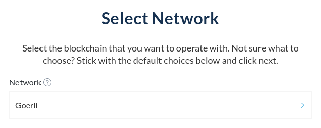

Whether you're creating the next big dapp on Ethereum, want to try out staking, or simply want to test the waters and see how Ethereum works, using testnet ETH can enable you to learn and develop on Ethereum-based networks without having to spend your precious, real Ether.

ETH on testnets has no value and is free to claim through [MyCrypto's Testnet Faucet](https://app.mycrypto.com/faucet), which supports all current Ethereum testnets (Ropsten, Rinkeby, Kovan & Görli/Goerli).

➡️ [Get started with the MyCrypto faucet by adding your address, and request testnet Ether right away.](https://app.mycrypto.com/faucet)

## What's a Testnet Anyway?

When talking about Ethereum, interacting with dapps, or selling and buying NFTs, we're always talking about the "mainnet." Mainnet is the main Ethereum blockchain we all know and love - and is where most of the action is happening. Ether on the mainnet has value, and transactions cost real money.

In addition to the mainnet, there are also multiple testnets. Testnets work separately from mainnet, but (mostly) work in the same way as mainnet. Ether for these networks can be freely obtained and has no real-world value. Oftentimes, major Ethereum upgrades are deployed on these testnets and tested extensively before being deployed on the mainnet. As Ether is free, it's also commonly used by smart contract developers to test out their contract before deploying it to the real Ethereum network.

### Görli/Goerli

Görli is a proof-of-authority testnet and was designed to work across various Ethereum clients, such as Geth, Parity/OpenEthereum, and Nethermind. Initially launched in 2019, the Görli network has already often been used before major upgrades are deployed on the Ethereum chain, such as the [Pyrmont Launchpad](https://pyrmont.launchpad.ethereum.org/en/) for becoming an Eth2 validator.

- Block explorer: [goerli.etherscan.io](https://goerli.etherscan.io/)
- GitHub: [github.com/goerli](https://github.com/goerli/)

### Ropsten

As the oldest working and only proof-of-work testnet on the list, the Ropsten testnet has been around since 2016. Previous to Ropsten, there was another testnet named "Morden" that launched when the Ethereum network was first launched in 2015 but was later [sunsetted due to replay attacks](https://blog.ethereum.org/2016/11/20/from-morden-to-ropsten/).

While having more unpredictable block times, Ropsten is the only proof-of-work testnet and most closely resembles the current mainnet.

- Block explorer: [ropsten.etherscan.io](https://ropsten.etherscan.io/)
- GitHub: [github.com/ethereum/ropsten](https://github.com/ethereum/ropsten)

### Kovan

Kovan is a proof-of-authority testnet that was initially created by the Parity (now OpenEthereum) team to work with the Parity/OpenEthereum client.

- Block explorer: [kovan.etherscan.io](https://kovan.etherscan.io/)
- GitHub: [github.com/kovan-testnet](https://github.com/kovan-testnet/)

### Rinkeby

A proof-of-authority testnet that was initially created to be used with the Geth client, but is nowadays also supported by other clients, such as OpenEthereum or Nethermind.

- Block explorer: [rinkeby.etherscan.io](https://rinkeby.etherscan.io/)

## Obtaining Testnet Ether

The easiest way to request testnet Ether for any network is to use [MyCrypto's Testnet Faucet](https://app.mycrypto.com/faucet).

To get started, add an account to your MyCrypto Dashboard and make sure to select the appropriate network (testnet) you would like to receive your testnet Ether on.

After adding your testnet account to your Dashboard, you're ready to use the MyCrypto Faucet. You can either go to [app.mycrypto.com/faucet](https://app.mycrypto.com/faucet), or go to Tools > Use Testnet Faucet in the left-hand side menu on MyCrypto.

After adding your account, you're ready to request your testnet Ether. Simply select your testnet account and click the "Request Assets" button. You'll be prompted to complete a Captcha, which we need in place to keep the faucet available for everyone.

You've successfully requested your free testnet Ether, and it'll be reflected in your asset overview in a short while!

### Requesting Additional Funds

You're free to request testnet funds multiple times, but keep in mind that the amount of testnet Ether you can request in a day is limited based on the demand. If you need a higher amount of testnet Ether, please [reach out to us directly](/contact-us) or send an email to [support@mycrypto.com](support@mycrypto.com). Include your testnet address and the name of the testnet on which you would like to receive funds.

If you are a [MyCrypto Member](https://app.mycrypto.com), you are able to request up to 10 testnet ETH per 24-hour period.

You can grab a membership for a full year for 30 xDAI, or one can be purchased with ETH or Polygon as well. Aside from the increase in testnet ETH, memberships include perks like MyCrypto swag and exclusive NFTs!

If you would like to request a higher amount because of exceptional circumstances (like education or non-profit development), please include a clear explanation of your use case.
