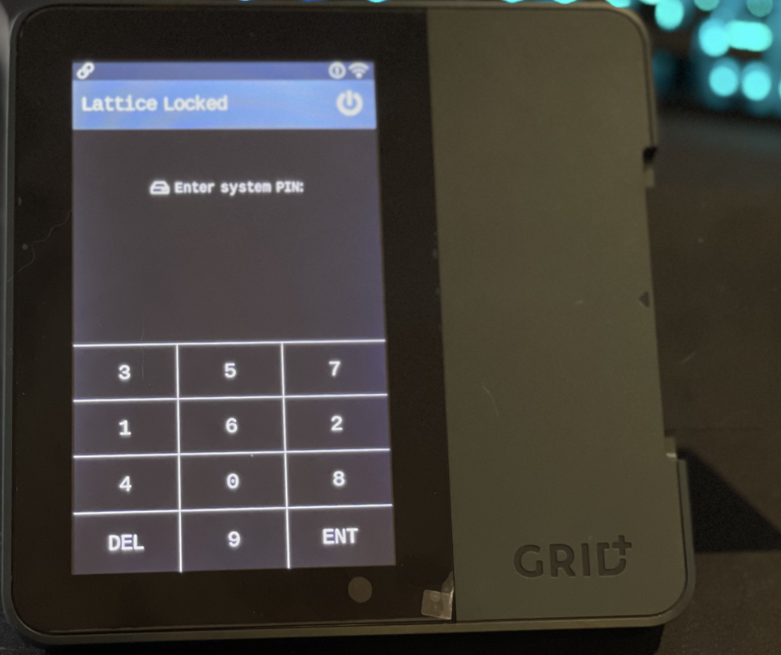
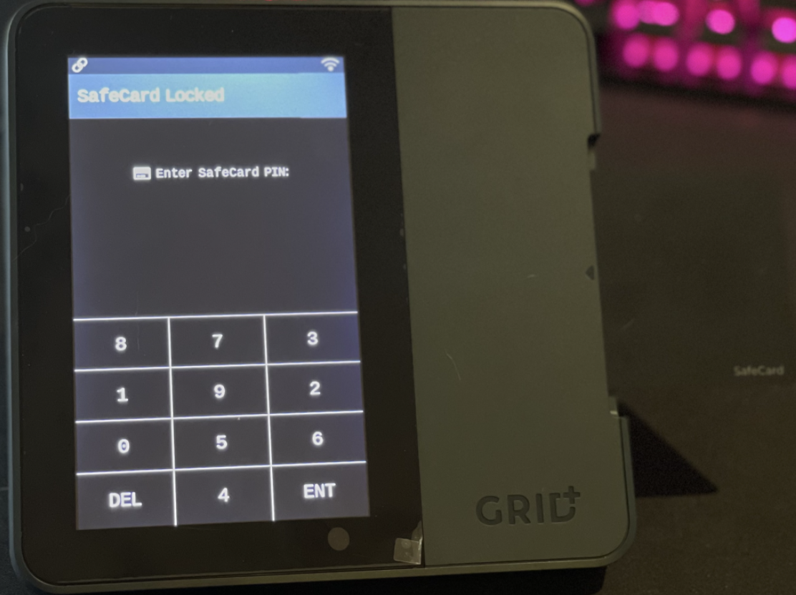
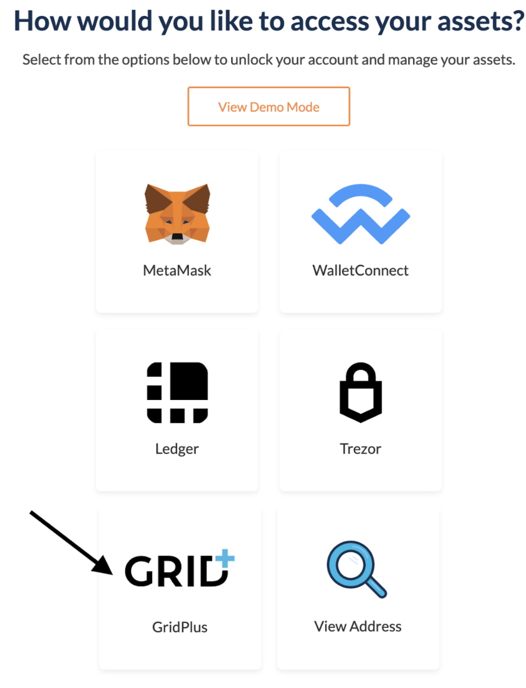
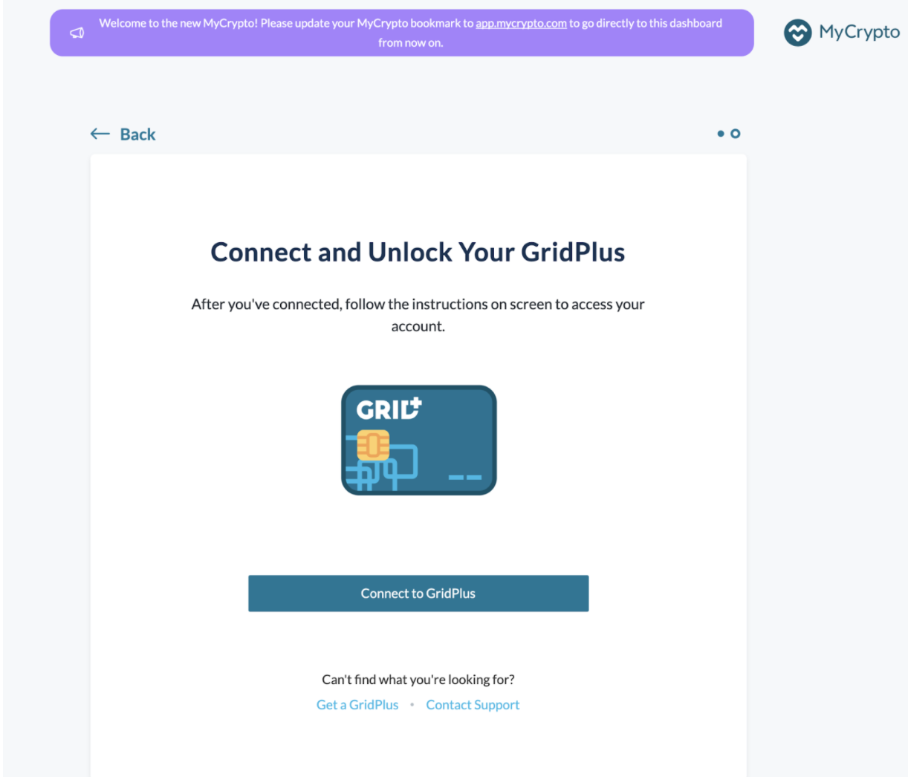
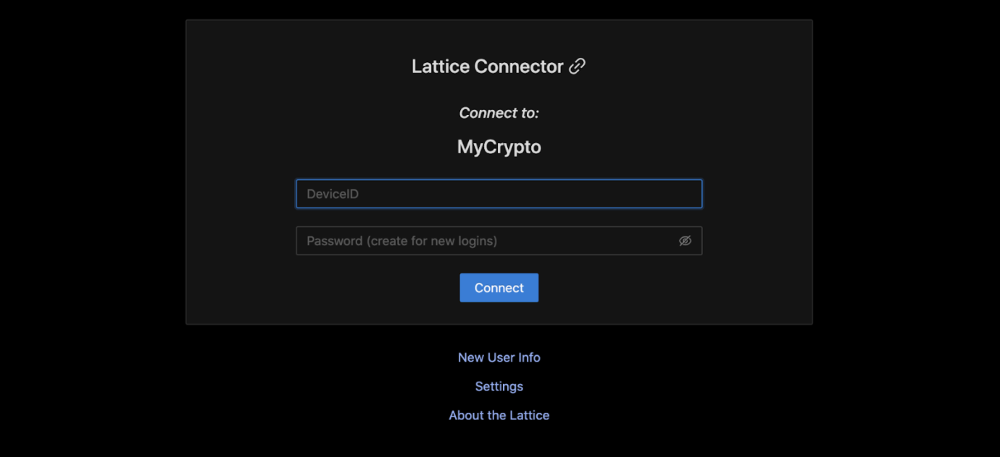
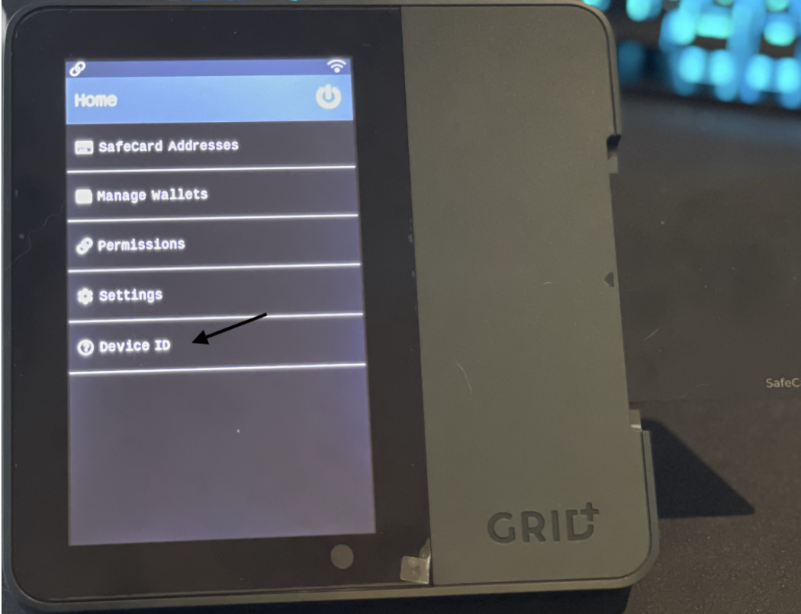
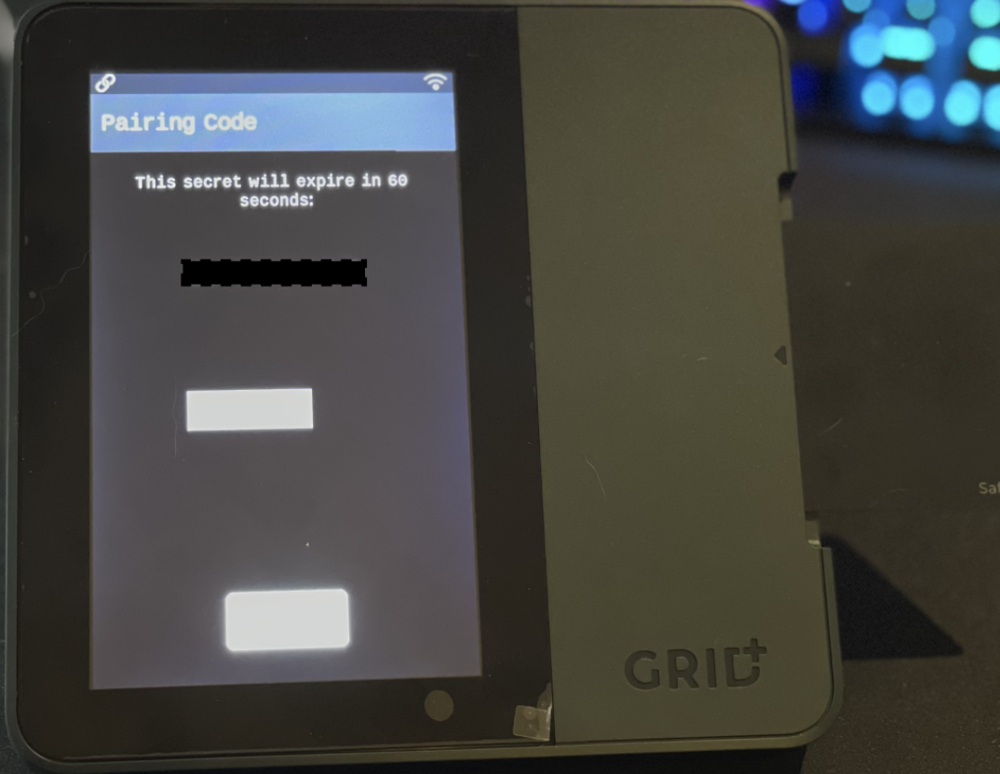
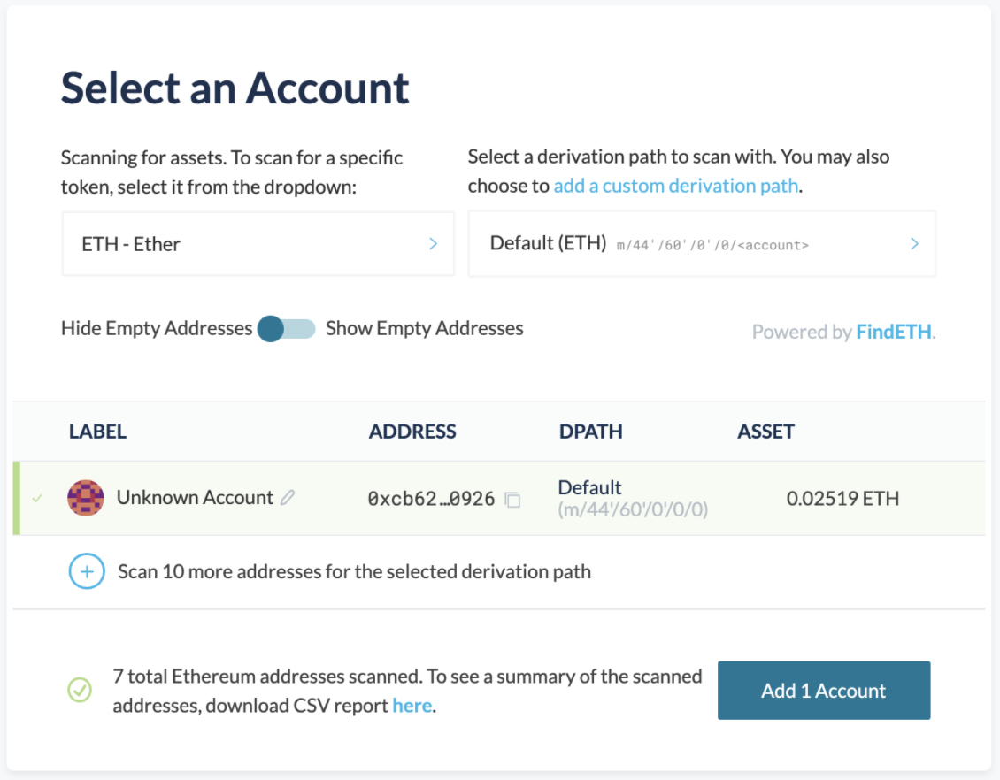

Connecting your GridPlus wallet to MyCrypto follows the same path as connecting any wallet (software or hardware) to MyCrypto.

Assuming you have already setup your GridPlus device, start by unlocking your device by inputting your system PIN.

The, insert your SafeCard and input your SafeCard PIN

Now that the device is unlocked, we go to “Add” on MyCrypto and choose the GridPlus wallet type, and select the network we want to connect with (typically this is default “Ethereum”).

You then have to press “Connect to GridPus” button, which will open a new tab to GridPlus

Once the new tab is opened, GridPlus will ask you for your DeviceID.

You can find the DeviceID on the GridPlus by selecting “Device ID” on the home menu of the GridPlus.

Once we have inputted the DeviceID, we will then ask for a pairing password. The password will appear on your GridPlus screen, and you need to insert that into the GridPlus website.

After you have inserted the GridPlus secret, it will connect your GridPlus to MyCrypto. MyCrypto will use our [Hardware Wallet Scanner](https://blog.mycrypto.com/new--hardware-wallet-scanner--rep-migration--tx-status--and-more-/) to find any previously used addresses and allow you to search for an address with a specific [derivation path](https://support.mycrypto.com/general-knowledge/ethereum-blockchain/what-is-a-derivation-path/).

On this screen, you can select any addresses (flip the “Show Empty Addresses” toggle at the top if you want) to add to MyCrypto, then press the “Add $x Account” button to complete the process.

