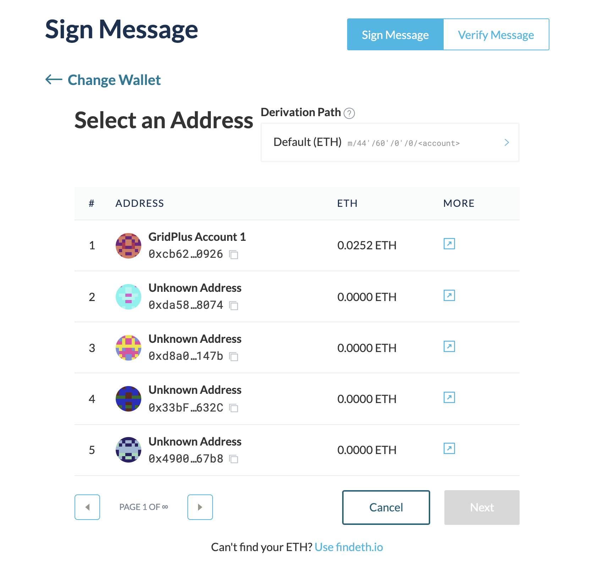

With a GridPlus (and pretty much any Hardware wallet), we can use MyCrypto to [sign an offchain message](/how-to/getting-started/how-to-sign-and-verify-messages-on-ethereum/).

This is a message that is signed cryptographically with your Ethereum keypair to prove that the owner of an address signed a specific message. This is an offchain process, so the act of signing this particular message is not a transaction broadcasted to the blockchain, so there is no gas involved.

This article assumes that you have [connected your GridPlus accounts to the MyCrypto interface](/how-to/hardware-wallets/gridplus/how-to-connect-gridplus-to-mycrypto/).

To start, go to "Tools" > "Sign/Verify Message" in the MyCrypto navigation, then select GridPlus option.


Make sure your GridPlus device is unlocked, with the SafeCard inserted, and wait for MyCrypto to detect the device is unlocked.


Next, select the account you want to sign the specific message for, then press the "Next" button



Now, in the textbox, input the message you want to sign and press the "Sign Message" button.


Then, look at your GridPlus device and ensure you are signing the correct message, then press "Approve" button on the GridPlus device


Once you have approved the signing on the GridPlus device, the signature will appear on the MyCrypto UI, and you can send this message to anyone offchain to prove you own keys to this specific address.


With the output signature, you can go to the "Verify Message" option at the top right, paste the entire signature (like below) and press "Verify Message" button. MyCrypto will verify the signature is cryptographically correct and let you know if the signed message is legitimate.


```json
{
  "address": "0xcb62c8C418ee4C39B6b023cB50149e62D6E90926",
  "msg": "Hello World, this is a message I am signing with the MyCrypto UI using a GridPlus!",
  "sig": "0xe0861fd2176f076d58c6e242571e12a6fecd9daa188522daa5a0534f7fa9dd7b603c088e39ece605bca9014f3ff4c193ef7ed384f3d94c8aa3b9934b924b8cbf1c",
  "version": "2"
}
```
