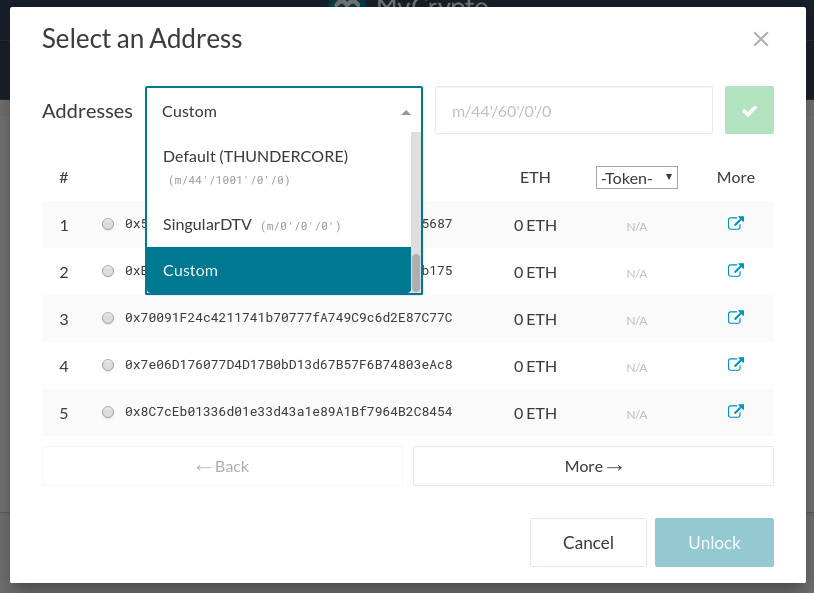
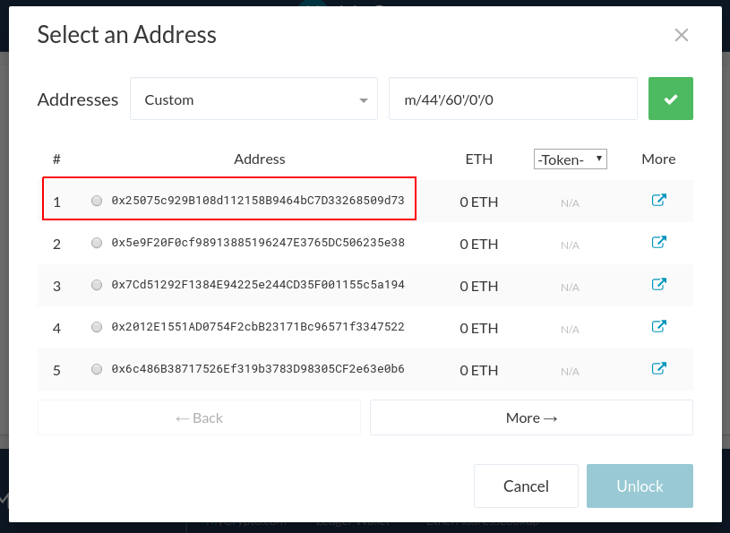

Ledger Live changed the way addresses are derived from the master seed. Unfortunately, MyCrypto is not fully compatible with this change. You can still access your Ledger Live addresses in MyCrypto, by manually setting the derivation path for the address.

To do this, start off by accessing your Ledger device on MyCrypto. On the address selection screen, click on the derivation path (e.g. "Ledger (ETH) (m/44'/60'/0')"), scroll all the way down and select the custom option.

Change the derivation path to:

* m/44'/60'/**0**'/0 for Ethereum, or
* m/44'/61'/**0**'/0 for Ethereum Classic

When you click on the green button, your first Ledger Live address should show up as the first address in the list.

To view your second address, replace the second to last **0** in the derivation path with 1. For the next address, replace it with 2, etc. The address will always be the first one in the list, as shown in the screenshot above.
