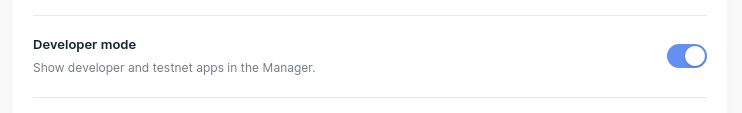
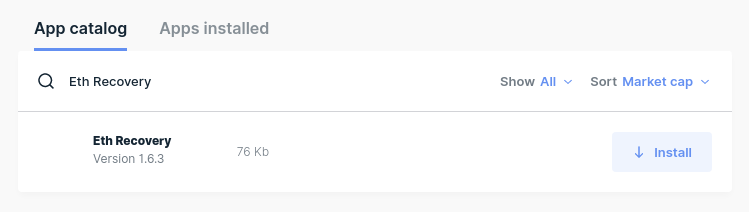
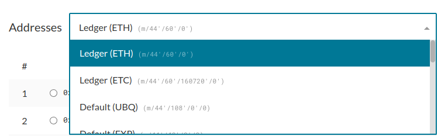

If you, for example, sent ETH to your ETC address, or EWT to your ETH address, you cannot simply transfer it back when using a hardware device like a Ledger wallet, due to restrictions in the standard apps provided by Ledger.

One way to recover those funds is to use the recovery phrase for your Ledger device, but this comes with the risk that your recovery phrase may be stolen by malware or phishing. To access those coins in a safer way, that does not involve using the recovery phrase, you can use the ETH Recovery app provided by Ledger. Simply follow the steps below.

## Install the ETH Recovery app

<Alert>

The ETH Recovery app is meant for recovering assets only. You **should not** use this app on a day to day basis, for transferring funds.

</Alert>

- Open Ledger Live, click on the Settings icon in the top right, and go to the "Experimental features" tab.

- Enable "Developer mode" if it is not enabled yet. This is required, because the ETH Recovery app is only visible with this option enabled.

  

- Make sure your Ledger device is unlocked, and go to the "Manager" page in Ledger Live.

- Under "App catalog," search for "Eth Recovery."

  

- Click on the "Install" button to install it to your Ledger device.

You should now see the ETH Recovery app on your Ledger device. This app works very similar to the standard Ethereum app, except that the restrictions for transferring other assets are removed.

## Access your account

- With the ETH Recovery app open on your Ledger device, open [MyCrypto](https://mycrypto.com) in your browser, or open [the desktop application](https://download.mycrypto.com/).

- Make sure you are connected to the network of the asset you want to recover. For example, if you want to recover ETC coins, you should be connected to the ETC network.

- Connect to your Ledger device in MyCrypto. If you are unable to connect to your device, you may need to close Ledger Live first. You can find further troubleshooting steps in [this article](https://support.mycrypto.com/troubleshooting/accessing-wallet/ledger-hardware-wallet-unable-to-connect-on-mycrypto).

- Your address likely won't show up at first. For this, you have to change the [derivation path](https://support.mycrypto.com/general-knowledge/ethereum-blockchain/what-is-a-derivation-path), to the derivation path of the asset that you sent your coins to. For example, if you sent your ETC **coins** to an ETH **address**, you have to change the derivation path to the ETH derivation path.

  

  If you are using an address provided by Ledger Live, please refer to [this article to access Ledger Live addresses in MyCrypto](https://support.mycrypto.com/how-to/hardware-wallets/ledger/how-to-access-ledger-live-address-in-mycrypto).

- Select your address and click on "Unlock."

## Transfer the assets

From here on, you can simply send a transaction as usual. We recommend sending it to one of the addresses specific for that coin, e.g. "Ledger (ETC)" for ETC coins, and "Default (EWC)" for EWT coins.

Note that if you sent ERC-20 tokens to the wrong address, you have to make sure that Contract Data is enabled on your Ledger device. Even if you enabled it previously using the regular ETH app, you have to enable it again.
