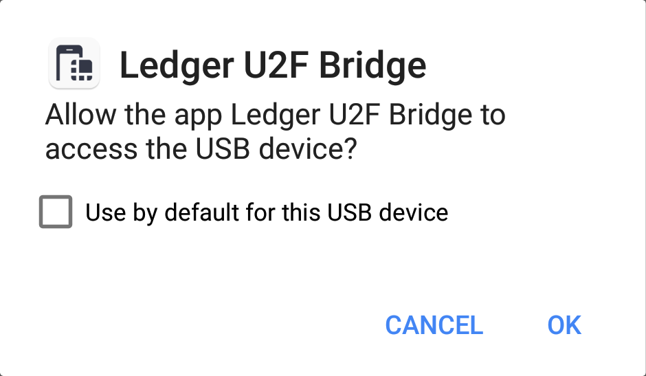

## Requirements

In order to use a Ledger Wallet with your Android phone, you need to have a modern phone or tablet that supports USB-OTG (USB On-The-Go) as well as a USB-OTG adapter to go with it. If you don't have an OTG adapter yet, you can pick one up on [Amazon](https://www.amazon.com/s/ref=nb_sb_noss_2?url=search-alias%3Daps&field-keywords=usb+otg+adapter) for just a few bucks. The adapter will allow you to plug the Ledger Wallet into your device.

If you are not sure whether your device supports USB-OTG, the easiest way to check it is by using an app like [USB OTG Checker](https://play.google.com/store/apps/details?id=com.faitaujapon.otg).

## Setting up Your Device

Before you connect your Ledger Wallet to your device, you first have to install an application made by Ledger, which can be found [here](https://github.com/LedgerHQ/android-u2f-bridge/releases). Simply open the URL on your device and click on the file `android-u2f-bridge-x.x.apk`. Once you downloaded the file, open it on your device and you should be asked to install it. Once installed, tap `Done`, as it is not yet possible to open the app.

Now, connect your Ledger Wallet and open the Ethereum application. Make sure both `Contract Data` and `Browser Support` are **ON** *(Note: this is no longer required in newer versions of the Ledger firmware)*. Open your browser and go to MyCrypto. On the Send & Receive page, select the Ledger option and tap on `Connect to Ledger Wallet`.

You should see a pop-up asking if you want to allow the Ledger application you just installed to access the Ledger Wallet. Tap on `OK` and you should be able to see your addresses on MyCrypto.
