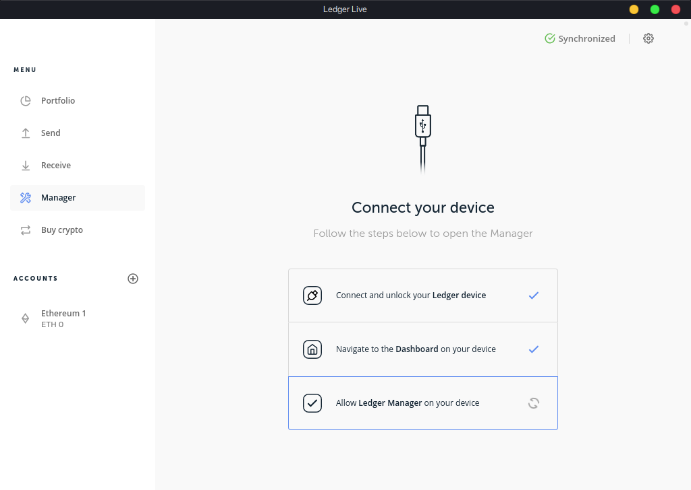
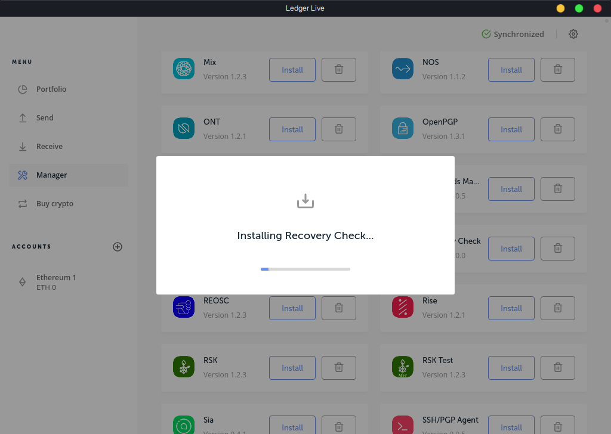

When you first set up your Ledger device, you are asked to write down your recovery phrase. You can use this recovery phrase to get access to your funds when the device breaks, or you have to setup the device again for some reason. It is good practice to verify the recovery phrase, to make sure you didn't make any mistakes when writing it down.

There are multiple ways to do this. You could use the recovery phrase on MyCrypto and check if the addresses match, or use a tool like [this one](https://iancoleman.io/bip39/) by Ian Coleman. The problem with these methods is that they require you to input your recovery phrase on a computer, potentially exposing it to malware or phishers. Fortunately, there is another method, provided by Ledger, to verify the recovery phrase on the device itself, using an application called Recovery Check.

## Recovery Check

Recovery Check is an official application provided by Ledger, that can be installed directly to the Ledger device. Simply follow these steps to install the application and verify your recovery phrase.

### 1. Install Recovery Check from Ledger Live

First, connect your Ledger to your computer and run Ledger Live. To install an application, you want to go to the "Manager" tab of Ledger Live.

You may have to allow Ledger Manager on your device. If so, you should see a message on the Ledger itself. Simply press the right button to allow Ledger Live to manage your device. If you are unable to connect to your Ledger, there are some troubleshooting tips [here](/troubleshooting/accessing-wallet/ledger-hardware-wallet-unable-to-connect-on-mycrypto).

You should see an overview of all installable applications. Scroll down until you find "Recovery Check" and click "Install".

You will see "Processing..." on your Ledger for a few seconds, and the application should be installed.

### 2. Run the application and enter your recovery phrase

The second step is a bit easier, but can be a bit time consuming. Navigate to the Recovery Check application on your Ledger and run it by pressing both buttons. You should see "Start check", simply press both buttons again three times, until you have to select a number of words.

The recovery phrase is usually 24 words long, so most of the time you can select this option. Otherwise select the option that applies to you. Next, you have to fill out all your words in the same order as you wrote them down. Most of the time, you only have to input the first few letters, and you can auto-complete the full word. You can scroll through the letters with the left and the right button, and press both buttons at the same time to select a letter.

When you're done, you should see "Recovery phrase matches". Now you can go back to Ledger Live and remove the application, by clicking on the trash icon next to the install button.

## What if the recovery phrase doesn't match?

There is a chance that the recovery phrase doesn't match. You may have wrote it down incorrectly or the order of words may be wrong. If this happens, make sure:

* You selected the correct recovery phrase length;
* You did not run the Recovery Check application with a passphrase.

If the recovery phrase is still wrong, it's recommended to move all your funds to another wallet and fully reset the Ledger, so you can get a new recovery phrase. Carefully write it down and check it again after setting up the Ledger. Then, simply send back the funds to the new address for your Ledger device. We recommend that you carefully read [this guide](/how-to/backup-restore/how-to-save-back-up-your-wallet) on how to properly back-up your recovery phrase.

## Related articles

* [[MyCrypto ➡ Ledger] Moving from MyCrypto to Ledger](/how-to/migrating/moving-from-mycrypto-to-ledger)
* [How to properly save & back up your wallet](/how-to/backup-restore/how-to-save-back-up-your-wallet)
