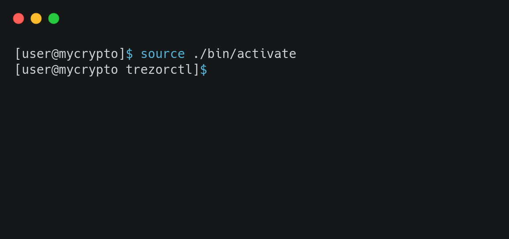

If you've ever sent coins to the wrong address (for example, sending ETC or EWT to your ETH address), it can be scary, but it's solvable. Making this mistake with a Trezor requires a little more time and effort to solve it as you cannot send ETC or EWT transactions from an ETH address by default with a Trezor device.

One way to recover those funds is to use the recovery phrase for your Trezor device, but this comes with the risk that your recovery phrase may be stolen by malware or phishing. To access those coins in a safer way (one that does not involve using the recovery phrase), you can use the new `trezorctl` command line too provided by Trezor. Simply follow the steps below.

## Install Python

The `trezorctl` tool is built on Python, and in order to use it, you need to have Python installed on your system. Python is available for [Windows](https://www.python.org/downloads/windows/), [macOS](https://www.python.org/downloads/mac-osx/) and [Linux](https://www.python.org/downloads/). Please refer to [the Python wiki](https://wiki.python.org/moin/BeginnersGuide/Download) for further installation instructions.

After installation, open a terminal (command line, PowerShell), and run the following command:

```bash
python -m venv trezorctl && cd trezorctl
```

This will create a new Python virtual environment, that you will use to install the `trezorctl` tool. Then, activate the virtual environment by running one of the following commands, depending on your operating system:

<Accordion>
<AccordionItem title="Windows">

On Windows, you can use the following command:

```bash
scripts\activate
```

</AccordionItem>
<AccordionItem title="macOS & Linux">

On macOS and Linux, you can use the following command:

```bash
source ./bin/activate
```

</AccordionItem>
</Accordion>

The output should look something like this:



## Install `trezorctl`

Now you can install `trezorctl` and its dependencies, by running the following command in your terminal:

```bash
pip install setuptools wheel attrs trezor
```

This will install the tool and dependencies in the virtual environment you previously created.

## Disable safety checks

<Alert type="warning">

Disabling safety checks allows for potentially malicious actions. It's highly recommended to enable it again, after you have recovered your assets!

</Alert>

Now that `trezorctl` is installed, you need to disable safety checks on your Trezor device. Make sure your device is connected, unlocked, and Trezor bridge is running. Then, run this command:

```bash
trezorctl set safety-checks prompt
```

If the tool is able to connect to your Trezor device, you should see:

> Please confirm action on your Trezor device.

On your Trezor device, you will see a message prompting you to disable the safety checks. Hold the button for a few seconds to continue.

## Transfer the assets

From here on, you can simply send a transaction as usual. We recommend sending it to one of the addresses specific for that coin, e.g. "Trezor (ETC)" for ETC coins, and "Default (EWC)" for EWT coins.

To enable safety checks again, use the following command:

```
trezorctl set safety-checks strict
```
