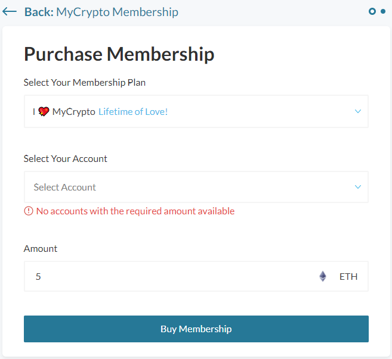

MyCrypto is free, open-source, and built by a small, dedicated team of cryptocurrency addicts.

We're on a mission to create a safer, more secure, and more accessible industry, and we need your help.

Purchasing a MyCrypto Membership means you're investing directly in the future of this industry while also reaping the benefits with exclusive NFT drops, swag, partner discounts, and an entirely elevated MyCrypto experience.

[Learn more about MyCrypto Membership](/general-knowledge/about-mycrypto/membership-information).

To purchase a MyCrypto Membership, you'll need to have the required amount of currency in one of your connected accounts. Need funds? Use [MyCrypto Swap](https://app.mycrypto.com/swap?utm_medium=organic&utm_source=support&utm_campaign=membership) or our [fiat onramp](https://buy.mycrypto.com) to obtain them.

1. Visit [app.mycrypto.com/membership](https://app.mycrypto.com/membership).
2. Click "Buy Membership Now."
3. Select the membership option that makes sense for you.
4. Select the account you’d like the MyCrypto Membership attached to.
5. Click “Buy Membership.”

Thank you for your support!

