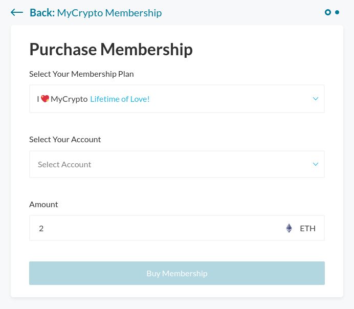

The MyCrypto Membership is a monthly subscription that gives you additional features and helps to support MyCrypto’s future developments.

[Learn more about MyCrypto Membership](/general-knowledge/about-mycrypto/membership-information).

_You’ll need to have connected an account to your MyCrypto Dashboard that has the required amount of DAI / ETH, respective to the length of membership you’d like. If you don’t have the required amount, visit [buy.mycrypto.com](https://buy.mycrypto.com/) to obtain it._

1. Visit [app.mycrypto.com/membership](https://app.mycrypto.com/membership).

2. Click "Buy Membership Now."

3. Select the length of the membership you’d like to purchase.

   1. 1 Month
   2. 3 Month (10% off!)
   3. 6 Month (20% off!)
   4. 12 Month (40% off!)
   5. I ❤️ MyCrypto (Lifetime of Love!)

4. Select the account you’d like the MyCrypto Membership attached to.

5. Click “Buy Membership.”

Thank you for your support!

