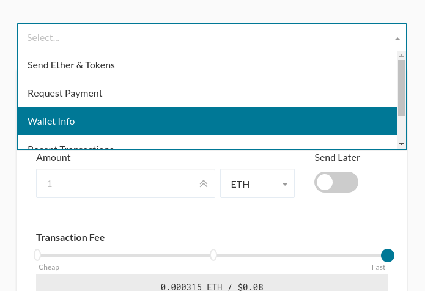
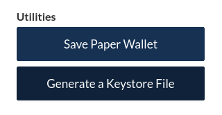

> Can I turn my unencrypted private key into an encrypted private key?

* Yes, you can encrypt your private key using MyCrypto by accessing your address using the [MyCrypto desktop app](https://download.mycrypto.com/). After accessing your private key, select "Wallet Info" in the dropdown.

* Then, click the "Generate a Keystore File" button.

* After clicking the button, there will be a password field where you can enter a new password to encrypt your private key.
* Click the "Generate Keystore File" button.
* After a few seconds, a "Download" button will appear. Click this and the download of your keystore file will begin.

## Remember

* Always have multiple backups of your private key! Without it, your ETH and tokens will be lost. MyCrypto cannot access your account, move funds, recover funds, reverse transactions, nor recover your private key or password.
* We are not a web wallet. We are a client-side interface that allows you to interact with the Ethereum blockchain.
* We never save, store, or transmit any sensitive information ever. We don't know you, your IP address, your email address, or even that you used the site.
