The Ledger Nano S is one of the best and easiest-to-use cryptocurrency hardware wallets out there, and is available for purchase [here](https://www.ledgerwallet.com/r/1985?path=/products/). While the Ledger Nano S supports a wide range of cryptocurrencies, this guide was specifically written for using Ether and ERC-20 tokens with MyCrypto.

## Initial setup

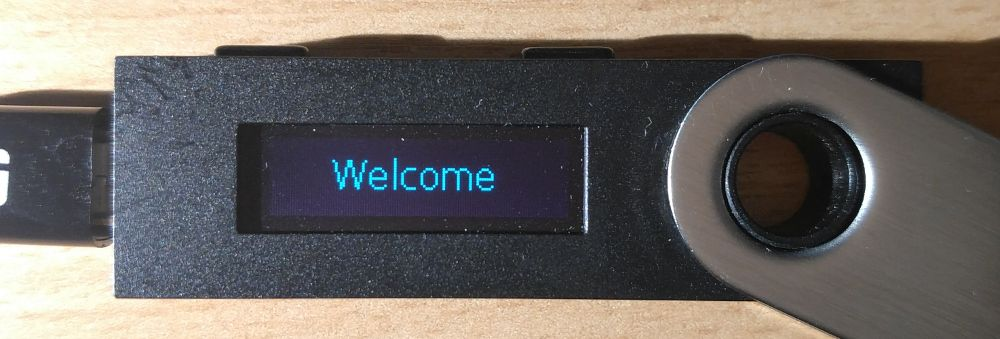

Navigating on the Ledger Nano S works by pressing either of the two buttons at the top of the device. Press both buttons at the same time to begin the configuration.

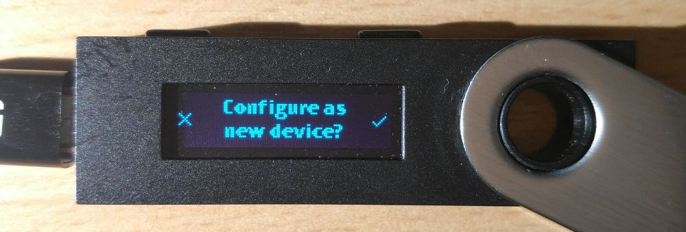

The first thing your Nano S will ask you is whether you want to set it up as a new device. Press the right button to confirm the action. If you ever want to restore your Nano S (more on this below!), you will have to select the left button and it will start the restoration process by asking for your recovery words.

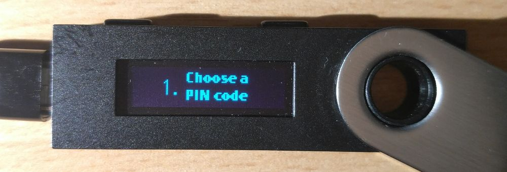

The Nano S will then ask you to set up a pin. This is an important step, as you will have to enter it every time you want to access your Nano S. The minimum amount of numbers needed is 4, and the maximum is 8. You can always change this pin after you are done setting up your Nano S. After entering, it will ask you to enter your pin once again to confirm it is correct. It's worth stating that if you enter the wrong pin number 3 times in a row, it will automatically reset your Nano S.

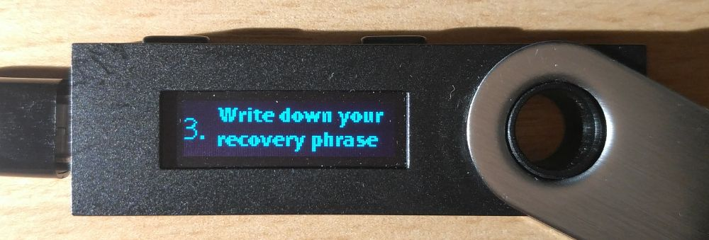

Next, the Nano S will give you 24 random words that you will have to write down on the provided card that came in the box. These are the recovery words, also known as a Secret Recovery Phrase, that you will have to use to restore your Nano S in case it fails or you accidentally reset it. Once you've written down all of the words, it will ask you to confirm your recovery phrase in order to make sure that you've written them down correctly.

**Do not save these recovery words on your computer**, as it will be just as unsafe as using a normal private key. Always write it down physically using a pen on a piece of paper only you have access to. Also, do not take a photo of your piece of paper.

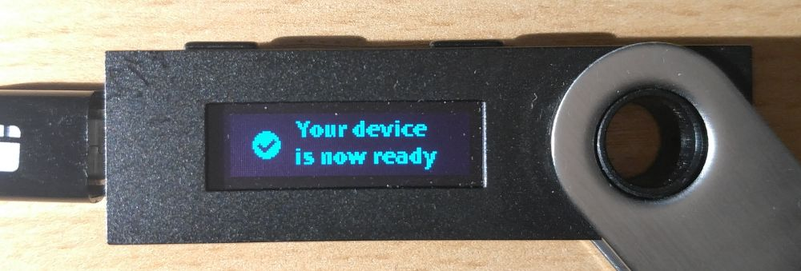

Now your Ledger Nano S is all set-up and ready to be used!

## Enabling your Ledger Nano S to work with MyCrypto

In order to make your Nano S work with MyCrypto, we will need to enable browser support. We are also going to enable contract data while we're at it, so we can have the ability to create token transfers as well.

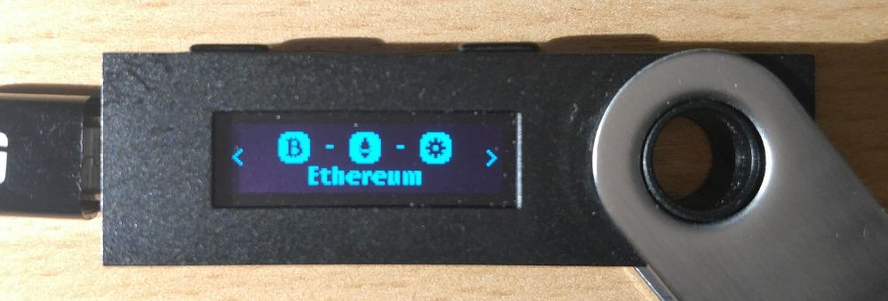

First of all, open up the Ethereum app by navigating to it and pressing both buttons at the same time to open it. Then press the right button to select "Settings." After that, press both buttons to open it up.

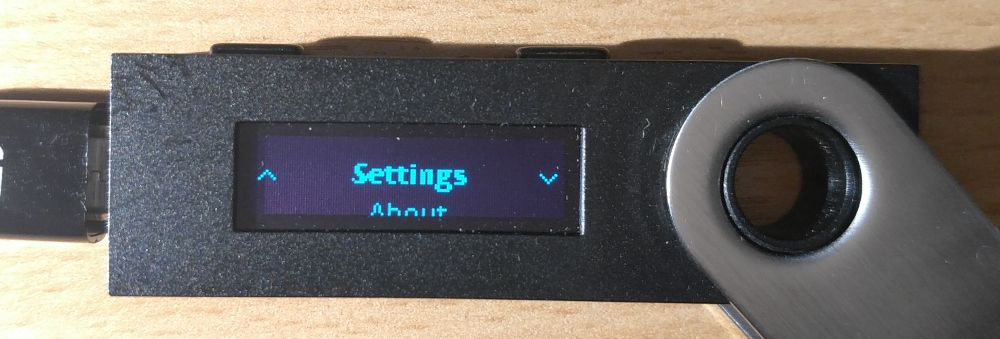

Now press both buttons at the same time again to open up "Contract Data," then press the right button to select "Yes," and then press both buttons again to proceed.

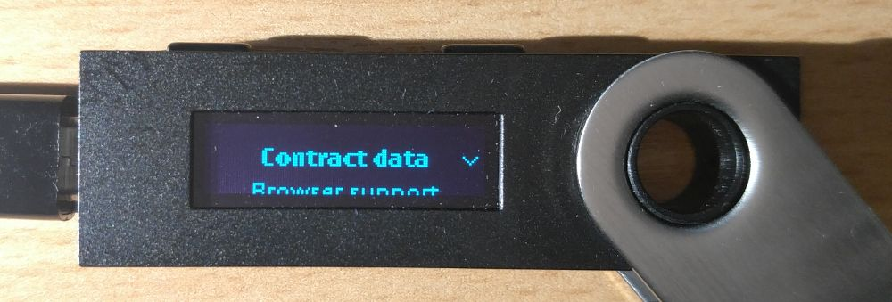

We will do the same thing with "Browser Support." Select "Browser Support," press both buttons at the same time to open it up, press the right button to select "Yes," and then press both buttons again to confirm.

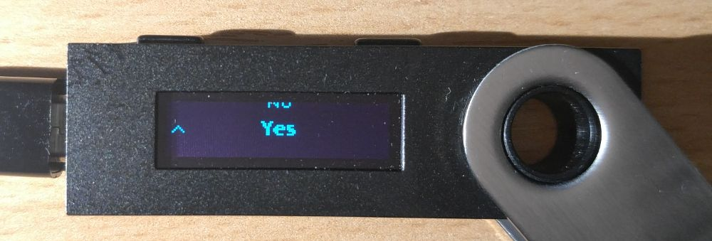

Now we are done configuring the Nano S to work with MyCrypto. You can press the right button to select "Back" and press both buttons at the same time to go back to the Ethereum app. If you do this once again, you will go back to the main menu with all the apps.

## Using the Ledger Nano S with MyCrypto

It's time to access our Nano S using MyCrypto! In order to do so, go to [MyCrypto](https://mycrypto.com/) and click the "Ledger" option.

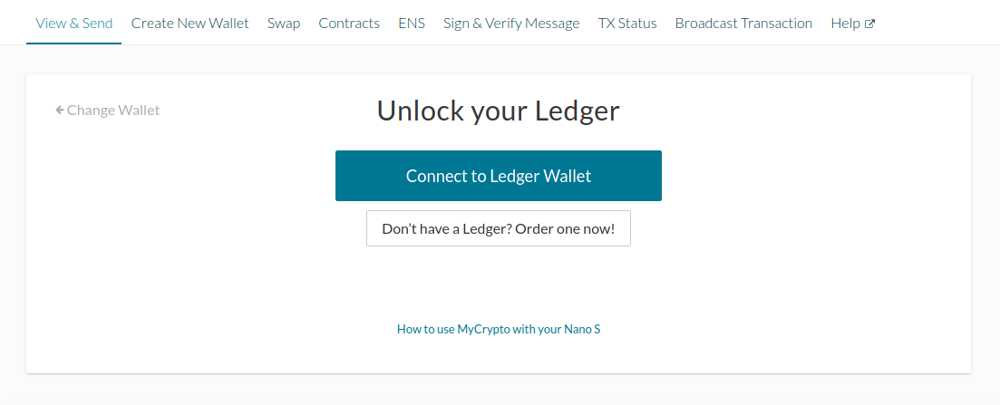

You will be presented with this screen. Plug in your Nano S and open up the Ethereum app. Once you've done that, click the big, blue "Connect to Ledger Wallet" button to be able to access the Ethereum wallets on your Nano S.

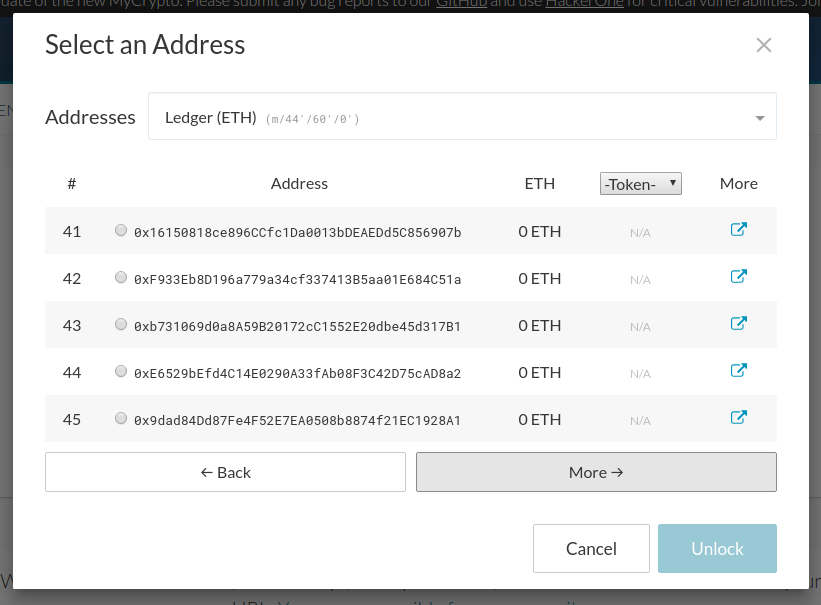

You will see a list of all your Ethereum addresses, which are safely stored on your Nano S. You can select any of these addresses to access them.

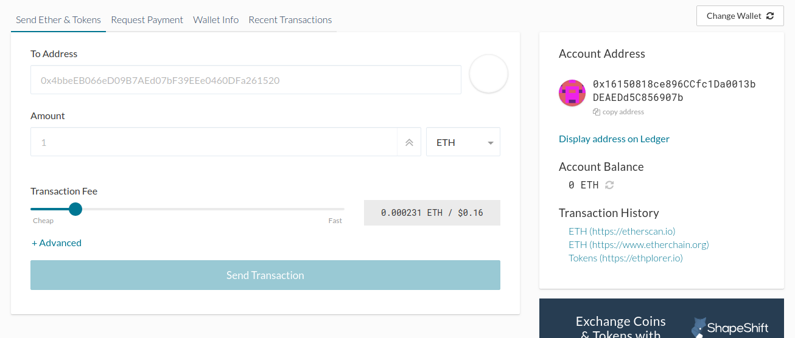

Once you select one of the addresses, the interface looks just the same as if you were to enter your private key to access it; it's no different. Your Nano S is ready to be used!

## Transferring funds from your private key to the Nano S

Sending ETH or tokens to your Nano S works the same as sending to any other address. Simply pick one of the addresses from the list when you access your Nano S, copy the Ethereum address, and send your ETH/tokens from your private key to the address. After you've done that and the transaction is completed, you can access your Nano S again and you will be able to see your funds safely stored on your Nano S!

## Restoring your Nano S

Ledger made a clear and easy-to-follow guide on how to restore your Nano S [here](https://support.ledgerwallet.com/hc/en-us/articles/360005434914-Restore-from-recovery-phrase).

## Troubleshooting

Ledger has an extensive knowledge base that you can find [here](https://support.ledgerwallet.com/hc/en-us), and MyCrypto's is [here](/). You can select any of these addresses to access them. If not, feel free to contact either [Ledger](https://support.ledgerwallet.com/hc/en-us) or [MyCrypto](mailto:support@mycrypto.com).
