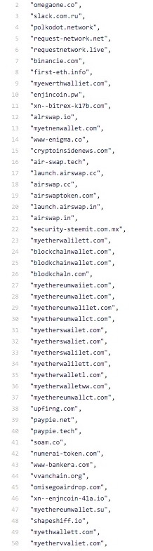
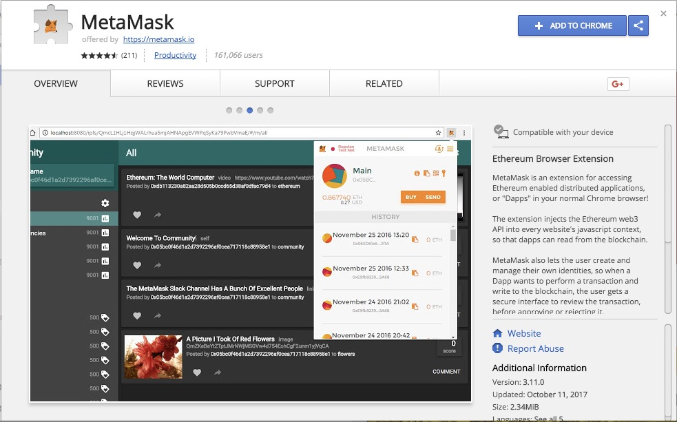
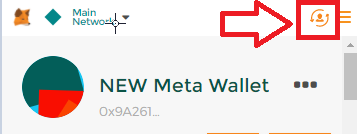
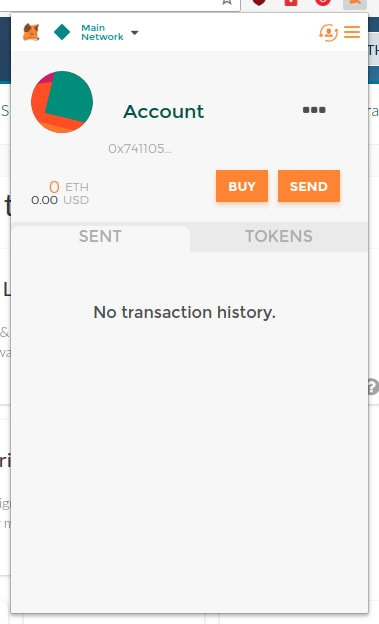

## Using MetaMask + MyCrypto has 3 key benefits:

1. If you use MetaMask, it is far less likely you will be phished or affected by a phishing site, as your key remains in MetaMask and the scam website will not be able to steal it.
2. It is by far the fastest, easiest way to unlock your wallet via MyCrypto.com and is completely free. You _just_ click a button. No more searching for keys or Keystore files!
3. MetaMask will block you with a big, red warning if you go to a malicious site [found on our blacklists](https://github.com/409H/EtherAddressLookup/blob/master/blacklists/domains.json). Look at all these crypto phishing websites! 

Damn! That's a lot of phishing sites!

## Installing & setting up MetaMask

When you set up MetaMask, you will be given a new wallet address and a new private key. There will be an option to import your already-existing private keys into MetaMask, and it is up to you to decide whether you want to keep using your old wallet or switch to the new one MetaMask gives you.

### Importing your Existing Wallet

- **Pros**: You don't need to transfer your funds to the wallet that MetaMask gives you. (Save on Eth Fees, Hurray!)
- **Cons**: The current wallet you use could be compromised, and importing your wallet to MetaMask won't stop your funds from being stolen. It will not be secured by the backup seed that MetaMask gives you.

### Using the new wallet MetaMask gives you

- **Pros**: There is no possible chance that the wallet could be compromised because the keys never leave MetaMask!
- **Cons**: You need to manually transfer all your Ether and tokens to the new wallet.

## How to install and set-up

1. [Find the MetaMask extension in the Chrome Store](https://chrome.google.com/webstore/detail/metamask/nkbihfbeogaeaoehlefnkodbefgpgknn).
2. Check to make sure it's the legit site. Are there are a ton of positive reviews? Are there a ton of users? If so, it's probably the right one.

3. Install the program by clicking "Add to Chrome."
4. Click the new orange MetaMask logo in your extension bar.
5. Read the terms of service. Accept said terms of service.
6. You will then be asked to enter a password, which protects your key by encrypting it. This means that your wallet will be more secure. Choose a strong password and write it down on paper! Do not store the password in Dropbox. Do not post it to Twitter. Do not share it with anyone. Write it down with good ol' fashion pen and paper! Write down your password multiple times to ensure that you've written it correctly.
7. You will then be shown 12 words. This is a fancy private key that creates an infinite amount of private keys that branch off from it. You will need this to access your Ether or to recover your MetaMask account if you forget the password. No one can recover the 12 words if you lose them, your computer dies, you reinstall Chrome, you uninstall the MetaMask extension, or you reinstall your OS. Make sure you back up these 12 words!
8. You can write your 12 words down and store them in a safe or [store them into metal](https://stee.ly/2Hcl4RE). This will ensure that they never get lost, even if your house catches fire. If using paper, you should store a second copy in a different physical location.

**Remember!** Do not share this key with anyone! If you do, they can access your account and send all your coins to themselves.

## Importing your wallet

Next, it is time to either import your existing wallet into MetaMask or transfer all your Ether and Tokens to the new wallet.

1. Log into MetaMask.
2. Click the little "man-switchy" icon in the top right corner.

3. Select `Import Account`.
4. Select your private key type: either `Private key` or `JSON file`.
5. Unlock wallet by pasting in your private key or uploading the JSON file. If you select your JSON file, you will need to input the password for the JSON file needed for decryption.
6. Click `Import`.

Your existing wallet should now be visible in MetaMask along with your Ether and tokens! This wallet is now listed as "loose."

## Loose keys

- If you click on the little man-switchy icon in the top-right corner after importing a private key, then you will see your new imported address with the word "loose" under it.
- "Loose" keys on MetaMask are imported private keys. These keys are NOT secured by the MetaMask backup seed phrases.

## Transferring your funds

1. You can now see your brand new account, balance, and transaction history. To transfer your funds from your old account to your newly setup MetaMask wallet, head to [MyCrypto](https://mycrypto.com/account).
2. First, check to be sure you are on the correct site. Is the URL mycrypto.com? Does it say `MyCrypto, Inc.` in the URL bar? Does the URL have any funky characters or is it misspelled?
3. No? Okay! Onward!
4. Unlock your account how you typically do.
5. Get your address from MetaMask. Click the orange extension icon, click the three dots (`. . .`) next to your new account, and click `Copy Address to clipboard`.

6. Paste your MetaMask address in the `To Address` field on MyCrypto.
7. First, send all your tokens. Click "Scan For Tokens" in the sidebar and wait for all those tokens to load.
8. Select your token from the dropdown.
9. Click the "Send Entire Balance" button.
10. Double check the amount, address, and tokens you are sending.
11. Generate and send the transaction. Ensure they were sent successfully and you can see them in MetaMask.
12. Repeat with all your tokens and then, last but not least, your ETH.
13. Next time you want to send your ETH or tokens, simply go to [MyCrypto](https://mycrypto.com/), click the "MetaMask" option. You will instantly connect. How easy is that?!

## Warning!

- If you are sending a huge amount of tokens or ETH, please send a small test amount first. Or consider [getting a hardware wallet](/staying-safe/hardware-wallet-recommendations) or [running MyCrypto offline](/how-to/offline/how-to-run-mycrypto-offline-and-locally). This ensures you are as secure as possible.

## Related articles

- [MetaMask Privacy Policy](https://metamask.io/privacy.html)
- [How to Transfer Funds](/how-to/sending/how-to-send-a-transaction)
