The TREZOR is one of the best and easiest-to-use cryptocurrency hardware wallets out there, and is available for purchase [here](https://shop.trezor.io/?offer_id=10&aff_id=1735). While the TREZOR supports a wide range of cryptocurrencies, this guide was specifically written for using Ether and ERC-20 tokens with MyCrypto.

When connecting to your TREZOR, **you do not generate a new wallet on MyCrypto**. Your TREZOR is your wallet and you use your TREZOR device now to store and send Ether and tokens.

## Initial setup

1. **Plug your device into your computer** using the USB cable provided.

2. **Go to the URL displayed on your device.**
   * You can use the buttons on your TREZOR to confirm/deny actions.
   
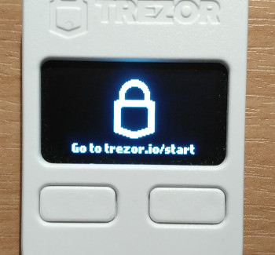

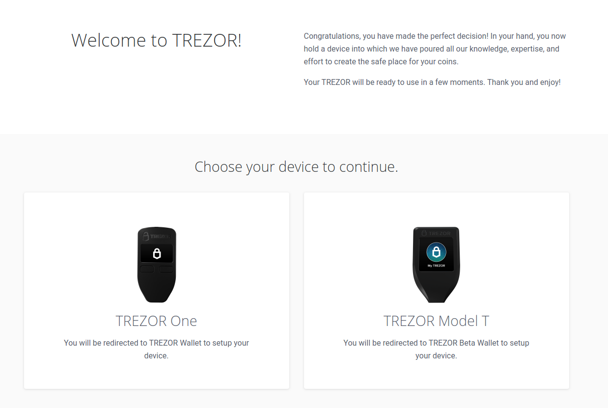

3. **Click "Create new"**

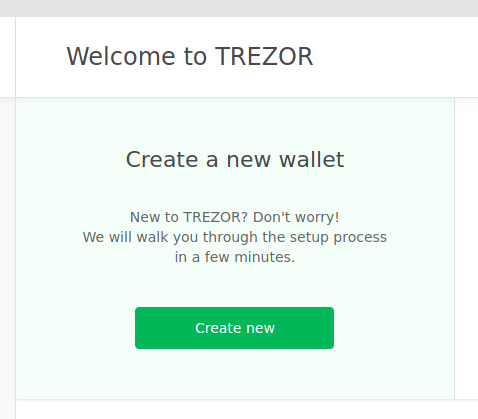

4. **Your TREZOR is ready!**
   * Click "Continue to the wallet." You will see a message that your TREZOR is not yet backed up, and that your progress is 10%. Click on "Create a backup in 3 minutes."

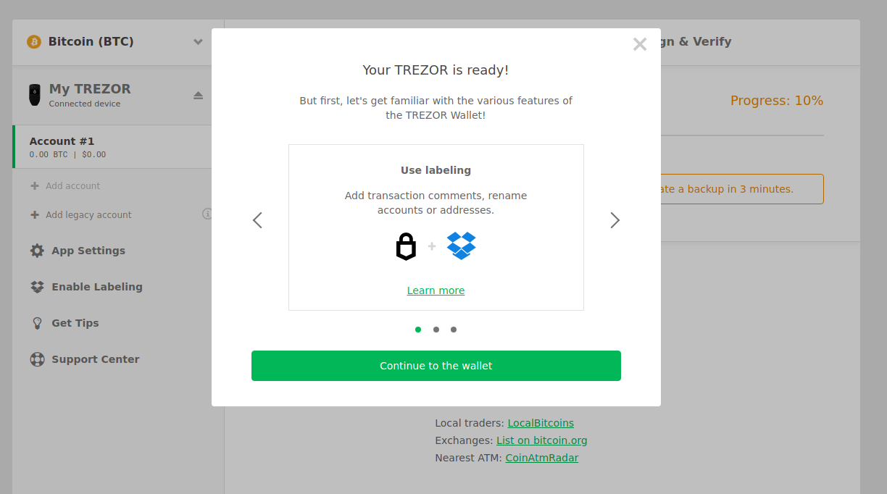

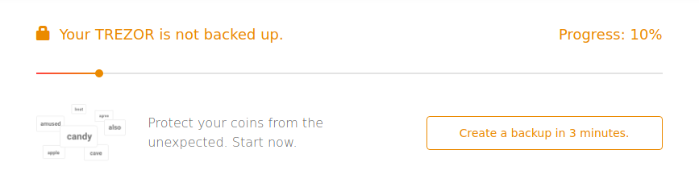

5. **Creating your backup.**
   * The TREZOR will give you 24 random words that you will have to write down on the provided card that came in the box. These are the recovery words, also known as a seed phrase.
   * You will have to use these words to restore your TREZOR in case it fails or you accidentally reset it.
   * **Do not save these recovery words on your computer or take a photo of these words with your phone.** Doing so means you are just as unsafe as using a normal private key.
   * Always write them down physically using pen and paper, and keep this paper safe.

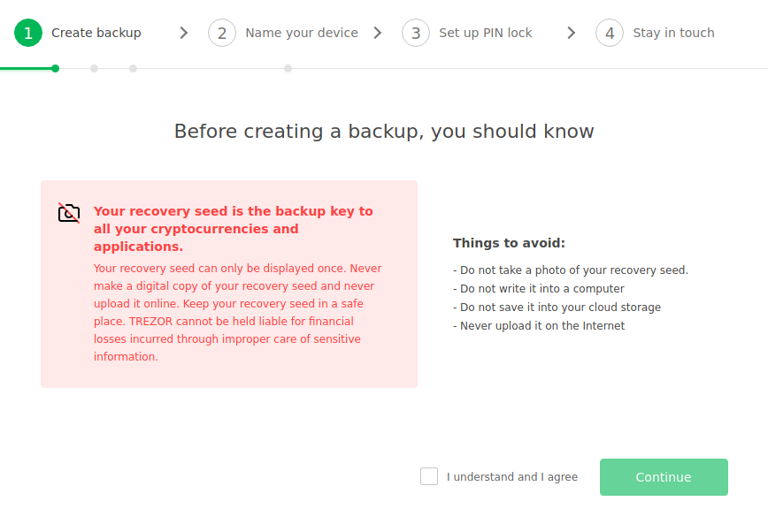

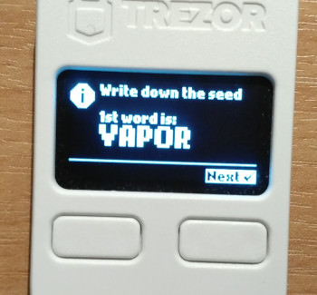

6. **Confirm your recovery words.**
   * Once you've written down all of the words, you will be asked to confirm your recovery phrase in order to make sure that you've written them down correctly.

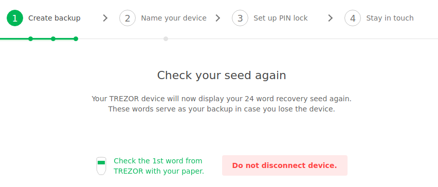

7. **You're done backing up your TREZOR!**
   * In case you lose or break your TREZOR, you will now be able to recover the wallets stored on it using the 24-word seed phrase.

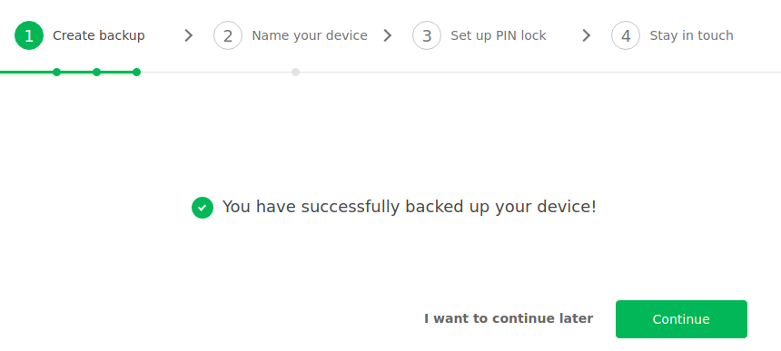

8. **Naming your device.**
   * Next, you will be asked to set a name for your TREZOR. This is useful in case you own multiple TREZORS or want to make sure the TREZOR you have is yours.
    
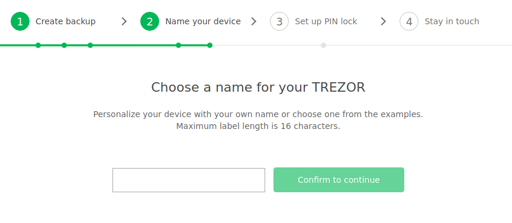

9. **The next step is setting a PIN.** Enter a new PIN that you will enter any time you want to access your wallets.
   * Make sure this pin is hard to guess so that others won't be able to get access to your TREZOR.
   * If you are not sure how PINs work with the TREZOR, look [here](https://wiki.trezor.io/User_manual:Entering_your_PIN) for more information.
   * E.g., I want to set "8963" as a pin. This would mean that I have to click the lower-left button, then the middle-right button, then the lower-middle button, and finally the upper-left button.
    
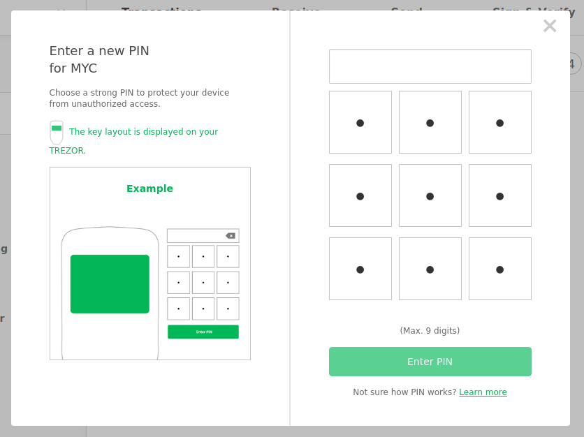

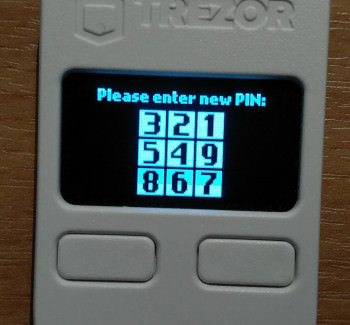

10. **Re-enter the PIN you just created.**
    * Be aware that the order of the numbers on the display of your TREZOR has changed, so you will have to click different buttons on your computer in order to enter the correct PIN.

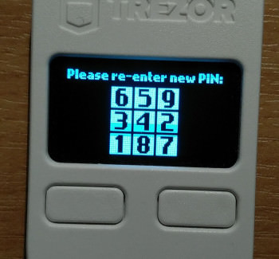

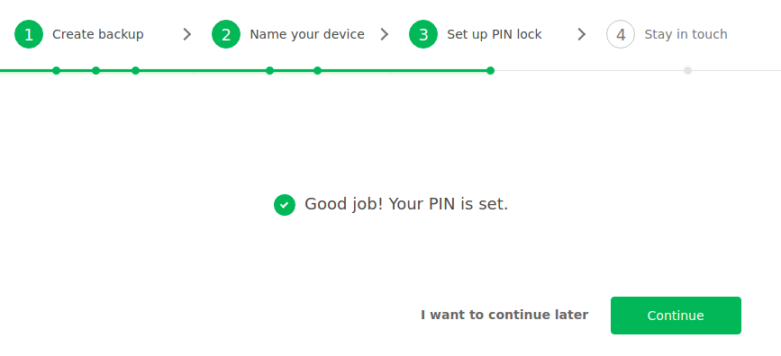

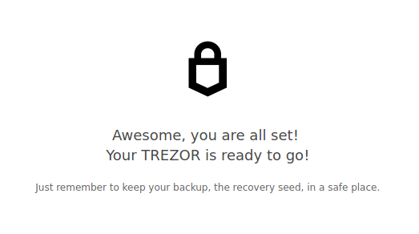

Now your TREZOR is set up and ready to be used!

## Connecting to your TREZOR with MyCrypto

It's time to access our TREZOR using MyCrypto! In order to do so, go to [MyCrypto.com](https://mycrypto.com/)

1. Plug in your TREZOR.
2. Select the TREZOR option on MyCrypto.
3. Click the blue `Connect to TREZOR` button on MyCrypto.

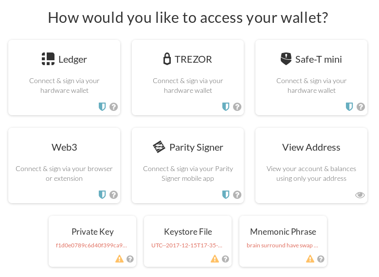

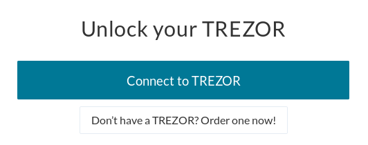

4. A window reading "Export public key for "Ether Account Number [...]" will pop up. Click "Export."

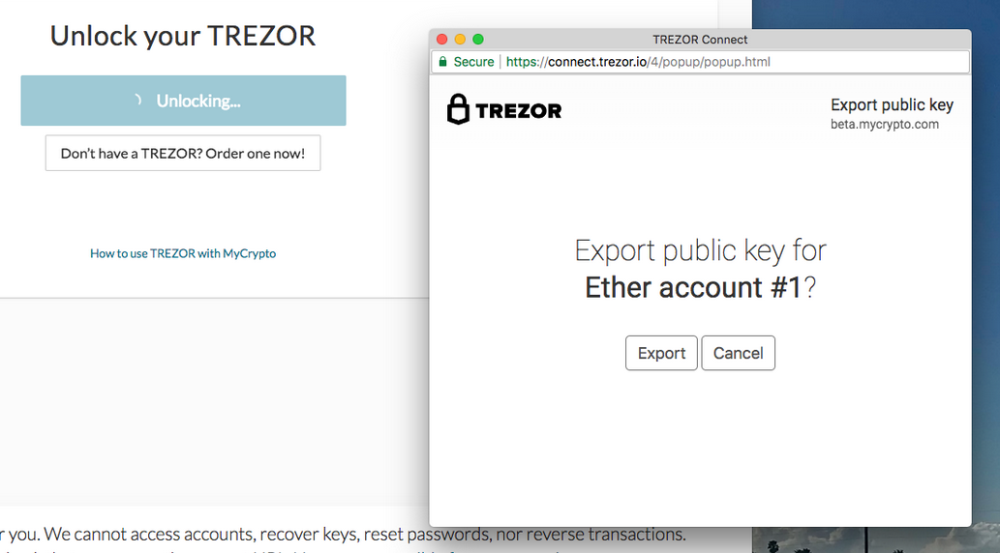

5. Different Ethereum addresses will be displayed on MyCrypto. All of these addresses are accessible via on your TREZOR. Select one of these addresses.

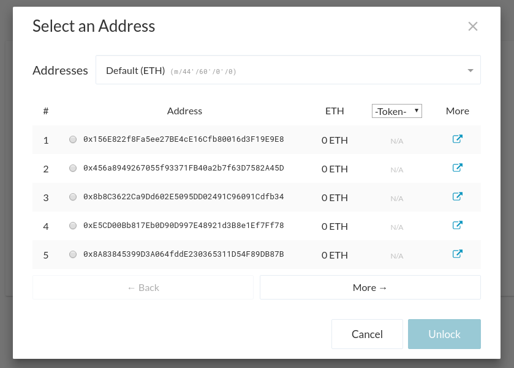

6. Once you select one of the addresses, the interface looks just the same as if you were to enter your private key to access it; it's no different.

Your TREZOR is ready to be used!

## Transferring funds from your private key to the TREZOR

Sending ETH or tokens to your TREZOR works the same as sending to any other address.

1. Pick one of the addresses listed when you access your TREZOR.
2. Copy this address to your clipboard.
3. Unlock your original Ethereum account address (via private key, MetaMask, or JSON file—wherever you are transferring from).
4. Paste your TREZOR address into the "To Address" field and send your ETH and tokens.
5. The next time you unlock your TREZOR wallet, you will be able to see your funds safely stored on your TREZOR!

## Sending funds FROM your TREZOR

In order to send from your TREZOR hardware wallet, connect to your TREZOR per the instructions above.

1. You should now see a "Send Ether & Tokens" view on MyCrypto.com.
2. The address displayed under 'Account Address' on the right side of the screen should match the address you selected earlier.

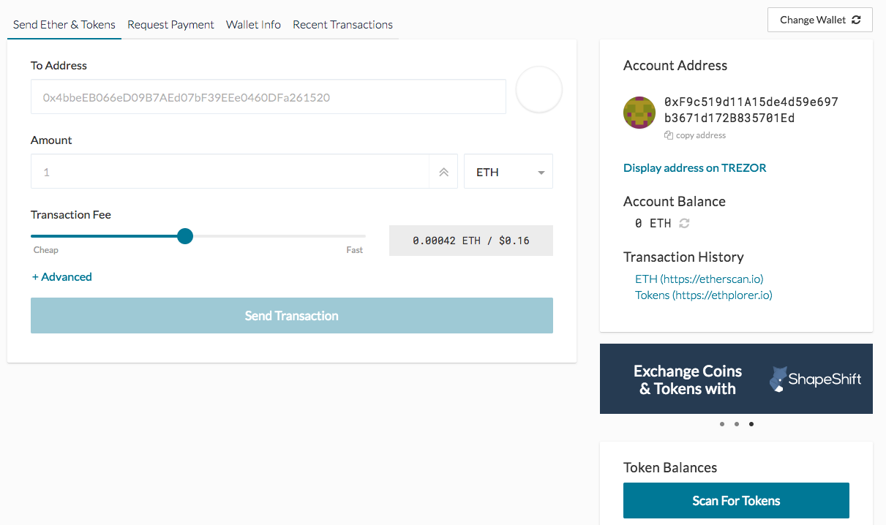

3. Enter the address you would like to send to in the `To Address:` field.
4. Enter the `Amount` you would like to send.
5. If you are sending tokens, click the `Scan for Tokens` button.
6. Then select the token you would like to send from the dropdown next to the amount.
7. Use the `Transaction Fee` slider to select how much [gas](/general-knowledge/ethereum-blockchain/what-is-gas) to use for your transaction.

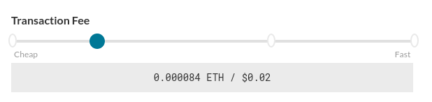

8. Click the `Send Transaction` button when you are ready to go. *(Don't worry, you will be able to review the transaction before it is sent)*

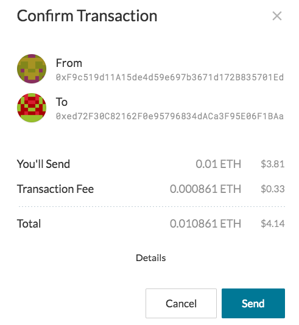

9. A pop-up will appear. Click `Details` for more information about your transaction. Please double check the information before you click send.

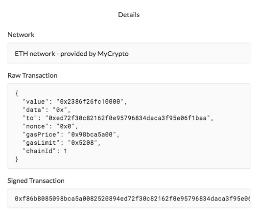

10. After you click `Send Transaction`, a green message should appear at the bottom of your screen. You can click the buttons to view and verify the transaction on Etherscan, Etherchain, or MyCrypto to Check the transaction Status.

[If your transaction doesn't show up on Etherscan / Etherchain / MyCrypto after a few minutes, you may need to send with more gas. Click here to learn more about gas.](/general-knowledge/ethereum-blockchain/what-is-gas).

## Restoring your TREZOR

TREZOR made a clear and easy-to-follow guide on how to restore the device [here](https://doc.satoshilabs.com/trezor-user/recovery.html).

## Troubleshooting

* TREZOR has an extensive knowledge base that you can find [here](https://trezor.io/support/), and MyCrypto's is [here](/). There is a big chance that any issue you might encounter is already listed on one of them.
* If you need further assistance, reach out to [TREZOR](https://trezor.io/support/technical/issue/) or [MyCrypto](/contact-us/) support.
