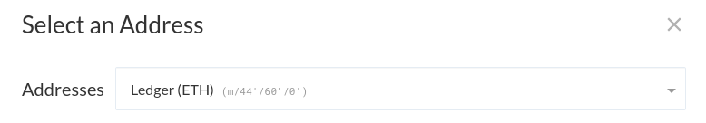
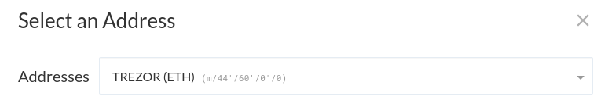
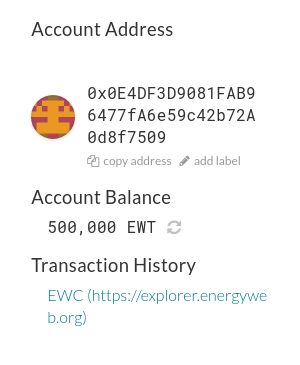
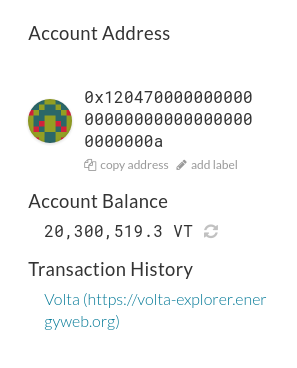

Energy Web Chain ("EWC") is a blockchain designed to be used for the energy sector. Its utility token is Energy Web Token ("EWT"), and this article will explain how you can access these tokens using MyCrypto.

EWC is a separate network and blockchain from Ethereum, and is not a token on the Ethereum blockchain. The term "token" may cause confusion, but keep in mind that EWT is separate from Ethereum.

## Switching to the Energy Web network

You can use MyCrypto's network switcher to change your interface to use the Energy Web Chain, instead of the Ethereum network that MyCrypto connects to by default.

If you use the [MyCrypto.com](https://mycrypto.com/) website, you can find the network switcher at the top-right of your interface. If you are using the [MyCrypto desktop app](https://download.mycrypto.com/), you can find this at the bottom-left of the interface. Click "Show Other Networks" to find the EWC network.

Keep in mind that when you are connected to this network, you will not see your Ethereum or ERC-20 funds. Simply switch back to the Ethereum network if you wish to access these funds again.

## Accessing your Energy Web Tokens

<Accordion>
<AccordionItem title="Ledger">

To interact with EWT using your Ledger device, you have to use the EnergyWebChain app on your Ledger device, **not** the Ethereum app. If you do not have this app installed, you can use [Ledger Live](https://www.ledger.com/ledger-live) to install it.

After accessing your Ledger device with MyCrypto, you will notice that a list of different addresses will show up, instead of the addresses that you would see if you were connected to the Ethereum network. You are free to use these for your Energy Web Tokens.

If you have accidentally sent EWT to your Ethereum addresses previously, you can still access these by clicking the drop-down field next to "Addresses", and selecting the "Ledger (ETH)" option.

You will see that your Ethereum addresses will show up, together with its EWT funds.

</AccordionItem>
<AccordionItem title="Trezor">

Access your Trezor device like usual. You will notice that a list of different addresses will show up, instead of the addresses that you would see if you were connected to the Ethereum network. You are free to use these for your Energy Web Tokens.

If you have accidentally sent EWT to your Ethereum addresses previously, you can still access these by clicking the drop-down field next to "Addresses", and selecting the "TREZOR (ETH)" option.

You will see that your Ethereum addresses will show up, together with its EWT funds.

</AccordionItem>
<AccordionItem title="Private Key/Mnemonic Phrase/Keystore File">

You can access your address like usual, and you'll be able to see your EWT right away.

From here, you are free to interact with your EWT however you wish. 

</AccordionItem>
</Accordion>

## Accessing the Volta testnet

To access the Volta testnet, choose the Volta network in the network switcher. After accessing your address, you can interact with the Volta network however you'd like.

