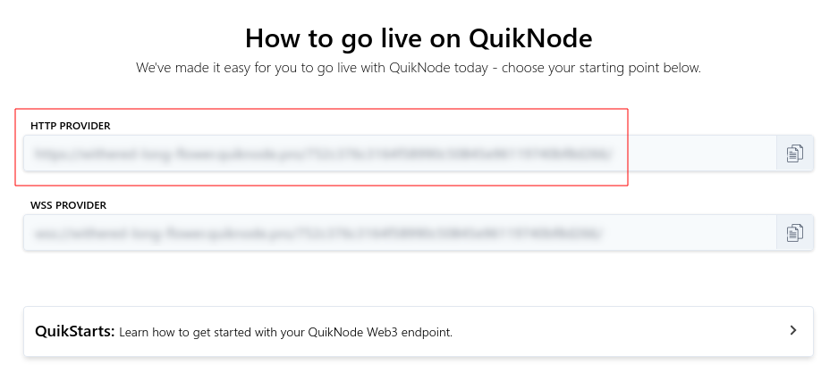
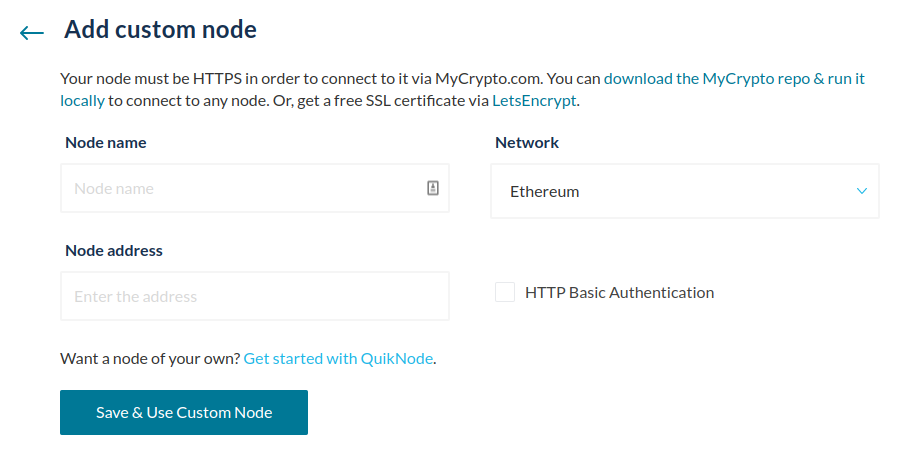

[QuikNode](https://quiknode.io/?tap_a=67226-09396e&tap_s=860550-6c3251) is a service that allows you to get your own, personal Ethereum node. Besides Ethereum, they also provide nodes for Bitcoin and Ethereum testnets, with the possibility to choose between a variety of different clients. They provide elastic APIs, dedicated nodes, powerful tools, and analytics, all in one easy-to-use dashboard.

You can get started with QuikNode by creating an account at [quiknode.io](https://quiknode.io/?tap_a=67226-09396e&tap_s=860550-6c3251).

## Finding your endpoint

Once you've created an account, and created your node, you'll be able to find it in your dashboard right away.

After selecting your node, the HTTP Provider URL that you can use in your MyCrypto interface will show up immediately, copy this URL.

## Connecting to your endpoint

Let's add this node to your MyCrypto interface! First, go to [the settings page on MyCrypto](https://app.mycrypto.com/settings). Under "Network & Nodes", click on the dropdown menu next to the Ethereum network, and select the "Custom" option on the bottom.

A new screen will appear, allowing you to enter the details of your QuikNode instance. For the name, it can be set to anything you'd like. For the network, make sure that it's the same one as you have your QuikNode instance set up to be. In the URL field, you can enter your personal endpoint that you copied earlier from the QuikNode dashboard.

After saving it, your MyCrypto interface will automatically connect to it. You've successfully added your own QuikNode instance to MyCrypto!
