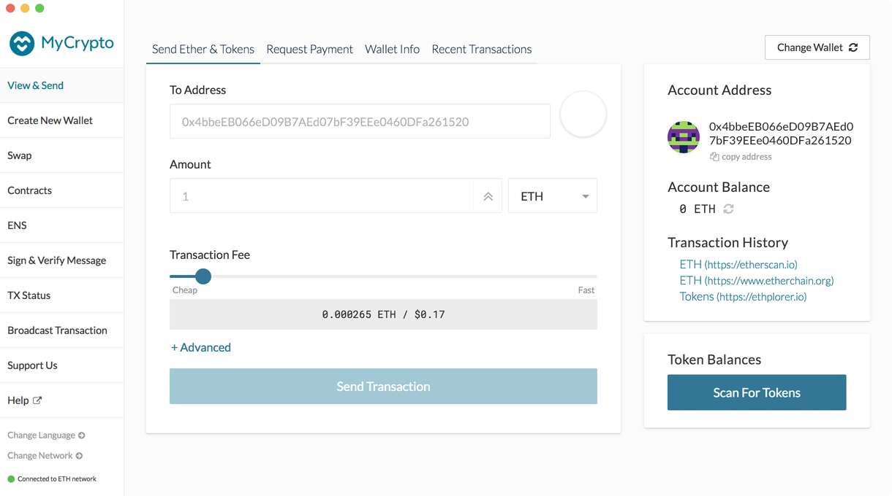

<Alert label="The desktop application is not actively maintained.">

The MyCrypto desktop application is part of an older version of MyCrypto that is not actively maintained. You can find the latest version of MyCrypto on [mycrypto.com](https://mycrypto.com/).

</Alert>

For increased security, you can run MyCrypto locally on your computer with our desktop application. The computer should have no internet connection. You can generate a wallet completely offline and send transactions from the "View & Send" page.

## Downloading and installing

In order to set up your local MyCrypto, start off by downloading the latest release of the desktop application from [download.mycrypto.com](https://download.mycrypto.com/). It's also highly recommended to check the signed checksums, we made a guide about verifying the authenticity of the desktop app [here](/staying-safe/verifying-authenticity-of-desktop-app).

Move the downloaded executable to a USB stick or something similar, in order to move it to your offline computer. Plug the USB stick into your offline computer and move the executable to a place that you can easily find on your offline computer.

## Running the application

To open the MyCrypto application, double-click the executable. This should open up a new window on your computer with the local version of MyCrypto running. You will get a warning that says it is unable to connect to the network, but this is completely normal. You won't be able to see your Ether or token balance through your local MyCrypto, but you can still use [Etherscan](https://etherscan.io/) or [Etherchain](https://www.etherchain.org/) to see your balance.

Be sure to periodically check for new updates to the MyCrypto desktop app, as it can't automatically let you know when it's on an offline computer. To update, simply download the newest version on [download.mycrypto.com](https://download.mycrypto.com/).
