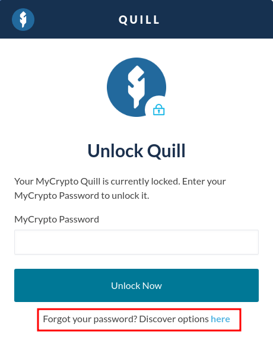
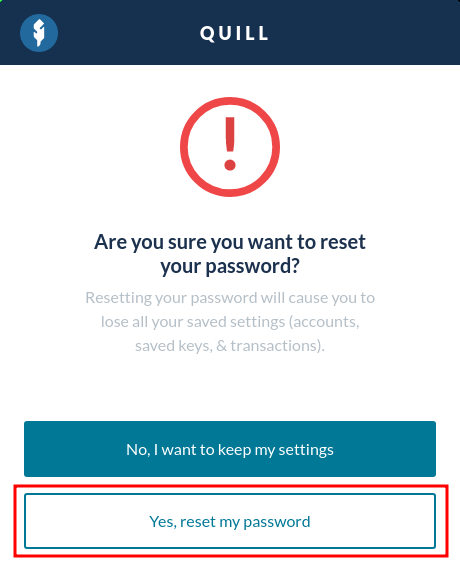

In the event that you lost your Quill password and no longer have access to your Quill accounts, you'll have to reset your Quill application and restore your account(s) using the 12-word Secret Recovery Phrase shown during the initial setup of your Quill account. **Keep in mind that you can only restore your Quill account(s) with your 12-word Secret Recovery Phrase.**

To reset your Quill while it's locked, click the "Discover options here" button at the bottom of your locked interface.

To proceed, click the "Yes, reset my password" button.

Your Quill application will become a blank slate like when you first installed it. Click the "Create Password" button to set your new password, and save it in a secure location. Then, you can either choose to create a brand new Quill account or [import your existing Quill account(s)].
