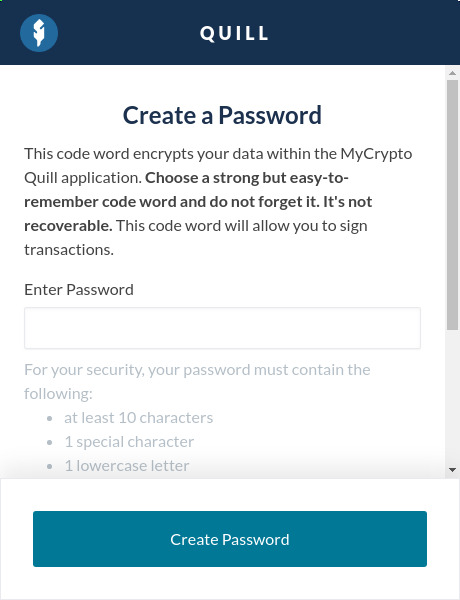
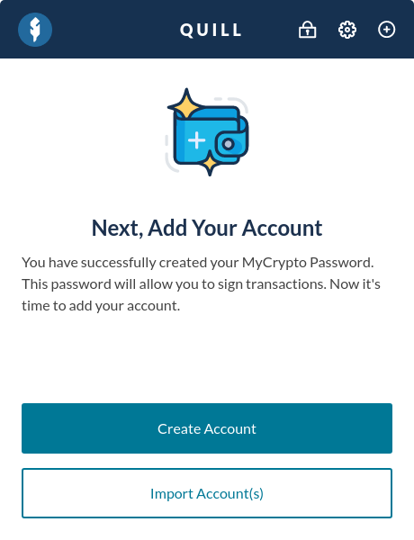
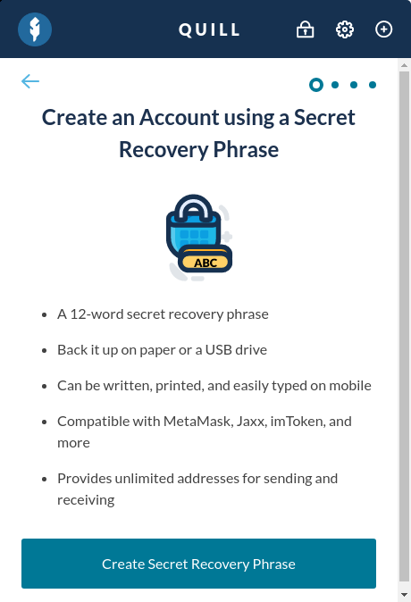
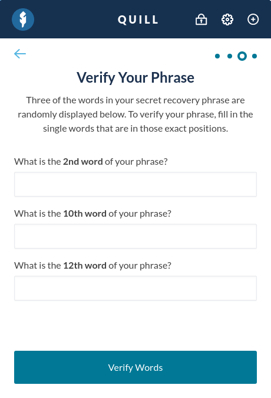
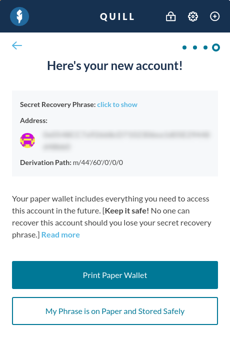
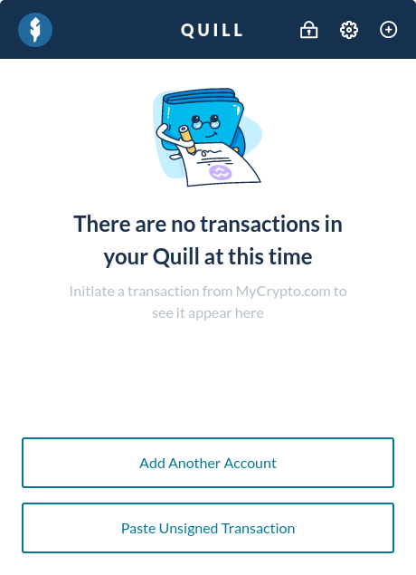
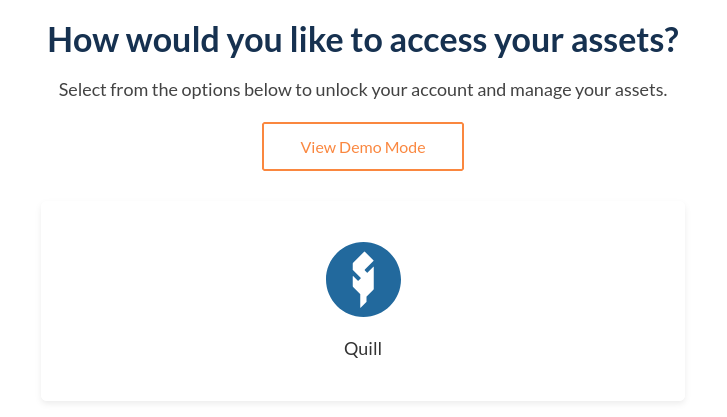
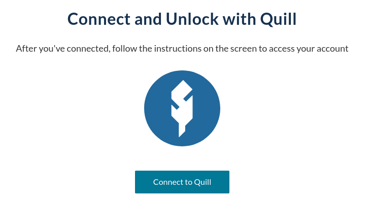
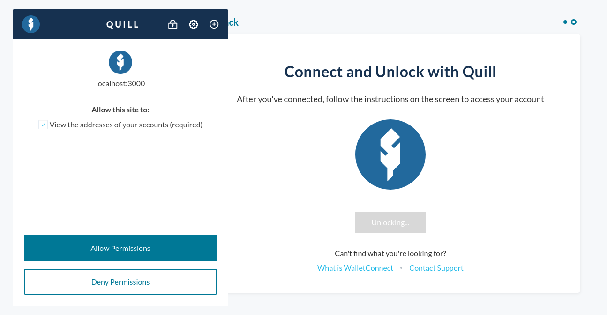
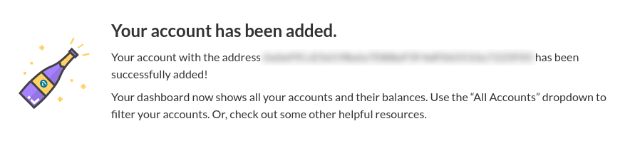

To install Quill, head on over to [download.mycrypto.com](https://download.mycrypto.com/), and install Quill for your operating system.

## Settings up Quill

To get started with Quill, you need to choose a strong password, which is used to encrypt your data within the Quill application.

This password will give anyone who has access to your computer access to your Quill accounts, so make sure it's secure and that only you know it. Read more on [safely creating and storing your password](/how-to/backup-restore/how-to-safely-create-store-your-password).

After entering your password, click the "Create Password" button.

You've successfully set a password, and you're ready to get started with Quill! You can either create a new account with Quill, or import any of the following wallet types:

- Secret Recovery Phrases
- Private keys
- Keystore Files

This article will guide you through creating a new account, but feel free to read more about [importing your own wallet](/how-to/quill/how-to-import-private-key-keystore-file-phrase), or [importing your existing Quill account(s)](/how-to/quill/how-to-restore-quill-accounts).

## Creating Your First Account

To create a brand new account within Quill, click the "Generate Account" button.

When you create a new account with Quill, you are provided a series of words that grants you access to your account(s) in case you lose your Quill password. Make sure to store your Secret Recovery Phrase in a [safe and secure place](https://blog.mycrypto.com/where-is-your-wallet/), offline, and not stored on your computer. Keep in mind that your phrase needs to be written down in the correct order, as shown in the Quill interface. **Never share your Secret Recovery Phrase with anyone, as it will allow them to gain full access to your account(s), even if they don't know your password.**

After writing down your Secret Recovery Phrase, click the "Confirm Phrase" button.

To make sure you've written down your phrase correctly, Quill will ask you to enter three words in random positions. After entering the correct words, click "Verify Words". **If an error shows up, go back and make sure that you've written down each of the 12 words in your Secret Recovery Phrase, and that you've written them down in the correct order.**

You successfully created your first Quill account! Again, make sure you are saving your Secret Recovery Phrase in a secure, offline location. You can also choose to print a paper wallet during this step. **Losing your Secret Recovery Phrase will cause you to lose access to your account(s) and funds. MyCrypto is not able to recover these accounts for you.**

Once you make sure your phrase is stored safely, you can continue.

You've successfully created a new Quill account, and you're ready to add this account to your MyCrypto Dashboard!

## Adding to Your MyCrypto Dashboard

Head on over to app.mycrypto.com, and find the "Add" button in your Dashboard sidebar.

Various wallet options will be shown, select Quill. Then, select the network you wish to use with your Quill account, which by default will be Ethereum, and continue.

Prompt MyCrypto to connect to your Quill instance by clicking the "Connect to Quill" button.

Your Quill window will appear, asking you to connect to MyCrypto. Make sure it's MyCrypto asking you to connect, and click "Allow Permissions".

You've now successfully created a new Quill account, and connected it with your MyCrypto Dashboard! Hooray!

From here on, you're free to add funds to your account by sending funds to your new account address, or by purchasing ETH with [buy.mycrypto.com](https://buy.mycrypto.com/).
