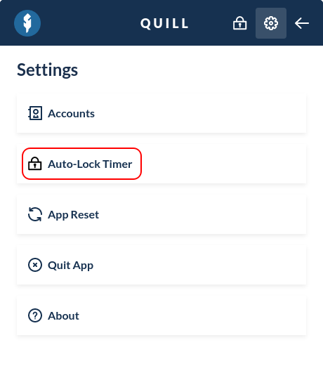
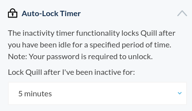

When your Quill interface was left unattended for a certain period of time, Quill's Auto-Lock Timer automatically locks your interface, keeping your funds safe and secure.

By default, Quill will automatically lock after 5 minutes of inactivity.

## Changing the Timer

Open up Quill, and unlock it by entering your Quill password.

Find the cogwheel icon in the top right corner of your Quill interface, this will open up your Quill settings.

Click "Auto-Lock Timer" in the list of settings that show up.

By default, Quill's Auto-Lock Timer is set to 5 minutes. You can select either a longer or shorter inactivity duration. After selecting your new inactivity duration, it'll automatically be saved in your Quill settings.

If you use a shared computer, we highly recommend keeping your Auto-Lock Timer at a low inactivity duration, and to lock your Quill interface immediately after use.
