Besides [setting up a brand new Quill wallet](/how-to/quill/getting-started-with-quill), it's also possible to import already existing private keys, keystore files, or Secret Recovery Phrases (mnemonic phrases) to your Quill instance.

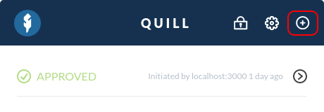

To get started with importing a new account, find the "+" button in the top right of your Quill interface.

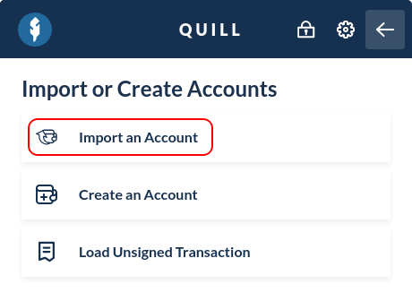

Click "Import an Account", and follow the instructions of the wallet type that you want to import.

<Accordion>
<AccordionItem title="Importing a Secret Recovery Phrase">

If you already used Quill previously, and wish to import your Secret Recovery Phrase, take a look at our article on [Restoring Your Quill Account(s)](/how-to/quill/how-to-restore-quill-accounts).

However, Quill also allows you to import any 12- or 24-word phrase generated with other wallets.

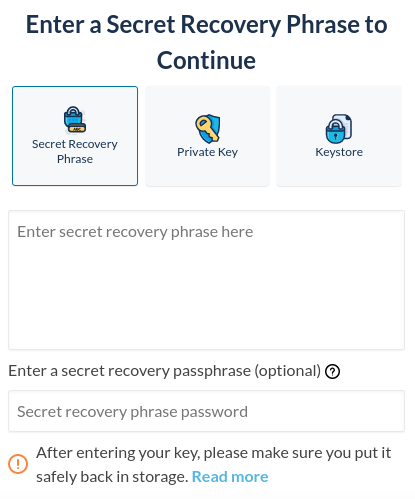

Enter your Secret Recovery Phrase in the correct order. If you've used a password previously, enter it in the password field. Keep in mind that the password field is optional, and other accounts will show up with different passwords. Read more on [how Secret Recovery Phrases work](/general-knowledge/cryptography/how-do-mnemonic-phrases-work).

Once you enter your phrase and additional password, click "Next."

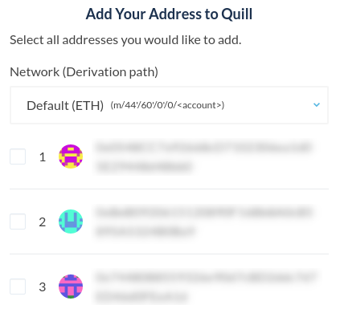

A list of addresses derived from the phrase you entered will appear. Select any that you would like to add to Quill, and click "Review Security Details".

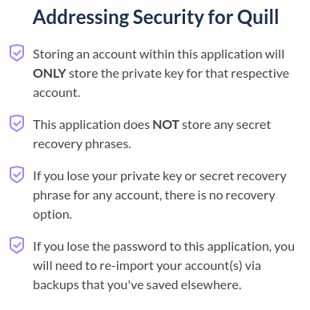

Review the security pointers, and continue by clicking "Acknowledge and Continue."

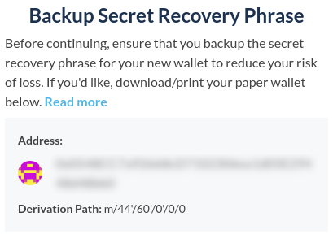

Quill will then ask you to ensure that you're safely storing your Secret Recovery Phrase, and also allows you to print a paper backup if desired. Once you make sure your phrase is stored safely, continue by clicking "My Phrase is Stored Safely, Add Account."

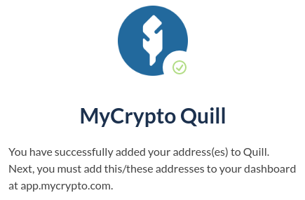

</AccordionItem>
<AccordionItem title="Importing a Private Key">

A raw private key is a string of 64 characters, consisting of a combination of characters between A-F and 0-9.

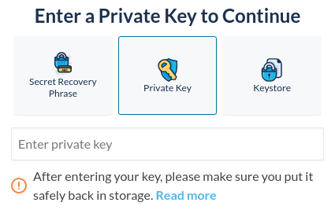

Click "Private Key" and enter your private key. Hit "Review Security Details" to go to the next step.

If you get an error or are unable to continue, make sure that you entered your private key correctly and no characters are missing.

Review the security pointers and continue by clicking "Acknowledge and Continue."

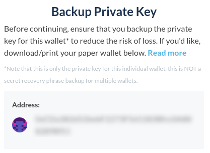

Quill will then ask you to ensure that you're safely storing your private key, and also allows you to print a paper backup if desired. Once you make sure your key is stored safely, continue by clicking "My Phrase is Stored Safely, Add Account."

You've successfully added your Secret Recovery Phrase account(s) to Quill! Head on over to app.mycrypto.com to add your account(s) to your MyCrypto Dashboard.

</AccordionItem>
<AccordionItem title="Importing a Keystore File">

Keystore files, commonly known as UTC/JSON files, are files that are generated using a private key + a password of your choosing, essentially encrypting the private key.

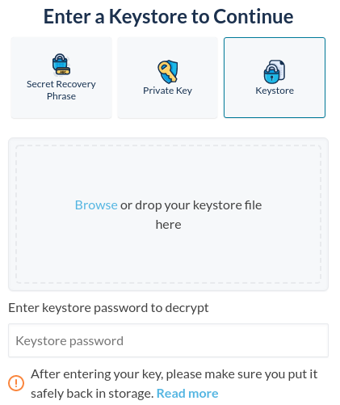

Click "Keystore," and either drag and drop your keystore file into Quill or click "Browse" to select the keystore file on your computer. Enter the password associated with this keystore file and hit "Review Security Details" to go to the next step.

Review the security pointers, and continue by clicking "Acknowledge and Continue."

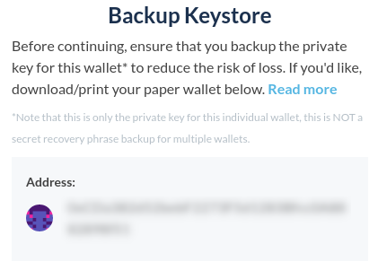

Quill will then ask you to ensure that you're safely storing your private key, and also allows you to print a paper backup if desired. Once you make sure your key is stored safely, continue by clicking "My Phrase is Stored Safely, Add Account."

You've successfully added your Secret Recovery Phrase account(s) to Quill! Head on over to app.mycrypto.com to add your account(s) to your MyCrypto Dashboard.

</AccordionItem>
</Accordion>
