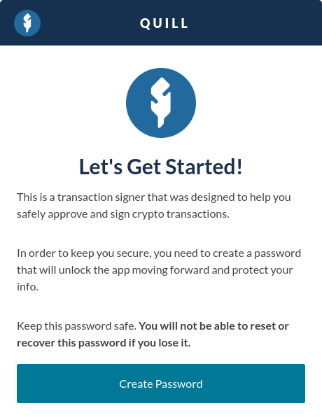
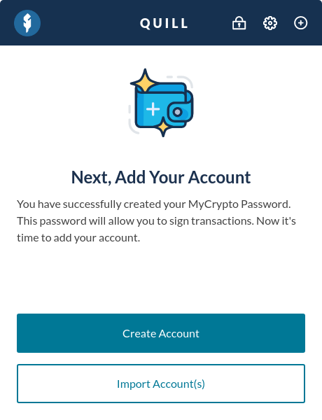
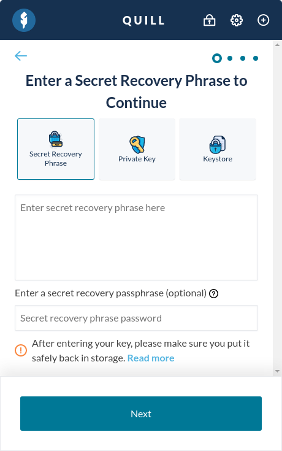
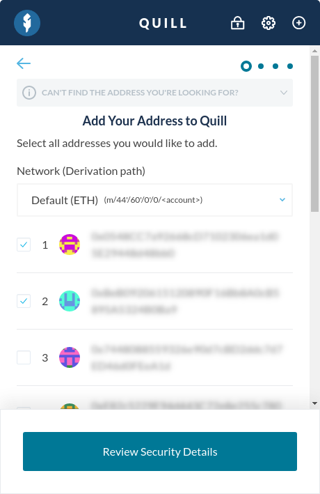
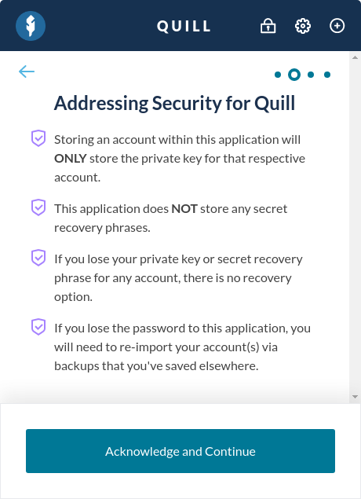
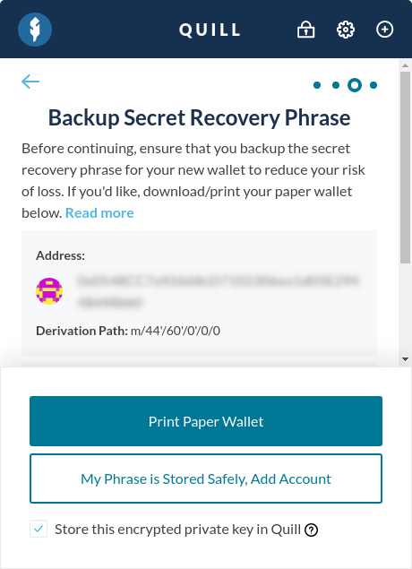
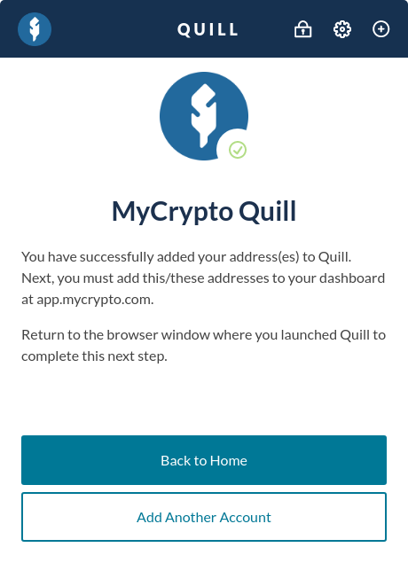

If you've used Quill previously, it's possible to safely restore access to your funds and interact with your accounts just like before.

Additionally, if you've generated a private key, keystore file, or secret recovery phrase, it's possible to add these to Quill too. For more information on importing these types, check [here](https://support.mycrypto.com/how-to/quill/how-to-import-private-key-keystore-file-phrase).

## Restoring your Account(s)

Whether you want to access your Quill account(s) on a new device, or were forced to wipe your Quill interface because you lost your password, restoring your Quill account(s) works all the same.

First step is to create a new password for your fresh Quill instance. If this is the first time you're using Quill, please check our [Getting Started with Quill article](https://support.mycrypto.com/how-to/quill/getting-started-with-quill).

You've successfully set your Quill password. Next, click the "Import Account(s)" button. A few wallet options will be shown.

When you first generated your Quill account(s), you were instructed to write down your 12-word Secret Recovery Phrase. Make sure the "Secret Recovery Phrase" option is selected, and enter your phrase in the correct order.

If you generated your phrase with Quill, you can leave the additional password field blank. **Never share your Secret Recovery Phrase with anyone, as it will allow them to gain full access to your account(s), even if they don't know your password.**

Once you’ve successfully entered your phrase, click "Next".

The accounts correlating to your Secret Recovery Phrase will show up. Select the account(s) you would like to be able to access with Quill, and click "Review Security Details."

If you don't see your account(s), try the following:

- Make sure you entered your Secret Recovery Phrase correctly, and in the right order.
- If you use a non-ETH network, select the correct derivation path in the "Network (Derivation path) drop down field.
- To find the correct path, you can also use [findeth.io](https://findeth.io/).

Review the security pointers, and continue.

Make sure the "Store this encrypted private key in Quill" checkbox is checked. This will make sure you won't have to re-add your account(s) next time you open Quill, you'll simply have to unlock with your password instead.

Make sure your Secret Recovery Phrase is stored offline, and continue.

You've successfully restored your Quill account(s!) If you're using a new device, make sure to add your restored addresses on your [MyCrypto Dashboard](http://app.mycrypto.com) as well.
