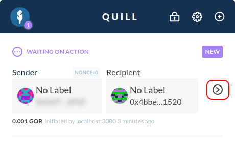

First off, make sure that you've successfully added your Quill account(s) to your MyCrypto Dashboard. Check out our [Getting Started with Quill](/how-to/quill/getting-started-with-quill) article if this is your first time using Quill!

## Sending a Transaction

Head on over to your MyCrypto Dashboard, and click "Send" in the sidebar, or "Send Assets" in your Dashboard overview.

Select the asset you'd like to send and select the Quill account you would like to send from. Then, enter a recipient you would like to send to, and the amount of your selected asset.

Make sure you're sending to the correct recipient, and click "Next" once all looks good.

MyCrypto will prompt your Quill interface. If not unlocked yet, Quill will ask for your password.

Your transaction will appear in Quill. Click the ">" icon to review the transaction.

Verify that the recipient, selected asset, and amount are correct. If everything seems right, you can approve the transaction by clicking "Approve Transaction." If you made an error while creating this transaction, you can deny it by clicking "Deny Transaction."

Once you approve the transaction, a confirmation message will appear in your MyCrypto interface. Check your transaction details once more, and hit "Confirm and Send" if all seems well. Your transaction will then get broadcast!

MyCrypto will calculate whether your transaction will get processed within the next 30 seconds, and let you know once your transaction was successfully confirmed.

