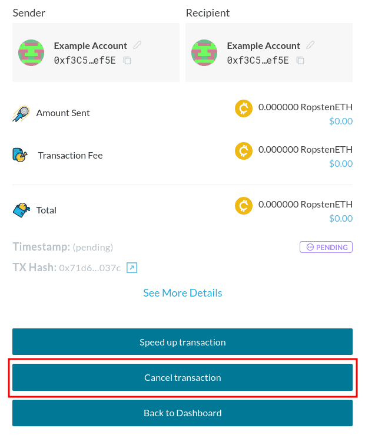
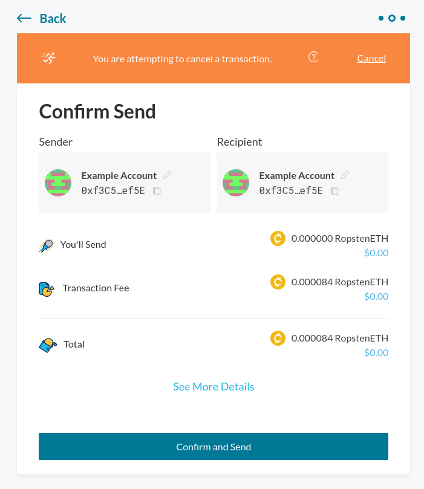
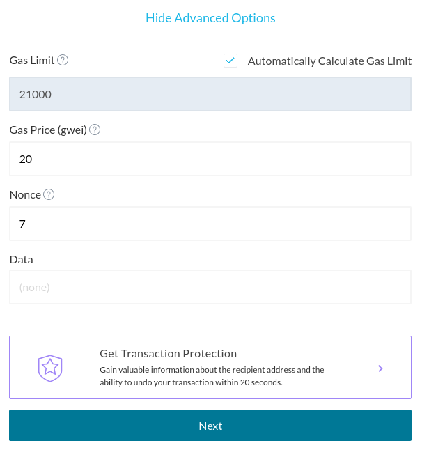

In certain cases you may want to _cancel_ or _replace_ a transaction, for example, when you used a [gas price](/how-to/sending/how-to-know-what-gas-price-to-use) that was too low. Especially in times when gas prices are relatively high, you may want to increase the gas price of your transaction, to make sure it will be confirmed quickly.

- **Cancel**: Sending a transaction with a value of 0 ETH to your own Ethereum address, with the purpose of preventing your previous transaction from being confirmed.
- **Replace**: Sending the same transaction to another Ethereum address, with the purpose of doing something (e.g. sending Ether or tokens, ...).

This works by sending a transaction with the same [nonce](/general-knowledge/ethereum-blockchain/what-is-nonce) as your previous transaction. Transactions must be confirmed in the order of the nonce, starting from 0, so if you re-submit a transaction with the same nonce and a higher gas price, your previous transaction will be overwritten. There is still a chance that your previous transaction is confirmed first, in which case the replacement transaction will be invalidated.

## Cancelling a Transaction

Please keep in mind that at this time, it is only possible to cancel transactions that were not conducted with a Web3 provider such as Metamask. See [here](https://metamask.zendesk.com/hc/en-us/articles/360015489251-How-to-Speed-Up-or-Cancel-a-Pending-Transaction) if you wish to cancel a transaction that was performed through MetaMask.

Either after sending a transaction, or after [checking the status](/how-to/sending/checking-the-status-of-a-transaction) of your transaction, you will see an option to cancel it.

After clicking the "Cancel transaction" button, you'll see that you will send a 0 ETH transaction, which will replace the pending transaction.

Make sure that everything seems right, and hit "Confirm and Send". Your transaction to cancel the previous transaction will be on its way, and should be mined shortly.

## Replacing a transaction

<Alert label="You can speed up transactions from the interface.">

If you'd like to replace a transaction to get it mined quicker, [you can speed it up right from the interface](/how-to/sending/how-to-speed-up-a-transaction).

</Alert>

1. In the "Recipient" field, you can enter a different address if you accidentally entered a wrong address previously, or your own address if you'd like to cancel it (see instructions above).
2. In the "Amount" field, enter the same amount as used in your original transaction. If you are sending tokens, make sure to select the token.
3. Click on "Show Advanced Options" to show the advanced transaction setting, and enter the [nonce](/general-knowledge/ethereum-blockchain/what-is-nonce) of the transaction you want to cancel in the "Nonce" field.
4. Enter a gas price that is **higher** than the gas price you used previously. If you are not sure what to enter, you can check the recommended gas price on [ETH Gas Station](https://ethgasstation.info/).
5. If your original transaction was sent to a contract, and **is not a token transaction**, enter the original data value in the "Data" field.
6. You should now have something like this:

Go ahead and send the transaction with the "Next" button. You can check the status of your new transaction on Etherscan, or on [the transaction status page](https://mycrypto.com/tx-status).

If all went well, your original transaction should be cancelled or replaced once the new transaction is confirmed.

## Related articles

- [What Is Gas?](/general-knowledge/ethereum-blockchain/what-is-gas)
- [What Is Nonce?](/general-knowledge/ethereum-blockchain/what-is-nonce)
